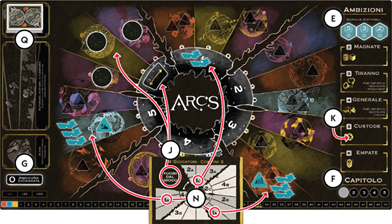
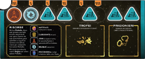

# TABELLONE

1. **Riserve Comuni**
   - Posiziona la **mappa** al centro del tavolo.
   - Poni accanto la riserva di **18 dadi Combattimento** e **25 segnalini Risorsa**.
   - Mescola le **6 carte Vox** e le **25 carte Gilda** per formare il **mazzo Corte**.
   - Pesca e poni in fila scoperte **3 | 4 carte Corte** (rispettivamente in 2 | 3-4 giocatori).

2. **Elementi sulla Mappa**
   - **`(1)` Carte Azione:** Mescola e poni le **20 | 28 carte** di valore **2-6 | 1-7** (rispettivamente in 2-3 | 4 giocatori).
   - **`(2)` Ambizione:** I **3 segnalini** (lato blu scoperto).
   - **`(3)` Capitolo:** Indicatore nello spazio **“1”**.
   - **`(4)` Segnalino Zero:** Nello spazio **Ambizione Dichiarata**.

3. **Setup Settori**
   - Pesca **1 carta Preparazione** (in base al numero di giocatori).
   - In **2 | 1 settori** sulla mappa (2-3 | 4 giocatori) poni:
     - **`(5)` Segnalino Rotta** sul portale numerato.
     - **3 segnalini Fuori dal Gioco** sui pianeti di quel portale.

> **Solo 2 giocatori:**
> Poni **`(6)` i 6 segnalini Risorsa** dei 6 pianeti coperti dai segnalini *Fuori dal Gioco* nei riquadri Ambizione:
> - **Magnate:** Materiale e Carburante.
> - **Generale:** Armi.
> - **Custode:** Reliquie.
> - **Empate:** Psicoenergia.

# GIOCATORI

1. **Dotazione Iniziale**
   - Ogni giocatore prende **`(7)` una plancia Giocatore** e il set del proprio colore (5 città, 5 spazioporti, 15 navi, 10 agenti).
   - Posiziona l'indicatore Potere **`(8)` nello spazio “0”** del tracciato sulla mappa.
   - Poni le **città** sugli spazi triangolari della tua plancia.

2. **Ordine di Gioco**
   - Scegliete casualmente il **1° Giocatore** e dategli l'indicatore **Iniziativa**.

3. **Posizionamento Pezzi `(9)`**
   *Dal 1° giocatore, in senso orario, seguendo la carta Preparazione:*

   - **1° giocatore:**
     - Sistema **1A**: 3 navi + 1 città (la più a sinistra sulla plancia).
     - Sistema **1B**: 3 navi + 1 spazioporto.
     - Sistema/i **1C**: 2 navi.
     - **Risorse:** Poni sulla plancia i 2 segnalini indicati nei sistemi A/B (nel 1°/2° spazio tondo).

   - **2 / 3 / 4° giocatore:**
     - Stessa procedura nei rispettivi sistemi **2/3/4A-C** e risorse sulla plancia.

4. **Mano Iniziale**
   - Ogni giocatore pesca **6 carte Azione**.
   - Le rimanenti formano **`(1)` la pila delle Azioni Scartate** (coperte).

> **Solo 2 giocatori:**
> Il 2° giocatore può scartare tutte le 6 carte e pescarne altre 6. Poi rimescola le vecchie nella pila Scartate.