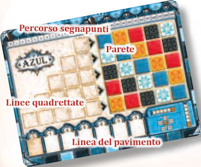
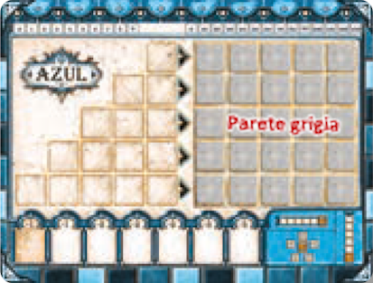

# Plancia del Giocatore

{.img-center}

La plancia è composta da **3 aree** principali:

- **Percorso segnapunti**: la traccia numerata su cui scorre il segnapunti per registrare il punteggio.
- **Linee quadrettate**: le 5 righe sul lato sinistro, di lunghezza crescente (1, 2, 3, 4, 5 caselle). Qui si accumulano le piastrelle raccolte durante la fase di Offerta. Una linea è "completa" quando tutte le sue caselle sono riempite con piastrelle dello stesso colore.
- **Parete**: la griglia 5×5 sul lato destro. Sul lato colorato, ogni casella ha già il colore prestampato che indica quale piastrella può essere collocata in quella posizione. Ogni riga della parete contiene esattamente un colore per posizione, e nessun colore si ripete nella stessa riga o nella stessa colonna.
- **Linea del pavimento**: la riga in basso, con 7 caselle. Raccoglie le piastrelle in eccesso e infligge penalità crescenti (da -1 a -3 per casella).

{.img-center}
