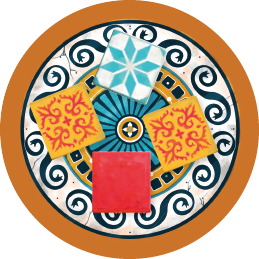

## Preparazione Comune

1. Disponi le [tessere vassoio]{.def} in cerchio al centro del tavolo:

:::indent
| Giocatori | Tessere vassoio |
|:---:|:---:|
| **2** | 5 |
| **3** | 7 |
| **4** | 9 |
:::

2. Riempi il **sacchetto** con le **100 piastrelle** (*20 di ogni colore*) e mescola.
3. Chi ha visitato più di recente il Portogallo prende il **segnalino primo giocatore** e riempie ogni tessera vassoio con esattamente **4 piastrelle** pescate dal sacchetto.
4. Rimetti nella **scatola** tutte le tessere vassoio, plance e segnapunti inutilizzati.

## Preparazione per Giocatore

1. Prendi **1 plancia** ed inseriscila nel contenitore in plastica.
    - **Partita Standard**: usa il lato **parete colorata**.
    - **Variante Parete Grigia**: usa il lato **parete grigia**.
:::indent
Tutti i giocatori devono usare lo stesso lato della plancia.
:::

2. Porta i **2 segnapunti scorrevoli** sullo **0** di entrambi i [percorsi segnapunti]{.def}.

> **Obiettivo:** completa **almeno 1 linea orizzontale di 5 piastrelle** consecutive sulla parete. Chi ha **più punti** dopo i bonus finali vince.

:::glossary
[tessere vassoio]: I supporti circolari {.img-inline} disposti al centro del tavolo, ognuno riempito con 4 piastrelle, da cui i giocatori pescano durante la Fase A.

[percorsi segnapunti]: Le tracce numerate sulla plancia su cui scorre il segnapunti per tenere il conto del punteggio.
:::
