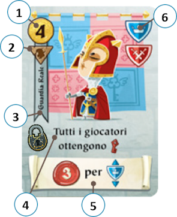

# Anatomia di una Carta

{.img-center}

Ogni **carta Personaggio** (**Villaggio e Castello**) è composta dai seguenti elementi:

| # | Elemento | Descrizione |
|:---:|:---|:---|
| **1**{.accent} | **Costo** | Monete d'Oro necessarie per acquistarla |
| **2**{.accent} | **Icona Messaggero** | Indica se e dove spostare la pedina |
| **3**{.accent} | **Nome e Vessillo** | Identifica il Personaggio e il suo tipo |
| **4**{.accent} | **Abilità** | Effetto immediato (con eventuale Lucchetto) |
| **5**{.accent} | **Pergamena dei punti** | Condizioni di punteggio a fine partita |
| **6**{.accent} | **Scudo** | Tipo di categoria del Personaggio |

## Icona Messaggero

| Icona | Effetto |
|:---:|:---|
| {.img-inline} | Muovi sul Villaggio |
| {.img-inline} | Muovi sul Castello |
| **Assente** | Non muovere |

## Vessillo

| Tipo | Vessillo |
|:---:|:---|
| {.img-inline} | **Villaggio** |
| {.img-inline} | **Castello** |

## Scudo

| Tipo | Scudo | Reperibilità Maggiore |
|:---:|:---:|:---|
| {.img-inline} | **Esercito** |  Villaggio  |
| {.img-inline} | **Artigianato** |  Villaggio  |
| {.img-inline} | **Agricoltura** |  Villaggio  |
| {.img-inline} | **Nobiltà** |  Castello  |
| {.img-inline} | **Fede** |  Castello  |
| {.img-inline} | **Sapienza** |  Castello  |

# Distribuzione degli Scudi

La tabella mostra quante **carte per ciascun tipo di scudo** sono presenti in ogni mazzo.

| Scudo | {.img-inline} | {.img-inline} | Totale |
|:--:|:--:|:--:|:--:|
| {.img-inline} | 14 | 1 | 15 |
| {.img-inline} | 12 | 5 | 17 |
| {.img-inline} | 11 | 6 | 17 |
| {.img-inline} | 8 | 10 | 18 |
| {.img-inline} | 7 | 11 | 18 |
| {.img-inline} | 0 | 20 | 20 |