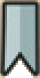
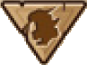
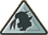

I giocatori si alternano in **senso orario** partendo dal primo giocatore. In ogni turno segui le **4 fasi nell'ordine indicato**:

## Fase 1 — Chiave *(facoltativa)*

- Puoi spendere **1 Chiave** per una delle seguenti azioni:
  - Spostare il [Messaggero]{.def} (Villaggio ↔ Castello).
  - Scartare le **3 carte** del luogo del Messaggero e rivelarne **3 nuove** dal mazzo.
  - ![puzzle]{.icon} **[FdS]** Puoi attivare **1 abilità [Lucchetto]{.def}** *prima o dopo* aver speso la Chiave.

## Fase 2 — Acquisto *(obbligatorio)*

1. Prendi **1 carta** dal luogo del [Messaggero]{.def}:
   - **Scoperta**: paga il costo in Monete (applica sconti permanenti attivi; minimo 0).
   - **Coperta**: gratis, ottieni **6 Monete + 2 Chiavi**, vale **0 punti** a fine partita.
2. Posizionala nella tua **griglia** rispettando entrambe le regole:
   - **Adiacente** (ortogonalmente) ad almeno 1 carta già presente.
   - Max **3 carte** per riga e per colonna.
   - ![puzzle]{.icon} **[FdS]** Se la carta ha un [Lucchetto]{.def}, poni **1 Chiave dalla riserva** su di essa.

## Fase 3 — Abilità *(obbligatoria)*

- Applica l'**abilità immediata** della carta appena acquistata (la carta stessa conta; prendi le risorse dalla riserva).

## Fase 4 — Messaggero + Rifornimento *(obbligatoria)*

1. Se il [vessillo]{.def} della carta acquistata ha l'[icona Messaggero]{.def}, spostalo dove indicato.
2. Rifornisci entrambe le gallerie fino a **3 carte** rivelando nuove carte dai mazzi.
   - Se un mazzo si esaurisce, mescola la sua **pila degli scarti** e continua.
   - ![puzzle]{.icon} **[FdS]** Se non l'hai già fatto nel turno, puoi attivare **1 abilità Lucchetto** dopo aver rifornito le gallerie.

> **Luogo vuoto**: se **non** ci sono abbastanza carte nemmeno dopo aver mescolato gli scarti, rimuovi tutte le carte da quel luogo e posa il Messaggero accanto ad esso (non è più possibile spostarlo).

:::glossary
[Messaggero]: La pedina che determina da quale galleria (Villaggio o Castello) si acquista al proprio turno.

[Lucchetto]: Abilità speciale {.img-inline} dell'espansione **Fuori dalle Segrete**. Quando acquisti la carta, posa 1 Chiave dalla riserva su di essa per attivare l'effetto una volta per turno.

[vessillo]: Il simbolo in alto a sinistra della carta che indica se appartiene al Villaggio {.img-inline} o al Castello {.img-inline}.

[icona Messaggero]: Simbolo che indica se spostare il Messaggero sul Villaggio {.img-inline} o sul Castello {.img-inline}.
:::