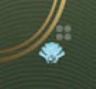

# Preparazione

In una partita a 1 o 2 giocatori vengono usate le **[carte Rivali]{.def}** come avversari automatizzati.

Scegli **2|1 carta Rivale** rispettivamente in 1|2 giocatori e modifica la preparazione in base al **livello di difficoltà** scelto:

| Livello | Modifica |
|---|---|
| **Mercenario** (Novizio) | I Rivali iniziano senza truppe nelle guarnigioni; il giocatore inizia con 1 carta Intrigo. |
| **Sardaukar** (Veterano) | Nessuna modifica. |
| **Mentat** (Esperto) | Come Sardaukar, ma usa anche le regole Escalation Brutale, Schieramento Esperto e Politica Astuta. |
| **Kwisatz Haderach** (Esperto+) | Come Mentat, ma il giocatore non può ottenere il Maestro di Scherma. |

> **1ª Partita – 1 giocatore:** si consiglia di scegliere un Rivale con valore Maestro di Scherma ≥ 8.
> **1ª Partita – 2 giocatori:** si consiglia di utilizzare la variante Rivali Semplificati.

Scegli **1 colore per ogni Rivale**, poi:

- Poni **1 cubo Fazione** su ogni Indicatore di Influenza (casella in fondo) **(7)**{.accent}.
- Poni **3 truppe** nella sua guarnigione (**non** con livello Mercenario) **(8)**{.accent} e le restanti nella sua scorta.
- Poni **2 Agenti** nella sua scorta e **1 Agente** (Maestro di Scherma) accanto al tabellone.
- Poni **3 Spie** e **1 acqua** nella sua scorta.

Mescola e poni le **[carte della Casa di Hagal]{.def}** accanto alle carte Rivali.

> **1 giocatore:** rimuovi dal gioco la carta Rimescola "2G" prima di mescolarle.

Distribuisci le **carte Obiettivo** in base al numero di giocatori.

> **1 giocatore:** giocatore e Rivali iniziano con 1 carta Obiettivo casuale ciascuno.
> **2 giocatori:** il Rivale inizia con la carta Obiettivo Ornitottero; i giocatori ricevono 1 carta Obiettivo casuale ognuno.

# Svolgimento del Gioco

Segui le normali regole del gioco base con le seguenti **differenze**.

## {.img-inline} Fase 2: Turni dei Giocatori

Ogni Rivale svolge il turno dell'Agente (finché ha Agenti), ma **mai** il turno di Rivelazione.

> **1 giocatore:** il segnalino Primo Giocatore passa tra il giocatore ed il Rivale come di consueto.
> **2 giocatori:** il segnalino Primo Giocatore passa solo tra i giocatori e mai al Rivale (viene considerato sempre alla sinistra del primo giocatore in modo da alternarsi tra i due giocatori).

Nel **turno dell'Agente del Rivale** rivela **1 carta Casa di Hagal** ed invia un suo Agente sulla casella indicata se libera, o rivela una nuova carta finché non viene indicata una casella libera.
- Quando il mazzo Casa di Hagal termina mischia la **pila degli scarti** per formarne uno nuovo.

Il Rivale ottiene gli **effetti** presenti sulla carta **ignorando** tutti i costi e gli effetti della casella (**non** ne ottiene le risorse).

Comportamenti specifici del Rivale:

- **Casella Combattimento:** schiera **+2 truppe** dalla sua guarnigione (se le possiede) anche se come effetto della carta non ha reclutato truppe.
- **Casella Creatore:** ottiene la spezia bonus presente, poi se possiede il segnalino Amo del Creatore e il Conflitto lo consente ottiene e pone i vermi delle sabbie indicati nel Conflitto, altrimenti ottiene la spezia base indicata sulla casella.
- **Carte Collocare Spia:** dopo aver collocato la Spia, rivela 1 nuova carta Casa di Hagal per porre l'Agente.

> **Modulo CHOAM:** il Rivale prende sempre **2 solari** anziché un contratto (anche quando lo ottiene come ricompensa di un Conflitto).

Un Rivale **non** richiama le sue Spie per Infiltrarsi o Raccogliere Informazioni, ma appena colloca la **3ª Spia** richiama subito le altre 2 Spie e risolve la sua **capacità Complotto** {.img-inline}.

Un Rivale ottiene e perde i **segnalini Alleanza**, ma **non** ottiene i bonus di Fazione quando raggiunge 4 Influenza.

Il Rivale converte le risorse (*ottenute dalle carte Casa di Hagal e dai Conflitti*) nel modo seguente:

- **Maestro di Spada:** appena ne raggiunge il valore (indicato in alto a destra della carta Rivale) lo acquisisce spendendo in ordine solari, spezie, carte Intrigo, acqua.
- **Punti Vittoria:** una volta ottenuto il Maestro di Spada, appena ha risorse sufficienti spende 7 solari, 7 spezie, 3 carte Intrigo o 3 acqua per ottenere 1 Punto Vittoria.

## {.img-inline} Fase 3: Combattimento

In ordine di turno, ogni Rivale con 1+ unità nel Conflitto, rivela **1 carta Casa di Hagal** e fa avanzare il suo **segnalino Combattimento** in base alle spade rivelate come **bonus di Combattimento**.

> Se pesca la carta **Rimescola**, rimescola e poi pesca 1 nuova carta.

Poi ogni giocatore può giocare **carte Intrigo Combattimento** normalmente prima di risolvere il Conflitto.

Un Rivale può ottenere le **ricompense** delle **carte Conflitto** (doppie se ha 1+ vermi delle sabbie). Se **vince** prende la carta Conflitto e può accoppiare le icone battaglia per ottenere 1 Punto Vittoria.

:::indent
Il Rivale può ottenere il **Controllo** ponendo il suo **segnalino Controllo** al di sotto della casella del tabellone e riscuoterne il **bonus** quando vi viene inviato un Agente (giocatore o Rivale) e porre **1 truppa** se viene rivelato un Conflitto che coinvolge quella casella.

Se ottiene **Influenza**, sceglie la Fazione per cui ne ha meno. In parità, segue la **lista di priorità** della sua carta Rivale (*da sinistra a destra per le sole Fazioni in parità*).

Se può ottenere **Punti Vittoria** da una **carta Conflitto**, lo fa sempre (*spendendo risorse o richiamando Spie*).
:::

# Fine della Partita

Se un **Rivale** raggiunge **10+ Punti Vittoria** si innesca normalmente il Fine Partita.

---
---

# Varianti di Gioco

Puoi applicare le seguenti varianti come indicato dal **livello di difficoltà** scelto oppure a tuo piacere.

## "Agitazione nell'Imperium" con i Dadi

*Per partite in solitario.*

Alla fine del **turno di Rivelazione** del giocatore, lancia **2D6**:
- **1..5**: rimuovi le carte corrispondenti dalla Fila dell'Impero. 
- **6**: **non** rimuovere alcuna carta.
- **risultati uguali** sui 2 dadi: rimuovi solo 1 carta. 

Poi pesca **nuove carte** al loro posto.

## Rivali Semplificati

*Per partite a 2 giocatori per un'esperienza testa a testa.*

Scegli **1 carta Rivale** tra *Lady Amber Metulli* e *Glossu "la Bestia"*. 

:::indent
Una volta che hanno ottenuto il **Maestro di Spade** sono più rapidi da gestire e **non** possono più ottenere **spezia** bonus dal tabellone (*ponila nella banca*).

Il Rivale **non** può vincere la partita.
:::

## Escalation Brutale

*Per giocatori veterani con Rivali più sfidanti nei Conflitti a partita inoltrata.*

Ogni volta che un Rivale partecipa ad un combattimento di un **Conflitto III**, gira **2 carte Casa di Hagal** e aggiungi le **spade** di entrambe le carte.

## Schieramento Esperto

*I Rivali sono più accorti nello schierarsi nel conflitto.*

Quando combatte per un:
- **Conflitto I o II**: il Rivale non schiera truppe se ha già 3+ truppe di vantaggio. 
- **Conflitto III**: continua a schierare le proprie truppe normalmente.

Il Rivale pone comunque sempre ogni **verme delle sabbie** quando può.

## Politica Astuta

*Per giocatori veterani con Rivali più sfidanti nell'arena politica.*

Quando un Rivale rivela **1 carta** che invia un Agente su una casella Fazione **senza costo**, **ignora** la carta e rivela **1 nuova carta** nei seguenti due casi:

- Se ha già l'Alleanza con quella Fazione e 1+ Influenza di vantaggio rispetto a tutti i giocatori.
- Se ha già 2+ Influenza con quella Fazione e 2+ Influenza di vantaggio rispetto a tutti i giocatori.

---
---

# ![puzzle]{.icon} Lignaggi

## Svolgimento del Gioco

Aggiungi al gioco base le nuove **carte Casa di Hagal** e **Rivale**:

- **Carte Casa di Hagal:** aggiungi le 2 carte *Sietch di Tuek* solo se stai usando il Leader *Esmar Tuek*. 
    - ![puzzle]{.icon} **Modulo Tecnologia:** aggiungi le 4 carte *Acquisire Tecnologia*.
- **Carte Rivale:** aggiungi le **5 carte Rivale**. 
    - ![puzzle]{.icon} **Modulo Tecnologia:** aggiungi la carta *Kota Odax di Ix* solo in solitario.

**Comandanti Sardaukar per i Rivali**{.accent}

Un Rivale può acquisire un Comandante Sardaukar **solo se ha già acquisito il suo Maestro di Scherma**.

Quando un Rivale invia il proprio **Agente** su una casella con un Comandante, se possiede **2+ Solari**, ne spende 2 per acquisirlo e reclutarlo (**non** acquisisce alcuna Abilità Comandante).

Se possiede **1+ Comandanti**, quando schiera truppe nel Conflitto, li schiera **prima delle truppe regolari** (ognuno ha Forza 4). Al termine del Conflitto rimetti nella scatola tutti i suoi Comandanti schierati.

> **Variante Rivali Semplificati:** quando un Rivale invia il proprio Agente su una casella con un Comandante lo rimuove dal tabellone (rimettilo nella scatola).

Se un Rivale deve **perdere 1 truppa**, perde sempre una truppa regolare prima di un Comandante, e sempre dalla guarnigione prima che dal Conflitto.

**Spie Sotto Copertura per i Rivali**{.accent}

Se un Rivale **deve porre 1 Spia Sotto Copertura**, la pone su un punto di osservazione di Fazione della prima Fazione disponibile in base alla sua lista di priorità (*ignora qualsiasi Spia avversaria*).

Se un Rivale **deve spostare 1 Spia** procedi come prima, ma ignora il punto di osservazione attuale nella sua lista di priorità. Se tutti i punti di osservazione sono occupati perde la Spia.

![puzzle]{.icon} **Modulo Tecnologia per i Rivali (solo per 1 giocatore)**{.accent}

> **2 giocatori**: il Rivale ignora le tessere Tecnologia; **non** considerare quanto segue.

Un Rivale può acquisire una **tessera Tecnologia** solo se ha già acquisito il suo **Maestro di Scherma**. Da quel momento **accumula spezia** (**non** spende 7 spezie per 1 Punto Vittoria, a meno che non si è ad una carta Conflitto III).

Quando **può acquisire** una tessera (icona {.img-inline} su *Acquisire Tecnologia* o *Anello di Kota Odax di Ix*), la paga **-1 spezia** e prende la tessera con l'**icona Rivale** {.img-inline} più costosa che può permettersi (in parità, quella più in alto). Se **non** ci sono tessere Rivale disponibili elimina 1 tessera dalla pila con più tessere (in parità, quella più in alto) e ne rivela una nuova.

> Controlla il **manuale** (p.9) per alcuni chiarimenti di alcune tessere.
