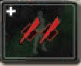

# Preparazione

Segui le normali regole del gioco base con le seguenti **differenze**.

- Poni il tabellone **sul retro** (*le fazioni Fremen e Imperatore sono sostituite dalle Fazioni Grandi Case e Mondi di Frontiera*).
- Quando componi il **mazzo dei Conflitti** **(3)**{.accent} **non** usare alcuna **carta Conflitto I**, ma solo **5 carte Conflitto II** sopra **4 carte Conflitto III**.
- Poni i **6 segnalini Bonus Maestro di Scherma** {.img-inline} con i Maestri di Scherma accanto al tabellone.

I giocatori si dividono in **2 squadre** da **3 membri** ciascuna, composte da **1 Comandante** (*Muad'Dib* o *Shaddam Corrino IV*) e **2 Alleati** (tra i Leader rimanenti). I Comandanti **non** hanno eserciti propri.

- I **Comandanti** si siedono uno di fronte all'altro: 
    - **Muad'Dib:** nella parte bassa del tabellone (*Arrakis*).
    - **Shaddam:** nella parte alta (*Landsraad*).
- Gli **Alleati** si siedono tra i 2 Comandanti alternandosi in modo che ad ogni turno giochi un membro di una squadra differente.

Ogni **Comandante** prende e pone **1 plancia personale** (plancia Fremen per Muad'Dib, plancia Imperatore per Shaddam) accanto alla sua carta Leader.

Quando poni i **4 segnalini Alleanza** sui rispettivi tracciati **(2)**{.accent}, poni anche i **2 segnalini Alleanza aggiuntivi**. I segnalini Fremen ed Imperatore vanno sulle due plance personali dei Comandanti.

Ogni **Comandante** prende i rispettivi **mazzi di partenza personali** invece di quelli standard (Muad'Dib {.img-inline}, Shaddam {.img-inline}) e i propri componenti (Muad'Dib azzurri, Shaddam grigi):

:::indent
Prende **3 segnalini Spia**, **2 dischi** (1 lo pone sulla casella 4 "C" dell'Indicatore dei Punteggi **(5)**{.accent}), **3 segnalini Agente** (quello con le doppie frecce {.img-inline} lo pone accanto al tabellone insieme ai Maestri di Scherma) e **1 cubo Fazione** (lo pone sulla casella più in basso dell'Indicatore di Influenza della propria plancia personale come per **(7)**{.accent}).
:::

Ogni **Alleato** pone i propri cubi Fazione sulle caselle più in basso degli **Indicatori di Influenza** **(7)**{.accent} delle 4 fazioni, ma **non** su quelli delle plance personali dei Comandanti. Poi pone il proprio **Segnapunti** sulla **casella 1 "A"** dell'Indicatore dei Punteggi.

Mescola tutte le **carte Obiettivo**. Ogni **Alleato** (**non** il Comandante) pesca e pone **1 Obiettivo scoperto** nella sua scorta.

- Se una squadra pesca **2 Obiettivi Topo del Deserto**, il giocatore con quello **"4/6G"** lo scambia con l'Alleato avversario seduto accanto a lui.

:::accordion Leader & Lore
Per avere **un’esperienza** più affine alla storia di Dune potete suddividere le due squadre come segue:

| Alleati per Muad’Dib | Alleati per Shaddam |
|:---:|:---:|
| Gurney Halleck | Feyd-Rautha Harkonnen |
| Lady Jessica | Lady Margot Fenring |
| Staban Tuek | Principessa Irulan |

Il Leader *Lady Amber Metulli* può schierarsi con ambo le parti.
:::

# Svolgimento del Gioco

Segui le normali regole del gioco base con le seguenti **differenze**.

I **Comandanti** usano le **carte** e le **caselle** del tabellone come gli altri giocatori, ma **non** hanno truppe da reclutare o schierare nel Conflitto, e **non** hanno **cubi Fazione** sui 4 Indicatori di Influenza del tabellone.

Scegliete **1+ regole di comunicazione** da applicare alla partita tra i membri della stessa squadra (è preferibile non comunicare privatamente).

## {.img-inline} Fase 2: Turni dei Giocatori

Quando un **Comandante** invia un proprio **Agente** sul tabellone, **1 Agente della squadra** riceve qualsiasi effetto che il Comandante non può usare direttamente in base alla freccia presente sul **segnalino Agent**e usato (*Alleato alla sua sinistra {.img-inline} o alla sua destra {.img-inline}*).

Durante il **turno di Rivelazione**, il Comandante sceglie quale Alleato attivare sia che abbia o meno già svolto il proprio turno di Rivelazione:

:::indent
- Se l'Alleato **non** ha ancora svolto il proprio turno di Rivelazione, sommerà i bonus/malus a quanto giocherà.
- Se l'Alleato **ha già svolto** il proprio turno di Rivelazione, non può sommare bonus/malus da lui inutilizzati.
:::

Tutte **le unità e le guarnigioni** possedute da un Alleato attivato sono possedute anche dal Comandante. Quando un Comandante **recluta/schiera** unità per un Alleato si considera che entrambi le abbiano reclutate/schierate (*questo consente di attivare alcune carte durante un turno del Comandante*).

> Le **carte Conflitto** vinte dagli Alleati **non** sono in comproprietà con i loro Comandanti.

Ogni Comandante ha **1 plancia personale** su cui inviare un proprio Agente (gli Alleati **non** possono) per ottenere:

- **Influenza 1 e 3:** benefici per ogni membro della squadra.
- **Influenza 2:** 1 Punto Vittoria.
- **Influenza 4:** l'Alleanza con quella fazione.

Gli Alleati **non** possono interagire con l'Influenza sulle plance personali dei Comandanti.

Per ogni **Indicatore di Influenza** sul tabellone i Comandanti ricevono l'**Influenza più alta tra i 2 Alleati** su quell'Indicatore e la applicano anche quando giocano un Agente sull'altro Alleato.

**2 delle icone Fazioni** fanno riferimento alle 2 Fazioni *diverse*. Per i requisiti o gli effetti di qualsiasi **carta o casella** del tabellone:

:::indent
- {.img-inline}: tutti usano la **Fazione delle Grandi Case**, mentre *Shaddam* può usare in alternativa la **Fazione Imperatore**.
- {.img-inline}: tutti usano la **Fazione dei Mondi di Frontiera**, mentre *Muad'Dib* può usare in alternativa la **Fazione Fremen**.
:::

La **Fazione delle Grandi Alleanze** presenta **2 nuove icone**:

| Icona | Effetto |
|:---:|---|
| **Rinforzi** | Il giocatore recluta 3 truppe, divise come preferisce tra gli Alleati della sua squadra, poi ne schiera un numero qualsiasi tra queste. |
| **Commercio** | Il giocatore sceglie 1 compagno di squadra con cui scambiarsi 1+ "merci" dello stesso tipo (*carte Intrigo, spezia, acqua o solari*). Uno o entrambi i giocatori coinvolti possono non cedere alcunché. |

La **plancia personale di Shaddam** e la **carta *Tenda Imperiale*** gli consentono di spostare **1 carta dalla Fila dell'Impero** alla **Fila del Trono** personale, da cui Shaddam ed i suoi Alleati possono acquisire nuove carte (**non** Muad'Dib ed i suoi Alleati).
:::indent
- Sostituisci immediatamente la carta così spostata con una nuova carta dalla Fila dell'Impero.
- Le carte che fanno riferimento alla Fila dell’Impero non influenzano le carte nella File del Trono.
- La Fila del Trono è **illimitata**.
:::

Un giocatore quando acquisisce il **Maestro di Scherma** ottiene e pone sul tabellone **1 segnalino Bonus Maestro di Scherma** {.img-inline}:

:::indent
- Gli **Alleati** lo pongono nella propria guarnigione.
- I **Comandanti** lo pongono sul bordo dell'area del Conflitto vicino al proprio lato del tabellone.

Il segnalino conferisce **2 spade** a quel giocatore ad **ogni turno di Rivelazione**.
:::

> Ogni giocatore può usare il proprio **Maestro di Scherma solo 1 volta per partita**, poi lo ripone nella scatola.

## {.img-inline} Fase 3: Combattimento

I giocatori giocano **carte Intrigo Combattimento**, in senso orario, come di consueto. Un Comandante gioca **per conto di 1 Alleato** con 1+ unità nel Conflitto (**non** può dividere gli effetti su 2 Alleati).

Se **2 Alleati della stessa squadra** sono in parità durante la risoluzione del Conflitto, uno dei due può cedere all'altro la ricompensa maggiore e prendere per sé quella minore. Se sono in parità per la **3ª ricompensa** il cedente non prende alcuna ricompensa.

Per dirimere le **parità** procedere normalmente usando lo schema della **Risoluzione Conflitti** per 4 giocatori intendendo G4 anche come G5 e G6.

{.img-center}

# Fine della Partita

Il **Fine Partita** si innesca come di consueto durante la *Fase 5 di Ripristino* se un giocatore ha **10+ Punti Vittoria** o se il **mazzo dei Conflitti è vuoto**.

Ogni giocatore può giocare le proprie **carte Intrigo Fine Partita** e gli Alleati possono usare le **carte Conflitto** con l'**icona battaglia jolly** {.img-inline} come di consueto.

> **Ricorda** che alcune carte Intrigo **non** danno benefici ai Comandanti (usa **Commercio** per darle ai tuoi Alleati) e che l'Influenza di un Comandante presso una Fazione del tabellone è quella maggiore tra i suoi due Alleati.

La **squadra con il maggior punteggio totale** è la vincitrice.

- In caso di parità tra squadre, si procede nell'ordine seguente:

| Criterio di spareggio | |
|---|---|
| 1. | Chi possiede più **spezia totale** |
| 2. | Chi possiede più **solari totali** |
| 3. | Chi possiede più **acqua totale** |
| 4. | Chi possiede più **truppe totali nelle guarnigioni** |

---
---

# ![puzzle]{.icon} Lignaggi

## Preparazione

Poni **1 Comandante Sardaukar** su ognuna delle seguenti **6 caselle** del tabellone, lasciando spazio per porvi gli Agenti durante la partita: *Supporto Militare, Consegnare Scorte, Gran Consiglio, Sala dell'Assemblea, Ottenere Supporto e Sardaukar* (quest'ultima sulla plancia dell'Imperatore).

Poni **1 Comandante Sardaukar** nella **banca** normalmente.

Rimetti nella scatola le **2 Abilità Sardaukar *Impetuoso***.

> Viene **sconsigliato** l'uso del Leader **Liet Kynes** per la sua inusuale interazione con i vermi delle sabbie.

:::accordion Leader & Lore
Per avere **un’esperienza** più affine alla storia di Dune potete suddividere le due squadre come segue:

| Alleati per Muad’Dib | Alleati per Shaddam |
|:---:|:---:|
| Chani | Conte Hasimir Fenring |
| Duncan Idaho | Gaius Helen Mohiam |
| Esmar Tuek | Piter De Vries |

Il Leader *Timoniere Y’rkoon e Kota Odax di Ix* possono schierarsi con ambo le parti.
:::

## Svolgimento del Gioco

**Comandanti Sardaukar**

La squadra di Muad'Dib **non** può acquisire né reclutare i Comandanti Sardaukar. Quando un membro della squadra invia un **Agente** su una casella con un Comandante può spendere **2 spezie** (**non** 2 solari) per pescare **1 carta Intrigo** e poi **rimuovere** quel Comandante dal gioco (*rimettilo nella scatola*). **Non** ottiene nulla dall'eliminazione.

Quando Shaddam acquisisce un Comandante, viene reclutato dall'**alleato attivato** che sceglie quale **Abilità Comandante Sardaukar** acquisire nella sua scorta. Da questo momento appartiene a quell'alleato (segue le normali regole e Shaddam **non** può pagare per reclutarlo dalla scorta dell’Alleato).

**Chiarimenti**{.accent}

Il Comandante di una squadra (*Muad'Dib e Shaddam*) può completare il **contratto *Ottenere Qualsiasi Alleanza*** solo ottenendo l'alleanza sulla **propria plancia personale**.

![puzzle]{.icon} **Modulo Tecnologia**{.accent}

- **Flotta di Ornitotteri:** un Comandante non può prendere alcuna carta Conflitto, pertanto non ha icone battaglia per influenzare questa tessera.
- **Lame di Plastacciaio, Alto Comando Sardaukar:** la squadra di Muad'Dib può acquisire queste tessere Tecnologia (beneficiando degli effetti di acquisizione). Se Shaddam possiede una di queste tessere Tecnologia, può usarle solo quando acquisisce un Comandante Sardaukar poiché da quel momento appartiene ad un suo alleato attivato.
