# Tabellone

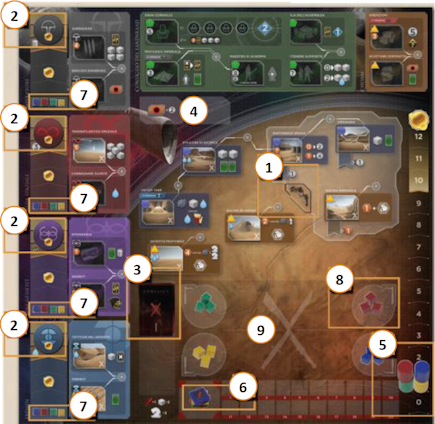{.img-center}

Poni il **tabellone** al centro del tavolo, poi poni il **[Muro Scudo]{.def}** nello spazio **(1)**{.accent} sotto la casella Raffineria di Spezia e i **4 segnalini Alleanza** sulle aree **(2)**{.accent} contrassegnate dagli **[Indicatori di Influenza]{.def}** delle fazioni.

Forma accanto al tabellone una **banca** con i **segnalini Solari**, **Spezia**, **Acqua**, **amo per Creatore** e **vermi delle sabbie** (*in legno, in plastica o entrambi*).
- Sono considerati **illimitati** (*usate altro quando li terminate*).

> ![puzzle]{.icon} **Modulo CHOAM:** mescola e poni coperti i **20 contratti** nella banca, poi pesca e poni **2 contratti scoperti** nelle caselle **(4)**{.accent}.

## Mazzo dei Conflitti

Componi e poni il **[mazzo dei Conflitti]{.def}** (*10 carte totali*) nello spazio Conflitti **(3)**{.accent}:

- Separa le **carte Conflitto** in base al dorso (*Conflitto I/II/III*).
- Mescola e poni **coperte** tutte le **4 carte Conflitto III** in una pila nello spazio Conflitti **(3)**{.accent}.
- Mescola e poni **coperte 5 carte Conflitto II** sopra le carte Conflitto III.
- Mescola e poni **coperta 1 carta Conflitto I** sopra le carte Conflitto II.
- Riponi le **carte rimanenti** nella scatola.

## Mazzo Impero ed Intrigo

Mescola e poni coperte le **carte Impero** al di sopra o al di sotto del tabellone e forma accanto una fila di **5 carte scoperte** (**[Fila dell'Impero]{.def}**). Poi poni accanto a queste il **mazzo Preparare la Strada** e il **mazzo La Spezia Deve Scorrere**.

Infine mescola e poni **coperte** accanto al tabellone le **carte Intrigo**.

> ![puzzle]{.icon} **Modulo CHOAM:** includi le carte con il simbolo CHOAM 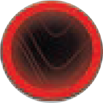{.img-inline} nel mazzo Impero e nel mazzo Intrigo.

# Giocatori

Mescola le **carte Obiettivo** in base al numero di giocatori (*indicate da 1-3G o 4/6G*). Ogni giocatore pesca e pone **1 Obiettivo scoperto** nella sua scorta.
- Il giocatore il cui Obiettivo mostra il **segnalino Primo Giocatore** 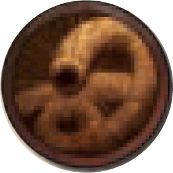{.img-inline} ne prende il segnalino.
- **Non** farlo in caso di **Snake Draft** (*vedi di seguito*).

Ogni giocatore sceglie e colloca davanti a sé una **carta Leader**.

- **Preparazione standard**{.accent}
:::indent
- Determina normalmente il **primo giocatore**.
- Ogni giocatore sceglie **casualmente o meno** il Leader da utilizzare per la partita.
    - Ogni Leader ha un numero di **icone bianche** accanto al nome che ne indica la **complessità**.
    - **Prima Partita**: usa solo Leader con 1 sola icona.
:::

- **Draft Inverso**{.accent} (*non ufficiale*)
:::indent
- Determina normalmente il **primo giocatore**.
- Mescola e rivela ***giocatori*+2 carte Leader**. 
- In ordine inverso di turno, ogni giocatore sceglie il proprio **Leader** tra quelli rivelati.
:::

- **Snake Draft**{.accent} (*non ufficiale*)
:::indent
- Determina casualmente l'**ordine di draft**.
- Mescola e rivela ***giocatori*+1 carte Leader**.
    - **Variante Rigida**: rivela solo ***giocatori* carte Leader**.
    - **Variante Estesa**: rivela ***giocatori*x2 carte Leader**.
- In ordine di turno, ogni giocatore sceglie il proprio **Leader** **OPPURE**{.accent} la propria **posizione di turno** nel Round 1.
- In ordine inverso di turno, ogni giocatore effettua la **scelta rimasta** (*Leader OPPURE posizione di turno*) in base a quella non presa al passo precedente.
- **Sedetevi al tavolo** nell'ordine deciso.
- Il giocatore che inizia riceve la **carta Obiettivo** e il **segnalino Primo Giocatore** corrispondente, mentre gli altri giocatori ricevono casualmente **1 carta Obiettivo** (*tra quelle rimaste in base al numero di giocatori*).
:::

> ![puzzle]{.icon} **Modulo CHOAM:** includi o escludi il Leader **Shaddam Corrino IV** a seconda che usi o meno questa espansione.

Poi mescola e pone **1 mazzo di partenza (10 carte)** a sinistra del suo Leader, e pone nella propria scorta **1 segnalino Acqua**.

Ogni giocatore sceglie un **colore** e ne prende tutti i componenti:

- Pone **2 Agenti** sul proprio Leader e **1 Agente** (**Maestro di Scherma**) accanto al tabellone.
- Pone **1 dei 2 dischi** (*Segnapunti*) sull'**Indicatore dei Punteggi** **(5)**{.accent} sulla casella 1|0 rispettivamente in 4|3-2-1 giocatori.
- Pone il proprio **segnalino Combattimento** (*lato* 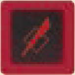{.img-inline}) sulla casella 0 dell'**Indicatore Combattimento** **(6)**{.accent}.
- Pone **4 cubi** (*1 per ogni fazione*) sulle caselle più in basso degli **Indicatori di Influenza** **(7)**{.accent} delle 4 fazioni.
- Pone **3 cubi** (*truppe*) nella **guarnigione** **(8)**{.accent} a lui più vicina (*userà questa per l'intera partita*).
- Pone i **componenti rimasti** nella propria scorta (*visibile agli altri giocatori*):

| | Componente | Quantità |
|:---:|:---|:---:|
| 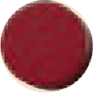{.img-inline} | **Segnalino Consigliere** | 1 |
| 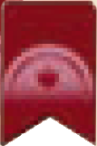{.img-inline} | **Segnalini Controllo** | 3 |
| 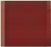{.img-inline} | **Cubi truppe** | 9 |
| 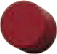{.img-inline} | **Segnalini Spia** | 3 |

---
---

# ![puzzle]{.icon} Lignaggi

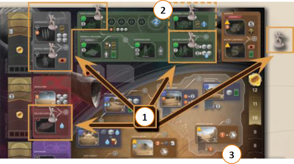{.img-center}

Prendi i **7 Comandanti Sardaukar** (*in legno o in plastica, **non** entrambi poiché sono limitati*).

## Posizionamento Comandanti Sardaukar

Poni **1 Comandante Sardaukar** su ognuna delle seguenti **(1)**{.accent} **5 caselle** del tabellone, lasciando spazio per porvi gli Agenti durante la partita: *Sardaukar, Servizio Doveroso, Consegnare Scorte, Gran Consiglio e Ottenere Supporto*.
- In **4 giocatori** poni **1 Comandante Sardaukar** anche **(2)**{.accent} in *Sala dell'Assemblea*, altrimenti nella scatola.

Poni **1 Comandante Sardaukar** nella banca (*usato con la carta Impero Soldati Sardaukar*).

Mescola e poni coperte le **14 Abilità Comandante Sardaukar** 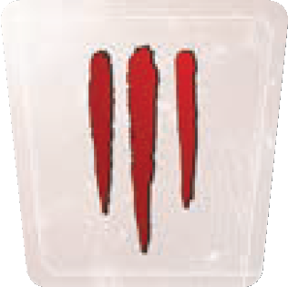{.img-inline} in una pila accanto al tabellone. Poi rivela e colloca **scoperte 4 Abilità Comandante Sardaukar** accanto alla pila.

## Nuove carte

Aggiungi al gioco base le nuove **carte Conflitto**, **Intrigo** e **Impero**:

- **Carte Conflitto:** componi normalmente il mazzo dei Conflitti (*rimetti nella scatola quelle avanzate*).
- **Carte Intrigo e Impero:** mescola normalmente per formare rispettivamente il mazzo Intrigo e il mazzo Impero.

> ![puzzle]{.icon} **Modulo CHOAM:** includi o escludi le carte con il simbolo CHOAM {.img-inline} dal mazzo Intrigo e Impero a seconda che usi o meno questa espansione.

> ![puzzle]{.icon} **Modulo Tecnologia:** includi o escludi le carte con il simbolo Tecnologia {.img-inline} dal mazzo Intrigo e Impero a seconda che usi o meno questo modulo.

Aggiungi al gioco base le nuove **8 carte Leader**.
- **Leader Esmar Tuek:** solo se in scelto, poni la nuova casella **Sietch di Tuek** sul tabellone **(3)**{.accent} al di sotto della casella *Bacino Imperiale*.

> ![puzzle]{.icon} **Modulo Tecnologia:** aggiungi anche il Leader **Kota Odax di Ix**.

## ![puzzle]{.icon} Modulo CHOAM

Aggiungi i nuovi **8 contratti** al gioco base prima di mescolarli e porli nella banca. Poi pesca normalmente **2 contratti**.

## ![puzzle]{.icon} Modulo Tecnologia

Poni la **plancia Ambasciata di Ix** accanto al tabellone. Mescola **coperte** le **18 tessere Tecnologia**, dividile in **3 pile da 6 tessere** e ponile **coperte** sulle 3 caselle della plancia Ambasciata di Ix. Gira a faccia in su la **tessera in cima** ad ogni pila.

> ![puzzle]{.icon} **Modulo CHOAM:** includi o escludi la tessera **Trasporti CHOAM** (una pila avrà 1 tessera in meno) a seconda che usi o meno questa espansione.

:::glossary
[Muro Scudo]: Segnalino 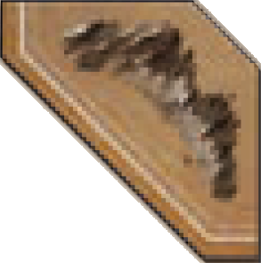{.img-inline} posizionato all'inizio della partita che impedisce l'uso dei vermi delle sabbie nei Conflitti presso i 3 luoghi critici. Può essere rimosso tramite apposite carte o caselle con icona detonazione 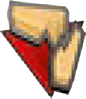{.img-inline}.

[Indicatori di Influenza]: Tracciati che misurano il livello di influenza di ciascun giocatore presso le 4 fazioni. Raggiungere certi livelli garantisce Punti Vittoria, bonus e il segnalino Alleanza.

[segnalino Alleanza]: Segnalino che indica chi possiede l'alleanza con una fazione. Vale 1 Punto Vittoria ed è conquistabile da chi raggiunge per primo (o supera) 4 Influenza presso quella fazione.

[mazzo dei Conflitti]: Mazzo di 10 carte (1×I + 5×II + 4×III) che determina le ricompense del combattimento in ogni round e la durata della partita.

[Fila dell'Impero]: Fila di 5 carte Impero scoperte dalla quale i giocatori acquisiscono nuove carte durante il turno di Rivelazione spendendo Persuasione.

[carte Rivali]: Carte che rappresentano avversari automatizzati nelle partite a 1 o 2 giocatori. Ogni Rivale ha priorità strategiche e usa le carte Casa di Hagal per muoversi sul tabellone.

[carte della Casa di Hagal]: Mazzo usato dai Rivali per determinare le loro azioni automatizzate: indicano su quale casella inviare l'Agente e quale effetto riscuotere.
:::
