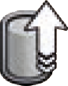
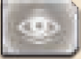
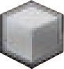
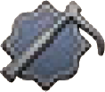
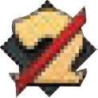
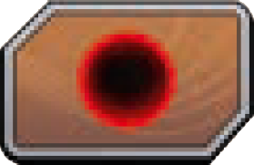
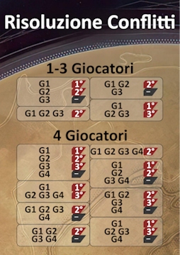
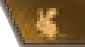
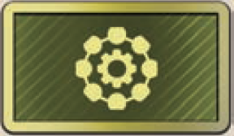
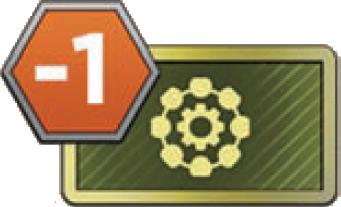

Il gioco si svolge in una serie di **round** ognuno composto da **5 fasi** da svolgere nel seguente ordine:

| Fase | Nome | Descrizione sintetica |
|:---:|:---:|:---|
| **1** | **Inizio del Round** | Rivela 1 carta Conflitto; ogni giocatore pesca 5 carte. |
| **2** | **Turni dei Giocatori** | Gioca turni dell'Agente e/o di Rivelazione; puoi giocare carte Intrigo Trama. |
| **3** | **Combattimento** | Risolvi il Conflitto; puoi giocare carte Intrigo Combattimento. |
| **4** | **Creatori** | Poni +1 spezia su ogni casella Creatore senza Agenti. |
| **5** | **Ripristino** | Innesca la Fine Partita oppure recupera gli Agenti e passa il segnalino Primo Giocatore per giocare un nuovo round. |

> Ricorda di risolvere le **capacità uniche** del tuo Leader quando si innescano.

# {.img-inline} Fase 1: Inizio del Round

Rivela e poni **1 nuova carta Conflitto** scoperta nella casella al di sotto del mazzo Conflitti (*sopra ad eventuali carte Conflitto dei round precedenti*).
- Questa riporta le **ricompense** che puoi ottenere con il Combattimento.

> Se contiene il **nome di un luogo controllato** da un giocatore, quel giocatore pone immediatamente **1 truppa** come bonus difensivo dalla propria scorta direttamente nell'**area del Conflitto** (*vedere sezione Luoghi Critici e Muro Scudo*).

Ogni giocatore pesca poi **5 carte** dal proprio mazzo.

# {.img-inline} Fase 2: Turni dei Giocatori

I giocatori si alternano in **turni** partendo dal primo giocatore e procedendo in **senso orario**. Al suo turno il giocatore può svolgere **uno (ed uno solo)** tra i seguenti **2 tipi** di turno:

| Tipo di Turno | Descrizione |
|:---:|:---|
| **Turno dell'Agente** | Gioca 1 carta dalla tua mano ed invia 1 Agente su una casella libera (o non libera in cui è presente una tua Spia), pagandone il costo e solo se soddisfi i requisiti, poi applica gli effetti ottenuti nell’ordine che preferisci. |
| **Turno di Rivelazione** | Rivela tutte le carte dalla tua mano, risolvi gli effetti, acquisisci nuove carte, calcola la forza di Combattimento e scarta tutte le carte giocate. |

Puoi svolgere **turni dell'Agente** finché non esaurisci gli Agenti, poi **devi** svolgere un **turno di Rivelazione**. Puoi però svolgere un **turno di Rivelazione** anche se hai ancora Agenti.
:::indent
Una volta svolto il turno di Rivelazione **termini questa fase**; gli altri giocatori possono svolgere altri turni.

Quando **tutti** hanno rivelato si passa alla fase successiva.
:::

Puoi giocare **1+ carte Intrigo Trama** in qualsiasi momento durante un tuo turno dell'Agente o di Rivelazione.

## Turno dell'Agente

Gioca **1 carta scoperta** dalla tua mano ed invia **1 Agente** dal tuo Leader ad **1 casella libera** (o **non libera** in cui è presente una tua **Spia**, ma non già occupata da un tuo Agente) sul tabellone che abbia un'**icona corrispondente** ad una delle **icone Agente** sulla carta giocata.

Se indicati, paga ogni **costo** e soddisfa ogni **requisito** della casella scelta. Diversamente **non** puoi inviarvi l'Agente.

:::indent
- **Costo:** 1+ risorse indicate sotto l'icona presente nella casella.
- **Requisito:** punti Influenza indicati sopra alla casella.
:::

> Se la carta **non** possiede 1+ icone Agente non puoi giocarla durante il turno dell'Agente, ma solo nel turno di Rivelazione.

Ottieni gli **effetti** sia della **casella del tabellone** sia quelli nel **riquadro Agente** della carta (*ignora il riquadro Rivelazion*e).

Se la casella appartiene ad una Fazione, sposta il tuo **cubo Fazione** di 1 casella in su nell'Indicatore di Influenza:

- A **2 Influenza**: ottieni subito 1 Punto Vittoria.
- A **4 Influenza**: ottieni gli effetti indicati sulla casella di quell'Indicatore di Influenza.
- A **4+ Influenza**: verifica se prendi e sottrai il **segnalino Alleanza** (+/- 1 Punto Vittoria).

Puoi applicare tutti questi effetti nell'**ordine che preferisci**.

> Alcuni effetti sono descritti **testualmente**, mentre la maggior parte sono rappresentati da **icone**.

Le **frecce** ({.img-inline}) indicano che **devi** pagare il costo riportato a sinistra della freccia (o sopra di essa) per ottenerne l'effetto riportato a destra (o sotto di essa).
- **Non** sei mai obbligato a farlo, ma per ottenere l'effetto **devi** farlo.

### Spie{.accent}

Sul tabellone ci sono diversi **[punti di osservazione]{.def}** **(10)**{.accent}, ognuno collegato ad **1+ caselle**, dove puoi porre le tue **Spie**.

Ogni volta che è presente l'**icona Spia** {.img-inline} su una carta o su una casella del tabellone puoi porre **1 Spia** dalla tua scorta su un **punto di osservazione libero**.
- Se hai **terminato** le Spie puoi richiamarne una nella tua scorta, senza attivare alcun effetto, e muoverla altrove.
- Alcuni effetti indicano una **specifica icona Agente** che deve essere collegata al punto di osservazione. Diversamente **non** puoi porvi la tua Spia.

Ogni volta che è presente l'**icona Richiama Spia** {.img-inline} su una carta, puoi richiamare nella tua scorta **1 Spia** da un punto di osservazione (**permette di solito di attivare effetti potenti**).

Puoi richiamare **1 Spia** (*senza l'icona Richiama Spia*) anche per uno dei seguenti effetti:

- **INFILTRARSI:**{.accent} puoi **inviare un Agente** su una casella del tabellone occupata da 1+ Agenti avversari **richiamando 1 tua Spia** da un punto di osservazione collegato per ignorare quegli Agenti ed inviarvi anche il tuo.
- **RACCOGLIERE INFORMAZIONI:**{.accent} quando invii un Agente su una casella del tabellone puoi **richiamare 1 tua Spia** da un punto di osservazione collegato per **pescare 1 carta** dal tuo mazzo (*se lo fai devi farlo prima di ricevere qualsiasi effetto*).

> Se possiedi **2 Spie** su punti di osservazione differenti collegati alla stessa casella puoi richiamarle entrambe, ma devi risolvere **due effetti differenti** (una per Infiltrarsi, l'altra per Raccogliere Informazioni).

Ricorda che l'**icona Agente Spia** {.img-inline} ti consente di inviare un Agente su una casella collegata ad un punto di osservazione in cui è presente una tua Spia.
- Questo **non** richiama automaticamente la Spia.

### Unità e Conflitti{.accent}

Quando compare l'**icona cubo** {.img-inline} su una carta o su una casella, prendi e poni **1 truppa** dalla tua scorta alla tua **guarnigione** sul tabellone (se le hai esaurite **non** puoi reclutarle).

Quando invii un Agente su una **casella Combattimento** {.img-inline} puoi schierare le tue unità nell'**area del Conflitto** **(9)**{.accent} al centro delle guarnigioni:

:::indent
Puoi schierare **un qualsiasi numero di unità** tra quelle reclutate durante il tuo turno (*dalla casella, dalla carta giocata e dalle carte Intrigo*) **più fino ad altre 2 unità** dalla tua guarnigione.
:::

Quando compare l'**icona verme delle sabbie** {.img-inline} su una carta o su una casella, prendi e poni **1 verme delle sabbie** dalla banca direttamente nell'**area del Conflitto** (**non** nella guarnigione).

:::indent
Puoi schierare un verme delle sabbie solo se possiedi il **segnalino Amo per Creatore** {.img-inline} nella tua guarnigione.

**Non** puoi schierare un verme delle sabbie in un Conflitto protetto dal **Muro Scudo** ({.img-inline} ⇔ {.img-inline}).
:::

### Luoghi Critici e il Muro Scudo{.accent}

Se vinci un Conflitto quando è in gioco una **carta Conflitto** che riporta il nome di un **luogo** (*Arrakeen, Raffineria di Spezia o Bacino Imperiale*), poni **1 segnalino Controllo** dalla tua scorta sulla **bandiera** **(11)**{.accent} sotto la casella corrispondente.

- Quando tu o un altro giocatore inviate un Agente su una casella che **controlli** ricevi immediatamente il **bonus** indicato.
- Quando viene rivelata una **carta Conflitto** per una casella che controlli poni immediatamente **1 truppa** dalla tua scorta nell'area del Conflitto **(9)**{.accent}.

Mentre è in gioco il **Muro Scudo** {.img-inline}, durante un Conflitto in uno di questi 3 luoghi, **nessuno** può collocare un **verme delle sabbie** nell'area del Conflitto.

Se giochi una carta o invii un Agente su una casella che contiene l'**icona detonazione Muro Scudo** {.img-inline} puoi rimuovere il **segnalino Muro Scudo** (*e rimetterlo nella scatola*). Da questo momento ogni giocatore può schierare **vermi delle sabbie** in **qualsiasi Conflitto**.

### ![puzzle]{.icon} Modulo CHOAM – Contratti{.accent}

Quando poni il tuo Agente su una casella che contiene l'**icona contratto** {.img-inline} prendi e poni nella tua scorta **1 dei 2 contratti** presenti sul tabellone, poi rimpiazzalo con uno nuovo dalla banca.

> Se i contratti sono terminati o non stai giocando con questo modulo, prendi **2 solari**.

Per essere **completati**, diversi contratti ti richiedono di inviare un Agente su una specifica casella. Se la casella è già occupata da un tuo Agente **non** ottieni immediatamente la ricompensa, ma **devi** inviarvi nuovamente un tuo Agente in uno dei turni successivi.

| Tipo | Come si completa |
|---|---|
| **Raccolto** | Lo completi quando invii un Agente su una casella Creatore ed ottieni l'ammontare di spezia indicata dal contratto (*totale dalla casella e da altre fonti in quel turno*). |
| **Immediato** | Lo completi appena lo prendi. |
| **Acquisizione** | Lo completi quando acquisisci la carta *La Spezia deve Scorrere*. |

Quando **completi** un contratto dichiaralo, prendi la **ricompensa** e riponilo **coperto** nella tua scorta (*alcune carte fanno riferimento ai contratti completati*).

## Turno di Rivelazione

Se **non** hai più Agenti oppure decidi di **non** usarne altri, svolgi un **turno di Rivelazione**, seguendo nell'ordine i seguenti passi:

**1. RIVELARE LE CARTE**{.accent}

Rivela **tutte le carte** dalla tua mano tenendole separate dalle altre giocate in precedenza nei turni dell'Agente.

**2. RISOLVERE GLI EFFETTI DI RIVELAZIONE**{.accent}

Ottieni e risolvi gli effetti dei **riquadri Rivelazione** (*ignora i riquadri dell'Agente*) di tutte le carte appena rivelate (*non quelle giocate nei precedenti turni dell'Agente*) nell'ordine che preferisci.

> Ricorda di attivare il **Legame con i Fremen** delle carte rivelate se hai in gioco **2+ carte Fremen** a prescindere dall’ordine con cui le hai giocate.

**Acquisire carte**{.accent}

Calcola la **Persuasione totale** {.img-inline} ottenuta in questo round dalle carte rivelate, dalla casella *Sala dell'Assemblea* (solo se contiene un tuo Agente), dal *Gran Consiglio* (solo se contiene il tuo segnalino) e da altri effetti. Poi spendila per acquisire **1+ nuove carte** tra:

- le **5 carte della Fila dell'Impero**
- le carte **Preparare la Strada**
- le carte **La Spezia Deve Scorrere**

Poi ponile nella tua **pila degli scarti**.

:::indent
Alcune carte Impero indicano un **effetto immediato** sotto al costo di Persuasione: risolvilo immediatamente appena acquisisci quella carta.

Ogni volta che rimuovi 1 carta dalla Fila dell'Impero devi **immediatamente** porvi una nuova carta Impero (puoi eventualmente acquisire subito questa nuova carta).

La Persuasione inutilizzata viene **persa** al termine di questo turno.
:::

**Stabilire la forza**{.accent}

Calcola la **forza totale di Combattimento** in base alle carte rivelate e alle unità presenti in combattimento (*se assenti la tua forza è 0*) e sposta il tuo **segnalino Combattimento** sulla casella corrispondente dell'**Indicatore di Combattimento**.

| Unità | Forza |
|:---:|:---|
| **Truppa** | +2 per ogni truppa |
| **Verme delle sabbie** | +3 per ogni verme |
| **Spada** | +1 per ogni spada rivelata (solo se possiedi 1+ unità in combattimento) |

>Se il **valore è > 20** gira il segnalino sul lato +20 e poi posizionalo nella casella corrispondente

**3. RIORDINARE**{.accent}

Rimuovi e poni tutte le carte giocate nella tua **pila degli scarti**.

# {.img-inline} Fase 3: Combattimento

Ogni giocatore che possiede **1+ unità nel Conflitto**, partendo dal primo giocatore procedendo in senso orario, si alterna per giocare **1+ carte Intrigo Combattimento** (se le possiede) oppure **passare**.

:::indent
Se ha passato, **non** è obbligato a passare nuovamente.

Quando tutti hanno **passato consecutivamente** (compreso chi eventualmente ha giocato l'ultima carta Intrigo Combattimento), il Combattimento viene risolto.
:::

Se cambia il numero di **unità in Combattimento**, sposta il corrispondente **segnalino Combattimento** di conseguenza.

:::indent
Se un giocatore **non** possiede più unità nel Conflitto la sua forza scende immeditamente a **0** (indipendentemente dal numero di spade sulle carte rivelate o sulle carte Intrigo Combattimento giocate).
:::

## Risolvere i Combattimenti{.accent}

Assegnate le ricompense della **carta Conflitto** in base alla forza raggiunta dai giocatori con il proprio **segnalino Combattimento**:

| Ricompensa | Ricompensa |
|:---:|:---|
| **1ª** | Giocatore con la forza più alta. |
| **2ª** | Giocatore con la 2ª forza più alta. |
| **3ª** | Giocatore con la 3ª forza più alta (*solo in 4 giocatori*). |

In caso di **parità** si ottiene la ricompensa successiva o nulla: controlla lo **schema** di seguito per dirimere la **vittoria** e i **pareggi** nelle varie situazioni.

{.img-center}

> Un giocatore con **0 forza** non riceve ricompense.

Se un giocatore possiede **1+ vermi delle sabbie** nel Conflitto, **raddoppia le ricompense** che riceve (**non** il controllo di un luogo e **non** le icone battaglia sulla carta Conflitto eventualmente vinta).
- Può **pagare una seconda volta** il costo di una ricompensa opzionale per ottenerla una seconda volta.

Chi ottiene la **1ª ricompensa** pone nella propria scorta anche la **carta Conflitto**. In alto a destra è presente l'**[icona battaglia]{.def}**:

| | Icona Battaglia |
|:---:|:---|
| {.img-inline} | **Cryss** |
| {.img-inline} | **Topo del Deserto** |
| {.img-inline} | **Ornitottero** |
| {.img-inline} | **Jolly** |

Appena possiede nella sua scorta una **coppia di icone battaglia** su due carte Conflitto o Obiettivo scoperte, gira entrambe le carte a faccia in giù e riceve **1 Punto Vittoria**.

- L'**icona battaglia jolly** può essere usata solo a Fine Partita.

Dopo aver assegnato le ricompense, ogni giocatore:

- Prende e pone le proprie **truppe** dal Conflitto nella propria scorta.
- Pone i **vermi delle sabbie** dal Conflitto nella banca.
- Pone il proprio **segnalino Combattimento** sulla casella **0** dell'Indicatore di Combattimento.

# {.img-inline} Fase 4: Creatori

Per ogni **casella** del tabellone con un'**icona Creatore** (*Deserto Profondo, Bacino di Hagga, e Bacino Imperiale*), se **non** contiene **1+ Agenti**, prendi e poni **1 spezia** dalla banca su di essa (*spazio spezia bonus*) aggiungendola a quella eventualmente già presente dai round precedenti.

# {.img-inline} Fase 5: Ripristino

Se un giocatore ha **10+ Punti Vittoria** o se il **mazzo dei Conflitti** è vuoto, si innesca la Fine della Partita.

Se **nessuno** ha ancora vinto:

- Ogni giocatore **recupera** tutti i propri Agenti dal tabellone.
- Il **segnalino Primo Giocatore** viene passato al giocatore successivo in senso orario.
- Si inizia un **nuovo round**.

---
---

# ![puzzle]{.icon} Lignaggi

Segui le normali regole del gioco base con le seguenti **differenze**.

## Comandanti Sardaukar

Se invii un **Agente** su una casella che contiene **1 Comandante Sardaukar**, puoi spendere **2 solari** per **acquisirlo e reclutarlo** immediatamente (questo è un **effetto** della casella e puoi risolverlo in qualsiasi ordine rispetto agli altri effetti).

Quando **acquisisci**{.accent} un Comandante, prendi e poni nella tua scorta **1 Abilità Comandante Sardaukar** tra quelle **scoperte**, poi rimpiazzala con una nuova.
- **Non** puoi scegliere un'Abilità che già possiedi.

Quando **recluti**{.accent} un Comandante lo poni nella tua **guarnigione**.

- Se in **quel turno** hai inviato un Agente su una casella Combattimento, puoi schierarlo direttamente nel Conflitto.
- **In seguito**, se invii un Agente su una casella Combattimento, può essere una delle "fino a due" unità da schierare dalla tua guarnigione.

Un Comandante è una **truppa** che ha **2 forza** nel Conflitto. Se schierato, al termine del Conflitto ponilo nella tua **scorta**.

Una volta per turno (*Agente o Rivelazione*) puoi pagare **2 solari** per **reclutare 1 Comandante** dalla tua scorta alla tua guarnigione (o direttamente nel Conflitto se hai inviato l'Agente su una casella Combattimento in quel turno).

> **Non** puoi reclutarlo come una normale truppa e **non** acquisisci una nuova Abilità quando lo recluti dalla tua scorta.

### Abilità Comandante Sardaukar{.accent}

Quando **1+ Comandanti Sardaukar** sono schierati nel Conflitto, gli effetti di **tutte** le tue **Abilità Comandante Sardaukar** sono attive.

:::indent
Ogni Abilità fornisce un **bonus nel turno di Rivelazione** o **forza in Combattimento**. L'effetto di ogni Abilità funziona **1 sola volta per round** anche se hai più Comandanti nel Conflitto.
:::

## Nuove icone ed effetti

### {.img-inline} Icona Spie Sotto Copertura{.accent}

Puoi porre **1 Spia** usando le normali regole, ma con l'opzione aggiuntiva di poterla porre su una casella che contiene già **1+ Spie avversarie** (**non** tue).

## {.img-inline}+ Effetto Comando{.accent}

Se una **carta Impero** include "**Comando ({.img-inline}+)**" nel **riquadro Rivelazione**, puoi usare nel turno di Rivelazione l'effetto che indica se generi **6+ Persuasione**.

## {.img-inline} Icona Combattimento{.accent}

Puoi schierare **truppe** nel Conflitto come se avessi inviato un Agente su una casella Combattimento. Puoi schierare **1+ unità** che recluti nel turno **+2 unità** dalla tua guarnigione (non di più anche se possiedi 2+ di queste icone nel turno).

## ![puzzle]{.icon} Modulo Tecnologia

La **plancia Ambasciata di Ix** aggiunge a tutte le caselle {.img-inline} del tabellone l'**effetto** {.img-inline} di poter acquisire **1 tessera Tecnologia scoperta** quando invii un Agente su una di queste caselle.

Scegli **1 tessera Tecnologia** da 1 delle 3 pile, paga un ammontare di **spezia** pari al costo indicato sulla tessera, poni la tessera nella tua **scorta** e rivela una **nuova tessera** da quella pila (se esaurita **non** fare nulla, avrai meno opzioni di scelta).

:::indent
Puoi avere un numero **illimitato** di tessere Tecnologia.

Puoi ridurre il costo di **-1 spezia** (mai < 0) se possiedi  **1 seggio nelGran Consiglio** per ogni tessera che vuoi acquisire.

Puoi ridurre il costo di **-1 spezia** (mai < 0) se giochi **1+ carte con l'icona** {.img-inline} per acquisire 1 singola tessera (**cumulabile** con il seggio nel Gran Consiglio, ma **non** con altre icone {.img-inline} giocate nello stesso turno).
:::

Se la **tessera Tecnologia** fornisce un **effetto di acquisizione immediato**, risolvilo appena la acquisisci. Risolvi la capacità delle **tessere Tecnologia** presenti nella tua **scorta** in base a quanto indicato sulla tessera stessa.

:::indent
Se una **tessera Tecnologia** contiene l’icona {.img-inline}, puoi usare la capacità di quella tessera **1 sola volta per round**. Una volta usata girala a **faccia in giù**; nella *Fase 1: Inizio del Round* successivo girala a **faccia in su** per poterla nuovamente usare.
:::

:::glossary
[punti di osservazione]: Posizioni sul tabellone collegate ad 1+ caselle dove è possibile porre le Spie. Consentono Infiltrarsi, Raccogliere Informazioni e di usare l'icona Agente Spia.

[icona battaglia]: Simbolo presente sulle carte Conflitto vinte (Cryss, Topo del Deserto, Ornitottero, jolly). Accoppiare 2 icone uguali su carte scoperte vale 1 Punto Vittoria.

[Comandante Sardaukar]: Unità speciale dell'espansione Lignaggi. Conta come truppa con 2 forza nel Conflitto e, se schierato, attiva tutte le Abilità Comandante Sardaukar possedute. Costa 2 solari per essere acquisito e reclutato.

[Abilità Comandante Sardaukar]: Carte bonus dell'espansione Lignaggi che si ottengono acquisendo un Comandante Sardaukar. Forniscono bonus nel turno di Rivelazione o forza aggiuntiva in Combattimento, e si attivano solo quando 1+ Comandanti sono schierati nel Conflitto.
:::
