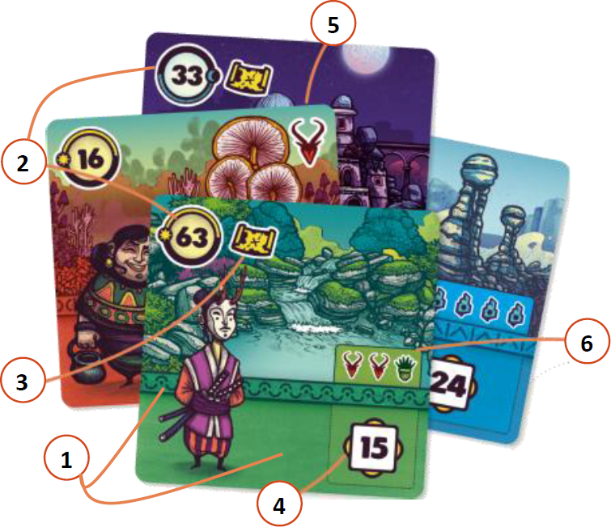
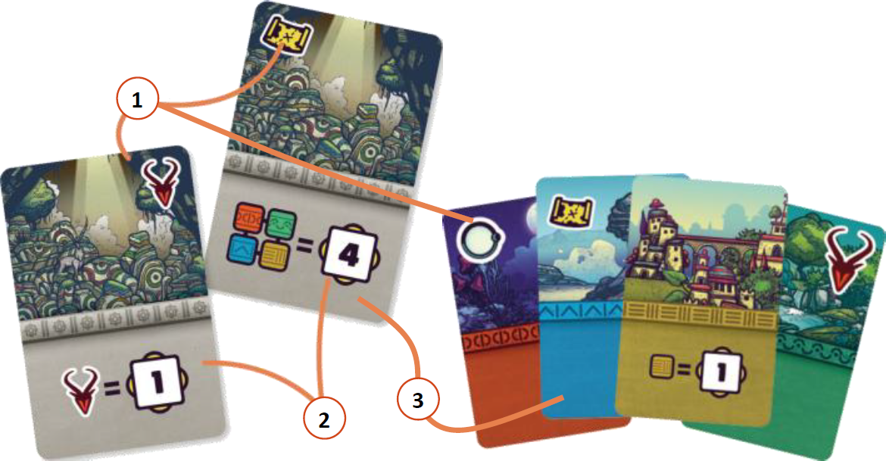
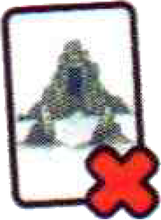
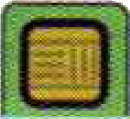
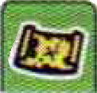

# Carte Regione

{.img-center}

| # | Elemento | Descrizione |
|:---:|:---|:---|
| **1**{.accent} | **Bioma** | Colore e fascia decorativa della carta (Deserto {.img-inline}, Foresta {.img-inline}, Fiume {.img-inline}, Città {.img-inline}, Rifugio Mistico {.img-inline}) |
| **2**{.accent} | **Durata di Esplorazione** | Quante ore (**da 1 a 68**) sono necessarie per esplorarla durante il **giorno** {.img-inline} o la **notte** {.img-inline} |
| **3**{.accent} | **Indizi** | Consentono l'accesso a **carte Santuario** |
| **4**{.accent} | **Punti Fama** | Ogni cittadino dà **1 Missione** che fornisce punti Fama a fine partita se si soddisfano i **Requisiti** |
| **5**{.accent} | **Risorse** | Pietre Uddu {.img-inline} (*minerale*), chimere Okiko {.img-inline} (*animale*), cardo Goldlog {.img-inline} (*vegetale*) |
| **6**{.accent} | **Requisiti** | **Risorse** richieste tra le carte Regione scoperte e/o le carte Santuario per ottenere i **punti Fama** della Missione |

> **Ricorda** che le pietre Uddu {.img-inline} sono più comuni delle chimere Okiko {.img-inline}, e le chimere Okiko {.img-inline} sono più comuni dei cardi Goldlog {.img-inline}.

Ad ogni **turno**, ogni giocatore gioca **1 carta Regione** dalla propria mano.

# Carte Santuario

{.img-center}

| # | Elemento | Descrizione |
|:---:|:---|:---|
| **1**{.accent} | **Bonus** | Impatto nel **corso della partita** (*Indizi*) oppure alla **fine** (*Risorse, Esplorazione di Notte*) |
| **2**{.accent} | **Missioni Secondarie** | Forniscono **punti Fama** aggiuntivi |
| **3**{.accent} | **Tipo di Regione** | Alcune carte sono collegate a un **Bioma** (colore e fascia decorativa), altre (*grige*) a nessun Bioma |

> **Ricorda** che ogni carta collegata a uno specifico tipo conta come **1 Regione di quel tipo** per la risoluzione delle Missioni e per il calcolo del punteggio.

Ogni volta che un giocatore trova **1 Santuario**, aggiunge la carta alla propria **area di gioco**.

# Punteggi

I **punti Fama** sono calcolati usando le **carte Regione** via via scoperte e le **carte Santuario**.

|   | Condizione | Punti Fama |
|---:|:---|:---:|
| {.img-inline} | Ogni icona **Indizio** visibile | 1 punto |
| {.img-inline} | Ogni icona **pietra Uddu** visibile | 2 punti |
| {.img-inline} | Ogni icona **cardo Goldlog** visibile | 3 punti |
| {.img-inline} | Ogni icona **chimera Okiko** visibile | 4 punti |
| {.img-inline} | Ogni carta **Città** {.img-inline} e ogni carta **Fiume** {.img-inline} | 2 punti |
| {.img-inline} | Ogni carta **Foresta** | 4 punti |
| {.img-inline} | Ogni set di **4 aree diverse** | 10 punti |
| {.img-inline} | Ogni carta **Esplorazione di Notte** | 4 punti |
| {.img-inline} | **Missione speciale** | 19 punti |
| {.img-inline} | ![puzzle]{.icon} Ogni carta **Rifugio Mistico** {.img-inline} | 5 punti |
| {.img-inline} | ![puzzle]{.icon} Ogni set di **3 risorse diverse** | 7 punti |
| {.img-inline} | ![puzzle]{.icon} Distruggi **1 Santuario** per ottenerne i punti | punti variabili |
| **2 x**{.accent} {.img-inline} | ![puzzle]{.icon} Distruggi **2 Santuari** per ottenerne i punti | punti variabili |
| **4 x**{.accent} {.img-inline} | ![puzzle]{.icon} **4+ carte Regione/Santuario Città** {.img-inline} per ottenerne i punti| punti variabili |
| **5 x**{.accent} {.img-inline} | ![puzzle]{.icon} **5+ Indizi** visibili per ottenerne i punti | punti variabili |
| **5 x**{.accent} {.img-inline} | ![puzzle]{.icon} **5+ carte Notte** per ottenerne i punti | punti variabili |

> **Ricorda** di rispettare i prerequisiti {.img-inline}.
> **Ricorda** anche che i Santuari distrutti {.img-inline} escono dal gioco.

Alcuni **Santuari** sono collegati ad una **Regione** (colore) e/o all'**Esplorazione di Notte**.
::: indent
Per i punti, **contano** come una Regione di quel tipo e/o come carta Esplorazione di Notte.
:::

