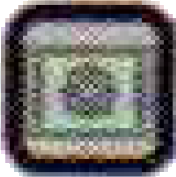
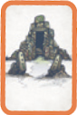

Mescola separatamente e poni al centro del tavolo le **[carte Regione]{.def}** e le **[carte Santuario]{.def}**.

Distribuisci ad ogni giocatore **3 carte Regione** come mano iniziale.

Rivela infine al centro del tavolo ***numero di giocatori*+1 carte Regione** a faccia in su.

> **Modalità Avanzata**: distribuisci ad ogni giocatore **5 carte Regione**, ognuno ne **sceglie 3** e scarta le altre 2. **Mischia** le carte scartate nel **mazzo Regione** e rivela ***numero di giocatori* carte Regione** (senza quella aggiuntiva).

---
---

# ![puzzle]{.icon} Popoli del Sottosuolo{.expansion}

Aggiungi le **nuove 9 carte Regione** e le **nuove 8 carte Santuario** ai rispettivi mazzi (potendo così giocare anche in **7 giocatori**).
:::indent
Viene aggiunto il **[Bioma]{.def}** {.img-inline} (già presente anche su alcune carte Santuario base).
:::

# ![puzzle]{.icon} Sotto Cieli Stellati{.expansion}

Aggiungi le **nuove 15 carte Regione Meteora** al mazzo Regione (hanno anche il **[Bioma]{.def}** {.img-inline}).

:::glossary
[carte Regione]: {.img-inline} Le carte principali del gioco, rappresentano luoghi da esplorare. Hanno Bioma, Durata di Esplorazione, Indizi, Risorse e Missioni con Requisiti.

[carte Santuario]: {.img-inline} Carte speciali ottenute trovando Santuari. Forniscono bonus durante la partita e punti Fama aggiuntivi a fine partita tramite Missioni Secondarie.

[Bioma]: Il colore e la fascia decorativa di una carta Regione (es. Città, Fiume, Foresta, Deserto, Rifugio Mistico). Determina il tipo di Regione per il punteggio e le Missioni. È presente anche sulle carte Santuario.
:::
