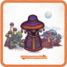

1. ![puzzle]{.icon} **[PdS]** Aggiungi le **9 carte Regione** e le **8 carte Santuario** ai rispettivi mazzi prima di mescolarli.
2. ![puzzle]{.icon} **[SCS]** Aggiungi le **15 carte Regione Meteora** al mazzo Regione prima di mescolarlo.
3. Mescola separatamente e poni al centro del tavolo le [carte Regione]{.def} e le [carte Santuario]{.def}.
4. Distribuisci ad ogni giocatore come mano iniziale:
    - **Modalità standard**: 3 carte Regione.
    - **Modalità avanzata**: 5 carte Regione, ognuno ne tiene 3 e scarta le altre 2 coperte nel mazzo Regione (*rimischialo*).   
5. Rivela al centro del tavolo a faccia in su:
    - **Modalità standard**: *giocatori*+1 carte Regione.
    - **Modalità avanzata**: *giocatori* carte Regione.

> **Obiettivo:** gioca **8 carte Regione** da sinistra a destra, poi risolvi ogni [Missione]{.def} da destra a sinistra per ottenere **punti Fama**. Chi ha **più punti** vince.

:::glossary
[carte Regione]: Le carte principali {.img-inline} del gioco. Ogni carta ha un Bioma, una Durata di Esplorazione, Indizi, Risorse e una Missione con eventuali Requisiti.

[carte Santuario]: Carte speciali {.img-inline} ottenute trovando Santuari. Forniscono bonus durante la partita e punti Fama aggiuntivi tramite Missioni Secondarie.

[Durata di Esplorazione]: Valore numerico unico (da 1 a 68) su ogni carta Regione. Bassa = più scelta nella fase 3; alta = accesso ai Santuari nella fase 2.

[Santuari]: Luoghi speciali trovati giocando una carta con Durata più alta della precedente. Fanno pescare carte Santuario.

[Missione]: Obiettivo del cittadino su una carta Regione. Se soddisfatti i Requisiti a fine partita, fornisce punti Fama.
:::
