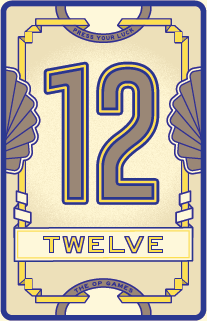
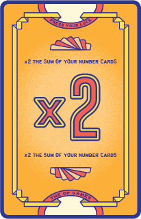
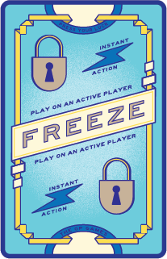
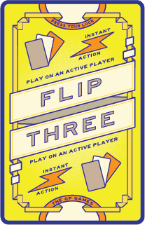
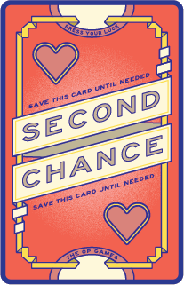

# {.img-inline} Carte Numero

Il loro valore determina il punteggio del round. Ci sono **12 carte 12**, **11 carte 11**, …, **1 carta 1** e **1 sola carta 0** (non vale punti ma conta ai fini del **[Flip 7]{.def}**).

# {.img-inline} Carte Modificatore

Non contano ai fini del **Flip 7** e non fanno **[sballare]{.def}**. Ognuna è presente in **singola copia** e modifica il punteggio finale del round:

| Carta | Effetto |
|-------|---------|
| **+2, +4, +6, +8, +10** | Aggiungono il loro valore alla somma delle carte Numero |
| **x2** | Raddoppia la somma delle carte Numero (applicata prima degli altri bonus) |

# {.img-inline} {.img-inline} {.img-inline} Carte Azione

Vengono giocate su un qualsiasi **giocatore ancora attivo** nel round, incluso sé stessi. Se si è gli unici giocatori attivi, si deve giocarla su sé stessi.

- **Freeze**{.accent}
:::indent
Il giocatore che la riceve deve **fermarsi** (mantiene i punti e non è più attivo).
:::

- **Flip Three**{.accent}
:::indent
Il giocatore che la riceve deve pescare le prossime **3 carte** una alla volta. Se pesca una **carta Freeze o Flip Three** la risolve dopo che ha pescato tutte e 3 le carte e solo se non ha sballato. Si ferma prima solo se **sballa** o completa il **Flip 7**.
:::

- **Second Chance**{.accent}
:::indent
Il giocatore che la pesca la tiene davanti a sé. Se pesca una **carta Numero duplicata**, scarta la Second Chance e il duplicato invece di sballare. In un round, un giocatore può avere **una sola Second Chance** alla volta: le successive deve giocarle su un giocatore attivo che non ne abbia alcuna (altrimenti vanno scartate).
:::

:::glossary
[Flip 7]: Condizione che si raggiunge quando un giocatore ha **7 carte Numero tutte di valore diverso** nella propria fila. Termina immediatamente il round e vale un bonus di **+15 punti**.

[sballare]: Condizione che si verifica quando un giocatore pesca una **carta Numero** con lo **stesso valore** di una già presente nella sua fila. Il giocatore è **fuori dal round** e **non ottiene punti**.
:::
