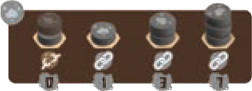
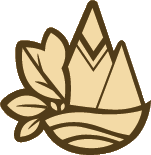
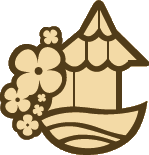
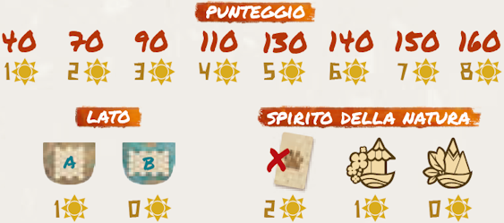

La partita **termina** in uno di questi modi:

- Quando è necessario rifornire la **plancia centrale**, ma il **sacchetto è vuoto**.
- Se alla fine del turno di un giocatore ci sono **2 caselle o meno non occupate** sulla sua **plancia giocatore**.

Se necessario, si **termina il round in corso** in modo che tutti i giocatori abbiano giocato lo stesso numero di turni.

Calcolate e sommate il punteggio per i **Paesaggi** che avete creato e per gli **Animali** che avete collocato (vedi la sezione *Calcolare il Punteggio*).

Il giocatore con il **maggior numero di punti** è il **vincitore**.

:::indent
In parità, chi ha collocato il maggior numero di **cubi Animale**.
In parità, **condividono** la vittoria.
:::

# Calcolare il Punteggio

## Punti dal Paesaggio

### Alberi{.accent}

{.img-center}

Un **Albero** è composto da **1 disco verde**, collocato sopra a **0, 1 o 2 dischi marroni**, per creare Alberi alti 1, 2 o 3 dischi.

L'**altezza di ogni Albero** determina il **numero di punti** ottenuti.

### Montagne{.accent}

{.img-center}

Una **Montagna** è composta da una pila di **1, 2 o 3 dischi grigi**.

L'**altezza di ogni Montagna** determina il **numero di punti** ottenuti.

> Una Montagna vale **0 punti** se non è adiacente a un'altra Montagna.

### Campi{.accent}

{.img-center}

Un **Campo** è composto da **2+ dischi gialli adiacenti** tra loro, facenti parte di un gruppo.

Ottieni **5 punti** per ogni Campo composto da 2 o più dischi gialli adiacenti (*crea piccoli gruppi separati tra loro per massimizzare il punteggio*).

### Edifici{.accent}

{.img-center}

Un **Edificio** è composto da **1 disco rosso**, collocato sopra a **1 disco marrone, grigio o rosso**.

Ottieni **5 punti** per ogni Edificio, ma solo se è circondato da 3+ dischi di colore diverso (tra i 6 disponibili, incluso il rosso). 

- Considera **solo** il disco in cima a ciascuna casella adiacente.

> Un Edificio vale **0 punti** se questa condizione non è soddisfatta.

### Acqua – Lato A: Fiume{.accent}

{.img-center}

Un **Fiume** è composto da una **serie di dischi blu consecutivi**.

La **lunghezza del Fiume** determina il **numero di punti** ottenuti: si conta il numero di dischi da un'estremità all'altra seguendo il **percorso più breve** (estremità incluse).

- Se il percorso contiene **7+ dischi** consecutivi, ottieni **4 punti** per ogni disco oltre il sesto.

> Ottieni punti solo per il **Fiume migliore**. 

### Acqua – Lato B: Isole{.accent}

{.img-center}

Ogni **casella o gruppo di caselle** separate tra loro da **dischi blu** forma un'**Isola**.

Ottieni **5 punti** per ogni Isola (hai sempre almeno 1 Isola, anche se non crei alcuna separazione usando i dischi blu).

## Punti dagli Animali e dagli Spiriti della Natura

### Carte Animali{.accent}

Per ogni **carta Animale** (completata o meno) ottieni il **numero di punti** indicato nello **spazio più in alto** che **non** contiene alcun **cubo Animale**.

> Una carta con **tutti i cubi** ancora su di essa vale **0 punti**. **Non** c'è alcuna penalità per la mancata rimozione da 1+ spazi (anche tutti).

### Carte Spirito della Natura{.accent}

Le carte **Spirito della Natura** sono trattate come le carte Animale.

Inoltre, alcune **carte Spirito della Natura** assegnano punti anche in base al **numero di Paesaggi** {.img-inline} o ai **gruppi di Paesaggi** {.img-inline} **collegati** (1 gruppo composto da 1 disco è considerato un Paesaggio isolato) sulla tua plancia giocatore.

---
---

# ![puzzle]{.icon} [Modalità Solitario]

Calcola e tieni traccia del **punteggio** ottenuto in base al **numero di soli** {.img-inline} seguendo la **tabella punteggi** in Panoramica.

{.img-center}
