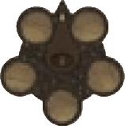
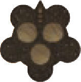
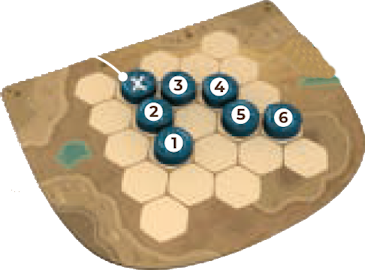
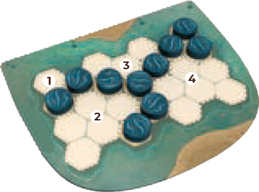
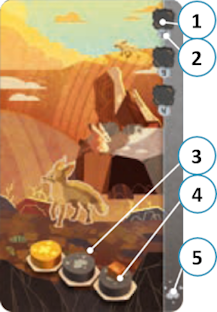

# Dischi

I **dischi** sono l'elemento base con cui costruisci il tuo **Paesaggio**: combinandoli e impilandoli secondo le regole di posizionamento, danno forma a **Montagne, Alberi, Edifici, Campi e Acqua**, e ricreano gli **Habitat** necessari per insediare gli **Animali**.

|   | Colore | Quantità |
|:---:|:---|:---:|
| {.img-inline} | **Dischi blu** | 23 |
| {.img-inline} | **Dischi grigi** | 23 |
| {.img-inline} | **Dischi marroni** | 21 |
| {.img-inline} | **Dischi verdi** | 19 |
| {.img-inline} | **Dischi gialli** | 19 |
| {.img-inline} | **Dischi rossi** | 15 |

# Plancia Centrale

La **plancia centrale** è divisa in **5 caselle** (3 caselle In Solitario), ciascuna rifornita con **3 dischi** pescati casualmente dal **sacchetto**.

Ha una **freccia** che identifica il **primo giocatore**.

| Modalità | Plancia Centrale |
|:---:|:---:|
| **2-4 giocatori** | {.img-inline-lg} |
| **Solitario** | {.img-inline-lg} |

Ogni giocatore, durante il proprio turno, preleva **3 dischi** da **1 casella qualsiasi** per poi collocarli sulla propria **plancia giocatore**.

# Plancia Giocatore

Ogni giocatore costruisce il proprio **Paesaggio** su una **plancia esagonale individuale**.

Le plance hanno **due lati** (**A** e **B**): tutti i giocatori devono usare lo stesso lato nella stessa partita. Il lato scelto influisce sul **conteggio dei punti** dell'**elemento Acqua**.

| Lato | Plancia Centrale |
|:---:|:---:|
| **Lato A: Fiume** | {.img-inline-lg} |
| **Lato B: Isole** | {.img-inline-lg} |

# Carta Animale

{.img-center}

Ogni **carta Animale** mostra:

| # | Elemento | Note |
|:---:|:---|:---|
| **1**{.accent} | **Spazi** | Su cui porre i cubi Animale, da riempire fino a quando non è possibile spostarli sulla propria plancia giocatore | 
| **2**{.accent} | **Punti** | Che la carta garantisce a fine partita |
| **3**{.accent} | **Modello** | Che i dischi devono comporre sulla plancia giocatore per creare l'Habitat richiesto |
| **4**{.accent} | **Casella esatta** | Su cui porre il cubo Animale all'interno dell'Habitat |
| **5**{.accent} | **Promemoria** | Del colore del disco su cui va posto ciascun cubo Animale |

> La **banda colorata** sul lato della carta indica il colore di disco coinvolto: evita di avere più carte che richiedono lo stesso colore contemporaneamente sopra la propria plancia.
