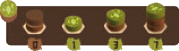
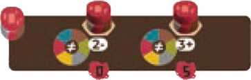
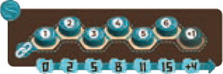
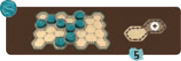

La partita termina quando si verifica una di queste condizioni:

- Il **sacchetto è vuoto** al momento di rifornire la plancia centrale.
- Alla fine del turno di un giocatore ci sono **2 caselle o meno non occupate** sulla sua plancia.

> Se necessario, **terminate il round** in corso affinché tutti abbiano giocato lo stesso numero di turni.

## Calcolo del Punteggio

*Punti dal Paesaggio*{.accent}

| Elemento | Come si calcola |
|:---:|:---|
| **[Alberi]{.def}** | In base all'altezza (dischi/punti = 1/1-2/3-3/7) |
| **[Montagne]{.def}** | In base all'altezza (dischi/punti = 1/1-2/3-3/7); 0 punti se isolata |
| **[Campi]{.def}** | 5 punti per ogni gruppo di 2+ dischi gialli adiacenti; 0 punti altrimenti |
| **[Edifici]{.def}** | 5 punti se circondato da 3+ dischi di colore diverso; 0 punti altrimenti |
| **[Fiume]{.def}** | Punti in base alla lunghezza del Fiume migliore (dischi/punti = 1/0-2/2-3/5-4/8-5/11-6/15-+1/+4 per ogni disco aggiuntivo) |
| **[Isole]{.def}** | 5 punti per ogni Isola (*hai sempre almeno 1 Isola*) |

*Punti dagli Animali e dagli Spiriti della Natura*{.accent}

| Elemento | Come si calcola |
|---|---|
| **Carte Animale** | Punti indicati nello spazio più in alto **senza** cubi sopra |
| ![puzzle]{.icon} **[SdN]** **Carte Spirito della Natura** | Come le carte Animale, più eventuali bonus da Paesaggi |

- Una carta con **tutti i cubi** ancora su di essa vale **0 punti**. Non c'è penalità per rimozioni parziali.
- ![puzzle]{.icon} **[SdN]** Le carte Spirito della Natura possono assegnare punti aggiuntivi in base al **numero di Paesaggi** o ai **gruppi di Paesaggi collegati** sulla tua plancia (1 gruppo da 1 disco = Paesaggio isolato).

## Vittoria e Spareggio

Il giocatore con il **maggior numero di punti** vince.

- In parità, chi ha collocato **più cubi Animale**.
- In ulteriore parità, la vittoria è **condivisa**.

:::glossary
[Alberi]: {.img-center} 1 disco verde sopra 0, 1 o 2 dischi marroni (altezza 1–3). L'altezza determina i punti.

[Montagne]: {.img-center} Pila di 1, 2 o 3 dischi grigi. Vale 0 punti se non adiacente a un'altra Montagna.

[Campi]: {.img-center} Gruppo di 2+ dischi gialli adiacenti. Ogni gruppo separato vale 5 punti.

[Edifici]: {.img-center} 1 disco rosso sopra 1 disco marrone, grigio o rosso. Vale 5 punti solo se circondato da 3+ dischi di colore diverso (considera il disco in cima a ciascuna casella adiacente).

[Fiume]: {.img-center} Serie di dischi blu consecutivi (lato A). Si misura sul percorso più breve tra le due estremità; vale solo il Fiume più lungo.

[Isole]: {.img-center} Casella o gruppo di caselle separate da dischi blu (lato B). Hai sempre almeno 1 Isola.
:::
