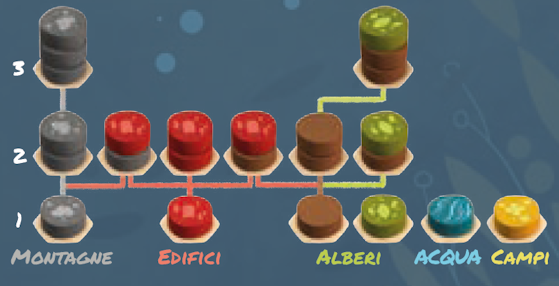

I giocatori si alternano in **turni** partendo dal **primo giocatore** e procedendo poi in **senso orario**. Al suo turno il giocatore esegue le **azioni** seguenti nell'**ordine che preferisce**.

| Azione | Tipo |
|---|---|
| **Prendere e collocare dischi** | *Obbligatorio*, 1 volta a turno |
| **Prendere 1 carta Animale** | *Facoltativo*, al più 1 volta a turno |
| **Collocare 1 cubo Animale** | *Facoltativo*, più volte a turno |

> **Ricorda** che le **azioni facoltative** possono essere svolte anche tra il posizionamento di **2 dischi diversi** durante l'azione obbligatoria.

All'inizio del **primo turno**, scegli e poni **1 [carta Spirito della Natura]{.def}** al di sopra della tua plancia giocatore (rimetti l'altra nella scatola) e poni **1 cubo Spirito della Natura** {.img-inline} su di essa.

Alla fine del proprio turno il giocatore:

- Pesca **3 dischi** dal **sacchetto** e rifornisce la **plancia centrale**.
- Se necessario, rifornisce la fila di **carte Animale** in modo che ce ne siano sempre **5 scoperte**.

# Prendere e Collocare Dischi

*Con questa azione poni i vari elementi e componi il tuo Paesaggio.*

Effettua questa azione **esattamente 1 volta** durante il tuo turno.

Prendi e poni **3 dischi** da **1 qualsiasi casella** della plancia centrale sulla tua **plancia giocatore** nel modo che preferisci, **uno alla volta**, seguendo le regole di posizionamento.

**Dopo** aver posto **1 disco**, puoi effettuare **azioni facoltative** prima di porre il successivo.

## Come Collocare un Disco

- Un disco può sempre essere collocato in **1 casella vuota**.
- Un disco può essere collocato **sopra 1 o 2 dischi collocati in precedenza**, per creare **Alberi**, **Edifici** o **Montagne**. **Non** è consentito impilarlo in nessun altro modo.
{.img-center}
- Un disco **non** può essere collocato **sotto dischi** già collocati in precedenza.
- Un disco **non** può essere collocato su una **casella occupata** da un **cubo Animale**.

# Prendere 1 Carta Animale

*Gli Animali sono rappresentati dalle carte Animale su cui è indicato l'Habitat da comporre nel tuo Paesaggio per porvi l'Animale.*

Questa azione è **facoltativa** e puoi effettuarla in qualsiasi momento nel tuo turno, ma **solo 1 volta per turno**.

1. Scegli e poni **1 carta Animale** tra le **5 scoperte** al di sopra della tua **plancia giocatore**. In quell'area puoi avere contemporaneamente fino a **4 carte** (compresa la **carta Spirito della Natura**).
2. Prendi dalla riserva **tanti cubi Animale** {.img-inline} quanti sono gli spazi da riempire sulla carta e poni **1 cubo** su ognuno di essi.

> **Prime partite**: è sconsigliato avere **più carte Animale** i cui cubi vadano collocati sullo stesso colore di disco. La **banda colorata** sul lato della carta è un promemoria di quel colore: cerca di scegliere Animali le cui bande siano di **colore diverso**.

# Collocare 1 Cubo Animale

*Gli Animali possono stabilirsi nel tuo Paesaggio una volta che hai ricreato il loro Habitat.*

Questa azione è **facoltativa** e puoi effettuarla in qualsiasi momento nel tuo turno e per **più volte** nel tuo turno.

Prendi e poni **1 cubo Animale** dallo spazio più in basso della **carta Animale** o della **carta Spirito della Natura** sul **disco** corrispondente dell'Habitat della tua plancia giocatore, se soddisfi i seguenti **requisiti**:

- Il **modello di Habitat** deve essere creato sulla tua **plancia giocatore** esattamente come **indicato sulla carta**, ma può essere orientato in **qualsiasi direzione**.
- **L'altezza degli Alberi e delle Montagne** deve corrispondere esattamente a quella **indicata sulla carta**.
- Il **disco** su cui deve essere collocato il **cubo Animale** all'interno dell'Habitat **non** deve essere occupato.
- Gli **Edifici** possono essere di **qualsiasi tipo** (il disco alla base può essere rosso, marrone o grigio).
- **Non** più di 1 cubo per casella.

> Un **singolo disco** può far parte contemporaneamente di **più Habitat diversi** (identici o differenti tra loro).

> Il posizionamento di ogni **cubo Animale** è **definitivo**, anche se l'Habitat inizialmente utilizzato per il suo posizionamento non è successivamente più presente sulla tua plancia giocatore.

Una volta collocato l'**ultimo cubo** di una **carta Animale** o di una **carta Spirito della Natura**, sposta quella carta accanto alla tua plancia giocatore: la carta è considerata **completata** e **non** conta più per il limite di 4 carte.

> Alla fine della partita, ogni **carta Animale** e **carta Spirito della Natura** ti fornisce punti vittoria.

---
---

# ![puzzle]{.icon} Modalità Solitario

Segui le **normali regole** del gioco base con le seguenti **differenze**.

Alla fine di ogni turno:

- Rimetti nella scatola i **6 dischi** rimanenti sulle caselle della plancia centrale (vengono **scartati**, non rimessi nel sacchetto), poi rifornisci ciascuna delle **3 caselle** con **3 dischi**.
- Se in questo turno **non** hai preso **una carta Animale**, puoi scartare **1 carta Animale** dal centro del tavolo e sostituirla con **1 nuova carta** dal mazzo di pesca.

:::glossary
[carta Spirito della Natura]: Carta opzionale che, come le carte Animale, fornisce punti a fine partita una volta che il relativo cubo viene posto sulla propria plancia giocatore.
:::
