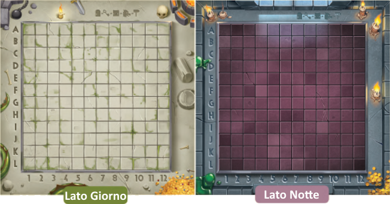

# Plancia

{.img-center}

Il **lato Giorno** viene usato nei livelli standard a 2 giocatori e in solitario, mentre il **lato Notte** viene usato nella modalità cooperativa e piano superiore (in solitario).

# Libretto dei Livelli

Il **[libretto dei livelli]{.def}** include due sezioni:

- **Modalità Avventura**: una campagna evolutiva di **50 sfide** da affrontare progressivamente, pensata per scoprire gradualmente gli aspetti del gioco.
  - **Livelli 1-28**: sono giocabili in solitaria o in modalità competitiva a 2 giocatori.
  - **Livelli 29-41**: sono giocabili in solitaria in modalità Piano Superiore.
  - **Livelli 42-50**: sono giocabili in modalità cooperativa a 2 giocatori.
- **Livelli Bonus**: offrono **80 sfide** aggiuntive.
  - **60 sfide**: classificate per difficoltà (facile, intermedio e difficile).
  - **20 sfide**: sono giocabili in solitaria in modalità Piano Superiore.

Ogni **riga del libretto** indica le **coordinate** su cui posizionare Porta, Chiave, Forziere, Mostro, Uscita e, quando richiesto, il numero esatto di tessere da utilizzare, le Buche e i Ponti.

> Usa l'**indicatore di progressione** {.img-inline} per segnare a che punto sei arrivato nella progressione dei livelli.

:::glossary
[libretto dei livelli]: Il libretto che indica le coordinate su cui posizionare i **Punti di Passaggio** per ciascun livello, ed eventuali condizioni speciali (numero di tessere, Buche, Ponti).
:::
