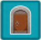
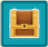
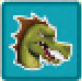
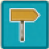

Ogni giocatore pone una **plancia lato Giorno** di fronte a sé e prende un **set di tessere Percorso** dello stesso colore (*verdi o blu*).

Poi pone le **tessere Punto di Passaggio** del proprio colore sulla propria plancia come indicato dal **livello scelto** (*in base alle coordinate*) nel **[libretto dei livelli]{.def}** (50 sfide progressive per la **modalità Avventura** e 80 divise per difficoltà come **Livelli Bonus**).

| Icona | Tessera |
|:---:|:---|
| {.img-inline} | **Porta** |
| {.img-inline} | **Chiave** |
| {.img-inline} | **Forziere** |
| {.img-inline} | **Mostro** |
| {.img-inline} | **Uscita** |

:::glossary
[libretto dei livelli]: Il libretto che indica le coordinate su cui posizionare i **Punti di Passaggio** per ciascun livello, ed eventuali condizioni speciali (numero di tessere, Buche, Ponti).
:::
