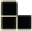
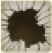

Al segnale di inizio la partita comincia. Si gioca **in [simultanea]{.def}**, senza attendere un proprio turno: tutti i giocatori posizionano le tessere **contemporaneamente**.

# Posizionare le Tessere

Dovete costruire il vostro **percorso** seguendo queste **regole**:

- Poni le **tessere Percorso** in sequenza.
- Le tessere devono collegarsi toccando solo **1 lato del quadrato** alle estremità della tessera.
- Il contatto tra gli **angoli** delle tessere **non** forma un percorso valido.
- Puoi **ruotare** e **ribaltare** le tessere Percorso.
- Puoi **modificare liberamente il percorso**, cioè rimuovere 1+ tessere già posizionate, per ottimizzare il percorso.

# Ordine di Passaggio

Dovete collegare le **tessere Punto di Passaggio esattamente** nell'ordine corretto:

1. {.img-inline} **Porta**.
2. {.img-inline} **Chiave**.
3. {.img-inline} **Forziere**.
4. {.img-inline} **Mostro**.
5. {.img-inline} **Uscita**.

Il livello è considerato **valido** se le **tessere Percorso** si collegano ai **Punti di Passaggio** toccandone **solo 1 lato** e poi proseguono con un'altra **tessera Percorso** da **1 solo altro lato**, senza che il percorso tocchi **nessun** altro punto nel mezzo.

La **Porta** e l'**Uscita** (*inizio e fine percorso*), devono essere collegate al percorso con 1 solo lato.

# Numero di Tessere

Quando il livello specifica un **numero esatto di tessere** {.img-inline} da usare, è **obbligatorio** trovare il percorso con precisione: **né** una tessera in più, **né** una in meno.

A volte sarà necessario ottimizzare il percorso per usarne il **minor numero possibile**, altre volte sarà invece necessario **allungarlo**.

# Ponti

Un **[Ponte]{.def}** ti consente di **attraversare il percorso in un singolo quadrato**.

Colloca una tessera Percorso su un lato di una **tessera Percorso** già posizionata, e un'altra **tessera Percorso** sul lato opposto **senza toccare ulteriori altre tessere**. Poni quindi il **Ponte** sul quadrato che viene attraversato.

> **Non** puoi collegare il Ponte alle tessere Punto di Passaggio **né** attraversarle. **Non** puoi usare il Ponte per attraversare le Buche.

Alcuni livelli richiedono l'uso di **1 o 2 Ponti**.

# Buche

Una **[Buca]{.def}** {.img-inline} **impedisce di attraversare** la casella su cui è posta, anche con un **Ponte**. È però consentito passarle accanto.

---
---

# Modalità Aggiuntive

Oltre alla **modalità standard** (in **solitario** o a **2 giocatori** sul lato **Giorno** delle plance), il gioco propone due varianti che utilizzano il lato **Notte** delle plance.

## Sfida Cooperativa

In questa variante, 2 giocatori **collaborano** per completare i propri percorsi **senza ostacolarsi** a vicenda.

Ogni giocatore ha un **set di tessere Percorso** ed una **plancia lato Notte** di fronte a sé.

- **Giocatore 1**: inizia con le coordinate A – L sulla propria plancia.
- **Giocatore 2**: inizia con le coordinate M – X sulla propria plancia.
- **Entrambi**: posizionano le **tessere Punto di Passaggio** e le **2 Scale** come indicato dal livello.

Si gioca in **simultanea**, collegando le **tessere Punto di Passaggio** del proprio colore in ordine, fino a raggiungere le **[Scale]{.def}** (toccando un solo lato e senza che il percorso proceda oltre).
:::indent
Una volta raggiunto entrambi le **Scale**, i giocatori si **scambiano le plance** e continuano il percorso, partendo da un solo lato delle Scale, fino a raggiungere la propria **Uscita**.

È permesso **comunicare**, ma **non** si può giocare al posto del compagno.
:::

> **Ricorda** che il percorso di un giocatore **non** può toccare lateralmente il percorso del compagno, a meno che non si utilizzi un **Ponte** e ciò sia consentito dal livello.

> Se il **livello risulta irrisolvibile**, i giocatori si scambiano nuovamente le plance e ricominciano.

## Modalità Piano Superiore (in solitario)

Poni la **scatola di gioco** senza coperchio davanti a te, con il lato che mostra la **scalinata** rivolto verso di te. Poni **una plancia** con le coordinate A – L dentro la scatola e l'**altra plancia** con le coordinate M – X sul tavolo (davanti alla scatola), entrambe **lato Notte**.

Hai a disposizione **un solo set di tessere Percorso**. Poni Porta, Chiave, Forziere, Mostro, Uscita e le **2 Scale** su entrambe le **plance**, secondo le **coordinate** del livello.

Per **passare da una plancia all'altra**, il percorso deve toccare un solo lato delle **Scale** su una plancia, poi continuare da un solo lato delle seconde **Scale** posizionate sull'altra plancia.

:::glossary
[simultanea]: Tutti i giocatori posizionano le proprie tessere nello stesso momento, senza attendere un turno.

[Ponte]: Tessera speciale che permette di attraversare il percorso in un singolo quadrato, collegando due tessere Percorso poste su lati opposti.

[Buca]: Casella che non può mai essere attraversata, nemmeno con un Ponte.

[Scale]: Punti di passaggio usati nella Sfida Cooperativa e nella Modalità Piano Superiore per collegare le due plance o scambiarsele tra giocatori.
:::
