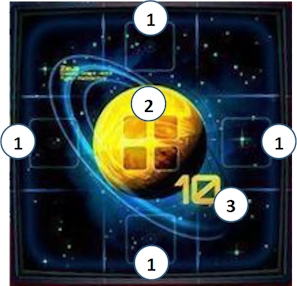
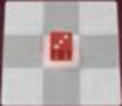
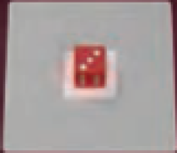
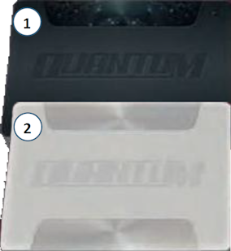

# Tessere Mappa

{.img-center}

Una **tessera Mappa** è composta dai seguenti elementi:

| # | Elemento | Descrizione |
|:---:|:---:|:---|
| **1**{.accent} | **Posizioni Orbitali** | Le 4 caselle a fianco non diagonali ad un pianeta |
| **2**{.accent} | **Posizioni dei Pianeti** | Spazi su cui porre i cubi Quantum |
| **3**{.accent} | **Valore del Pianeta** | Da raggiungere con i dadi nelle posizioni orbitali per porre 1 cubo Quantum |

# Dadi e Navi

Ogni **dado colorato** sulla mappa rappresenta una nave di un giocatore. Il numero sul dado indica sia il **movimento** (tante caselle fino al numero del dado) sia la **potenza in combattimento** (i numeri più bassi sono più potenti).

## Adiacenza

| | Termine | Caselle incluse |
|:---:|:---:|:---|
| {.img-inline-lg} | **"Di fianco"** | Caselle ortogonali (**non** diagonali) |
| {.img-inline-lg} | **"Circostanti"** | Caselle ortogonali **e** diagonali |

## Dadi Combattimento

Il **dado nero** viene usato per le armi in attacco, mentre il **dado bianco** viene usato in difesa.

# Cubi Quantum

I **cubi Quantum** sono estrattori di energia planetaria che fungono anche da **avamposti di schieramento** per la flotta di ogni giocatore.

# Carte Avanzamento

{.img-center}

Esistono 2 tipi di **carta Avanzamento**:

| # | Tipo | Descrizione |
|:---:|:---:|:---|
| **1**{.accent} | **Carte Azzardo** | Azioni audaci monouso con effetto immediato |
| **2**{.accent} | **Carte Comando** | Capacità permanenti con effetti duraturi |
