# Scelta della Mappa

Scegli direttamente o casualmente (con **2D6**, ritira se ottieni 12) una **[Mappa di Settore]{.def}** tra quelle disponibili in base al numero di giocatori (*2|3|4*) e disponi le **tessere Mappa** come indicato al centro del tavolo.

> **1ª partita:** scegli la mappa base.

## Mappe di Settore

| | Mappa |
|:---:|:---:
| {.img-inline} | Pianeta di partenza |
| {.img-inline} | Pianeta |

### Mappe per 2 giocatori{.accent}

:::accordion Mappa Base

### (2) Settore Alfa - **5 cubi** per giocatore{.accent}

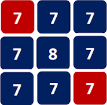{.img-center}

| Valore Pianeta | Quantità |
|:---:|:---:|
| **7** | 8 |
| **8** | 1 |

:::

:::accordion Mappe Avanzate

### (3) Ipotesi Nulla - **5 cubi** per giocatore{.accent}

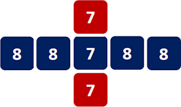{.img-center}

| Valore Pianeta | Quantità |
|:---:|:---:|
| **7** | 3 |
| **8** | 4 |

---

### (4) Complicazione - **5 cubi** per giocatore{.accent}

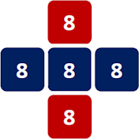{.img-center}

| Valore Pianeta | Quantità |
|:---:|:---:|
| **8** | 5 |

---

### (5) Falso Binario - **6 cubi** per giocatore{.accent}

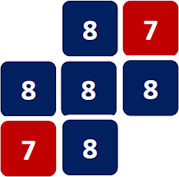{.img-center}

| Valore Pianeta | Quantità |
|:---:|:---:|
| **7** | 2 |
| **8** | 5 |

---

### (6) Parallasse - **6 cubi** per giocatore{.accent}

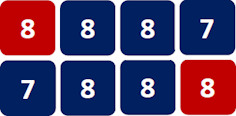{.img-center}

| Valore Pianeta | Quantità |
|:---:|:---:|
| **7** | 2 |
| **8** | 6 |

---

### (7) Logica Circolare - **6 cubi** per giocatore{.accent}

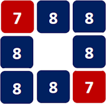{.img-center}

| Valore Pianeta | Quantità |
|:---:|:---:|
| **7** | 2 |
| **8** | 6 |

---

### (8) Funzione Onda - **6 cubi** per giocatore{.accent}

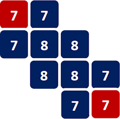{.img-center}

| Valore Pianeta | Quantità |
|:---:|:---:|
| **7** | 6 |
| **8** | 4 |

---

### (9) Terra Minor - **7 cubi** per giocatore{.accent}

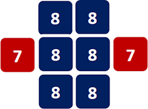{.img-center}

| Valore Pianeta | Quantità |
|:---:|:---:|
| **7** | 2 |
| **8** | 6 |

---

### (10) Terra Major - **7 cubi** per giocatore{.accent}

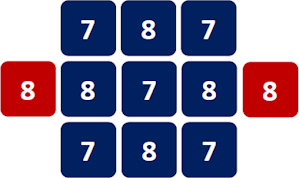{.img-center}

| Valore Pianeta | Quantità |
|:---:|:---:|
| **7** | 5 |
| **8** | 6 |

---

### (11) Materia e Antimateria - **7 cubi** per giocatore{.accent}

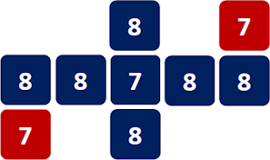{.img-center}

| Valore Pianeta | Quantità |
|:---:|:---:|
| **7** | 4 |
| **8** | 6 |

:::

### Mappe per 3 giocatori{.accent}

:::accordion Mappa Base

### (2) Settore Beta - **5 cubi** per giocatore{.accent}

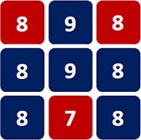{.img-center}

| Valore Pianeta | Quantità |
|:---:|:---:|
| **7** | 1 |
| **8** | 6 |
| **9** | 2 |

:::

:::accordion Mappe Avanzate

### (3) Cont. Spazio-Temporale - **5 cubi** per giocatore{.accent}

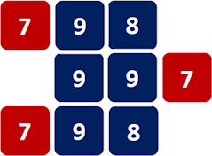{.img-center}

| Valore Pianeta | Quantità |
|:---:|:---:|
| **7** | 3 |
| **8** | 2 |
| **9** | 4 |

---

### (4) Densità Critica - **5 cubi** per giocatore{.accent}

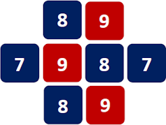{.img-center}

| Valore Pianeta | Quantità |
|:---:|:---:|
| **7** | 2 |
| **8** | 3 |
| **9** | 3 |

---

### (5) Costante Gravitazionale - **5 cubi** per giocatore{.accent}

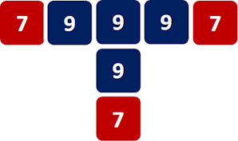{.img-center}

| Valore Pianeta | Quantità |
|:---:|:---:|
| **7** | 3 |
| **9** | 4 |

---

### (6) Teoria delle Stringhe - **5 cubi** per giocatore{.accent}

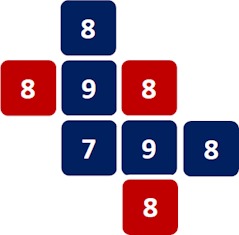{.img-center}

| Valore Pianeta | Quantità |
|:---:|:---:|
| **7** | 1 |
| **8** | 5 |
| **9** | 2 |

---

### (7) Origine del Pensiero - **6 cubi** per giocatore{.accent}

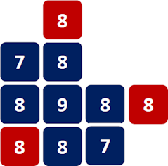{.img-center}

| Valore Pianeta | Quantità |
|:---:|:---:|
| **7** | 2 |
| **8** | 7 |
| **9** | 1 |

---

### (8) Equinozio - **6 cubi** per giocatore{.accent}

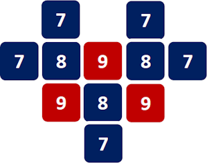{.img-center}

| Valore Pianeta | Quantità |
|:---:|:---:|
| **7** | 5 |
| **8** | 3 |
| **9** | 3 |

---

### (9) Ouroboros - **6 cubi** per giocatore{.accent}

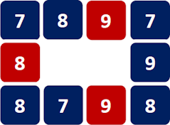{.img-center}

| Valore Pianeta | Quantità |
|:---:|:---:|
| **7** | 3 |
| **8** | 4 |
| **9** | 3 |

---

### (10) Propaggini Esterne - **7 cubi** per giocatore{.accent}

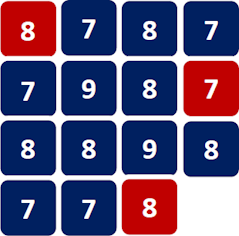{.img-center}

| Valore Pianeta | Quantità |
|:---:|:---:|
| **7** | 6 |
| **8** | 7 |
| **9** | 2 |

---

### (11) Fondazione - **7 cubi** per giocatore{.accent}

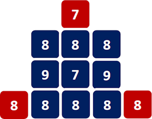{.img-center}

| Valore Pianeta | Quantità |
|:---:|:---:|
| **7** | 2 |
| **8** | 8 |
| **9** | 2 |

:::

### Mappe per 4 giocatori{.accent}

:::accordion Mappa Base

### (2) Settore Gamma - **5 cubi** per giocatore{.accent}

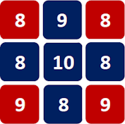{.img-center}

| Valore Pianeta | Quantità |
|:---:|:---:|
| **8** | 5 |
| **9** | 3 |
| **10** | 1 |

:::

:::accordion Mappe Avanzate

### (3) Singolarità - **4 cubi** per giocatore{.accent}

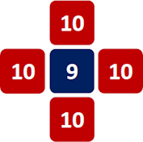{.img-center}

| Valore Pianeta | Quantità |
|:---:|:---:|
| **9** | 1 |
| **10** | 4 |

---

### (4) Nexus - **6 cubi** per giocatore{.accent}

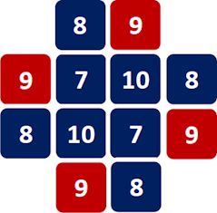{.img-center}

| Valore Pianeta | Quantità |
|:---:|:---:|
| **7** | 2 |
| **8** | 4 |
| **9** | 4 |
| **10** | 2 |

---

### (5) Nebulosa Spirale - **6 cubi** per giocatore{.accent}

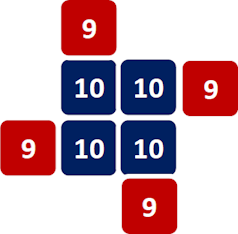{.img-center}

| Valore Pianeta | Quantità |
|:---:|:---:|
| **9** | 4 |
| **10** | 4 |

---

### (6) Tesseract - **6 cubi** per giocatore{.accent}

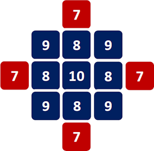{.img-center}

| Valore Pianeta | Quantità |
|:---:|:---:|
| **7** | 4 |
| **8** | 4 |
| **9** | 4 |
| **10** | 1 |

---

### (7) Rotazione Galattica - **6 cubi** per giocatore{.accent}

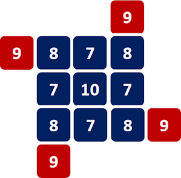{.img-center}

| Valore Pianeta | Quantità |
|:---:|:---:|
| **7** | 4 |
| **8** | 4 |
| **9** | 4 |
| **10** | 1 |

---

### (8) Il Grande Firmamento - **6 cubi** per giocatore{.accent}

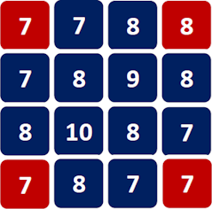{.img-center}

| Valore Pianeta | Quantità |
|:---:|:---:|
| **7** | 7 |
| **8** | 7 |
| **9** | 1 |
| **10** | 1 |

---

### (9) Orizzonte degli Eventi - **6 cubi** per giocatore{.accent}

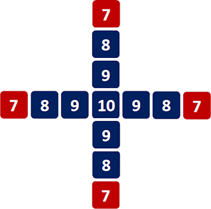{.img-center}

| Valore Pianeta | Quantità |
|:---:|:---:|
| **7** | 4 |
| **8** | 4 |
| **9** | 4 |
| **10** | 1 |

---

### (10) Nodo di Gordio - **7 cubi** per giocatore{.accent}

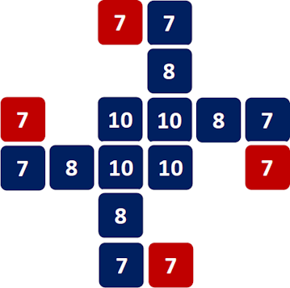{.img-center}

| Valore Pianeta | Quantità |
|:---:|:---:|
| **7** | 8 |
| **8** | 4 |
| **10** | 4 |

---

### (11) Impero Spoglio - **7 cubi** per giocatore{.accent}

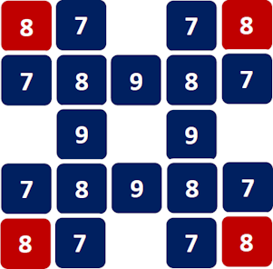{.img-center}

| Valore Pianeta | Quantità |
|:---:|:---:|
| **7** | 8 |
| **8** | 8 |
| **9** | 4 |

:::

## ![puzzle]{.icon} Mappe di Settore - The Void

Scegli direttamente o casualmente (con **1D6**, se col primo tiro avevi ottenuto 12, ritira se ottieni 1 o 6) una **Mappa di Settore con Void** tra quelle disponibili in base al numero di giocatori (*2|3|4*) e disponi le **tessere Mappa** come indicato al centro del tavolo.

| | Mappa |
|:---:|:---:
| {.img-inline} | Pianeta di partenza |
| {.img-inline} | Pianeta |
| {.img-inline} | The Void |

:::accordion Mappe per 2 Giocatori

### (2) Assiomatico - **5 cubi** per giocatore{.accent}

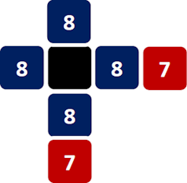{.img-center}

| Valore Pianeta | Quantità |
|:---:|:---:|
| **7** | 2 |
| **8** | 4 |

---

### (3) Da Polvere a Polvere - **6 cubi** per giocatore{.accent}

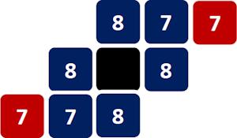{.img-center}

| Valore Pianeta | Quantità |
|:---:|:---:|
| **7** | 4 |
| **8** | 4 |

---

### (4) Asintoto - **6 cubi** per giocatore{.accent}

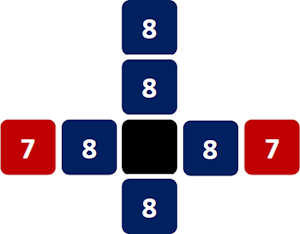{.img-center}

| Valore Pianeta | Quantità |
|:---:|:---:|
| **7** | 2 |
| **8** | 5 |

---

### (5) Il Grande Piano - **7 cubi** per giocatore{.accent}

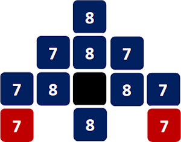{.img-center}

| Valore Pianeta | Quantità |
|:---:|:---:|
| **7** | 6 |
| **8** | 5 |

:::

:::accordion Mapper per 3 Giocatori

### (2) Punto di Svolta - **5 cubi** per giocatore{.accent}

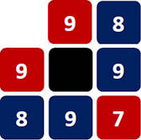{.img-center}

| Valore Pianeta | Quantità |
|:---:|:---:|
| **7** | 1 |
| **8** | 2 |
| **9** | 4 |

---

### (3) Dilemma - **6 cubi** per giocatore{.accent}

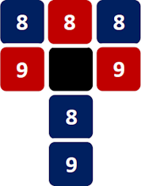{.img-center}

| Valore Pianeta | Quantità |
|:---:|:---:|
| **8** | 4 |
| **9** | 3 |

---

### (4) Il Centro Vuoto - **6 cubi** per giocatore{.accent}

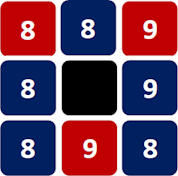{.img-center}

| Valore Pianeta | Quantità |
|:---:|:---:|
| **8** | 5 |
| **9** | 3 |

---

### (5) Il Limite dell’Oblio - **7 cubi** per giocatore{.accent}

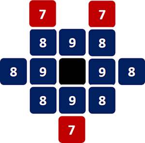{.img-center}

| Valore Pianeta | Quantità |
|:---:|:---:|
| **7** | 3 |
| **8** | 6 |
| **9** | 4 |

:::

:::accordion Mapper per 4 Giocatori

### (2) Supercollisore - **5 cubi** per giocatore{.accent}

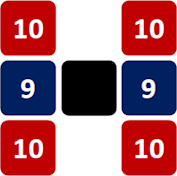{.img-center}

| Valore Pianeta | Quantità |
|:---:|:---:|
| **9** | 2 |
| **10** | 4 |

---

### (3) Moto Browniano - **6 cubi** per giocatore{.accent}

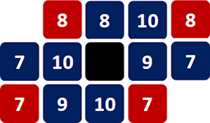{.img-center}

| Valore Pianeta | Quantità |
|:---:|:---:|
| **7** | 4 |
| **8** | 3 |
| **9** | 2 |
| **10** | 3 |

---

### (4) Effetto Doppler - **7 cubi** per giocatore{.accent}

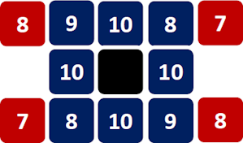{.img-center}

| Valore Pianeta | Quantità |
|:---:|:---:|
| **7** | 2 |
| **8** | 4 |
| **9** | 2 |
| **10** | 4 |

---

### (5) Elica - **7 cubi** per giocatore{.accent}

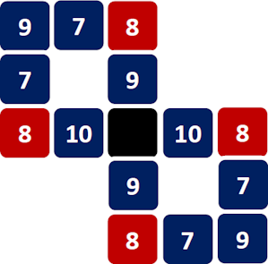{.img-center}

| Valore Pianeta | Quantità |
|:---:|:---:|
| **7** | 4 |
| **8** | 4 |
| **9** | 4 |
| **10** | 2 |

:::

## Mappe di Settore - Personalizzate

Crea una **mappa personalizzata** seguendo le indicazioni qui di seguito.

:::accordion Mappe di Settore - Personalizzate

### Numero di Cubi Quantum{.accent}

Più **cubi Quantum** devono essere collocati, più lunga è la partita.

- **4 cubi** rappresentano una veloce schermaglia, ..., mentre
- **7 cubi** rappresentano un conflitto epico.

### Combattimento contro Esplorazione{.accent}

La **dimensione** e la **conformazione** della mappa influiscono sullo stile di gioco.

- Mappe **più piccole**, con più posizioni centrali o meno posizioni per collocare cubi, incoraggiano i **combattimenti**.
- Mappe **più estese**, con pianeti di alto valore ai bordi o più posizioni per collocare cubi, incoraggiano il **movimento e l'esplorazione**.

Un **numero medio di posizioni totali** può essere pari al numero di giocatori più il numero totale di cubi Quantum nella partita.

- Se superiore, dai origine ad una mappa **più esplorativa**.
- Se inferiore, dai origine ad una mappa **più combattiva**.

### Compenetrazione Quantum{.accent}

Dovresti evitare la **[compenetrazione Quantum]{.def}** — ovvero che un giocatore debba collocare più di un suo cubo sullo stesso pianeta — seguendo questi passi:

- Poni i **cubi Quantum** nelle posizioni di partenza come se stessi preparando il gioco.
- Poni **tutti -1 cubi Quantum** di un colore su pianeti diversi, partendo da quelli con meno posizioni disponibili.
- Ripeti il passaggio precedente per **tutti i colori**, uno alla volta, in base al numero di giocatori previsti dalla mappa.
- Assicurati ora che ci siano **1+ posizioni libere** per porre l'ultimo cubo Quantum rimanente di ogni colore.

Per risolvere una **compenetrazione Quantum** puoi aumentare le posizioni aggiungendo **altri pianeti** o incrementando il **valore dei pianeti** già presenti.

> Puoi comunque anche decidere di **mantenerla**, poiché può portare ad interessanti strategie finali.

:::

# Schede e Componenti Personali

Ogni giocatore sceglie una **Scheda Comando** e prende **7 dadi** e **5|6|7 cubi Quantum** (*per mappa base|avanzata*) del colore corrispondente.

- Pone **1 dado** sulla **casella Ricerca** con il valore "1" in alto.
- Pone **1 dado** sulla **casella Dominio** con il valore "1" in alto.
- Pone **2 dadi** accanto alla Scheda Comando come **navi di espansione**.
- Tira i **3 dadi rimanenti** come navi di partenza (puoi ripetere il tiro di tutti i dadi 1 ed 1 sola volta).
- Poi pone i **cubi Quantum** nel riquadro cubi Quantum.

# Determinare il Primo Giocatore

Il **primo giocatore** è quello con il **punteggio più basso** come somma dei valori delle proprie navi di partenza.
- In parità, spareggia con il lancio di un **dado di combattimento**.

# Collocamento Iniziale

Partendo dal **primo giocatore** e procedendo in senso orario:

1. Ogni giocatore colloca **1 cubo Quantum** su una delle posizioni dei **pianeti di partenza** indicati dalla mappa scelta.
2. Poi, sempre in ordine di turno, ogni giocatore pone le **3 navi di partenza** in **3 posizioni orbitali** del proprio pianeta di partenza.

# Carte e Dadi

Mescola e poni separatamente e coperte le **carte Azzardo** e le **carte Comando** accanto alla mappa.
- Forma **due file di 3 carte scoperte** rispettivamente da ciascuno dei 2 mazzi.

Poni i **2 dadi di combattimento** accanto alla mappa.

:::glossary
[Mappa di Settore]: L'area di gioco composta da tessere Mappa disposte al centro del tavolo. Determina la conformazione dello spazio in cui si svolge la partita.

[posizioni orbitali]: Le 4 caselle ortogonali (non diagonali) adiacenti a un pianeta. Sono le uniche posizioni dove le navi possono costruire cubi Quantum.

[navi di espansione]: Le 2 navi aggiuntive per giocatore, inizialmente fuori dalla mappa. Entrano in gioco solo tramite la carta Azzardo Espansione.

[compenetrazione Quantum]: Situazione in cui un giocatore deve collocare più di un suo cubo Quantum sullo stesso pianeta. Il valore del pianeta aumenta di 3 per questa costruzione.
:::
