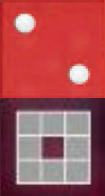

I giocatori si alternano in **senso orario** partendo dal primo giocatore. In ogni turno segui le 2 fasi nell'ordine indicato:

- ![puzzle]{.icon} **[TV]** *Prima della Fase 1:* per ogni tua nave sulla **[tessera Mappa del Vuoto]{.def}**, ottieni **+1 [dado Ricerca]{.def}**, senza spendere azioni né capacità speciali. Le navi coinvolte agiscono normalmente nel turno.

## Fase 1 — Azioni

Esegui fino a **3 azioni** tra le 5 disponibili. Puoi scegliere la **stessa azione più volte**. Le azioni non usate **non** si conservano.

In aggiunta, per ogni nave puoi usare **1 volta** la sua **[capacità speciale]{.def}** (**non** consuma azioni).

> Ogni nave può **muovere/attaccare 1 sola volta** per turno e usare la sua capacità speciale **1 sola volta** per turno, anche se il suo numero cambia durante il turno.

*1. Riconfigurazione*{.accent}

1. Tira il dado di **1 tua nave** sulla mappa o nel **[cimitero delle astronavi]{.def}**.
2. Ripeti finché non ottieni un **numero diverso** da quello attuale.

*2. Schieramento*{.accent}

1. Prendi **1 nave** dal tuo **cimitero delle astronavi**.
2. Ponila in una **posizione orbitale vuota** di un pianeta con un tuo **cubo Quantum** (**non** conta come movimento).

> **Non** puoi schierare le **navi di espansione** finché non le ottieni con una **carta Azzardo Espansione**.

*3. Movimento/Attacco*{.accent}

**Movimento:**

1. Muovi **1 nave** fino al numero di caselle indicato dal suo dado (puoi cambiare direzione liberamente).
   - Solo caselle **a fianco** (ortogonali), mai in diagonale.
   - **Non** puoi attraversare pianeti, passarci sopra o attraversare altre navi.
   - Devi terminare su una **casella vuota**, a meno di effettuare un attacco.

**Attacco** *(parte del movimento — risolto quando termini su una nave nemica)*:

1. Termina il movimento sulla casella della **nave nemica** (*poni la tua nave a metà tra le 2 caselle*). Entrare in una casella nemica costa **1 movimento**. Dopo l'attacco il movimento termina.
2. L'attaccante tira il **dado nero** (*armi*); il difensore tira il **dado bianco** (*difesa*).
3. Ognuno somma al risultato il **numero del dado della propria nave**.
4. **L'attaccante vince se il suo totale è ≤ a quello del difensore.**

:::indent
*In caso di **successo** — nave del difensore distrutta:*
- **Difensore:** tira il dado e pone la nave nel suo **cimitero delle astronavi**. Diminuisce di **1** il suo **[dado Dominio]{.def}** (minimo "1").
- **Attaccante:** sceglie se avanzare nella casella del difensore o tornare a quella di partenza. Aumenta di **1** il suo **dado Dominio** (massimo "6").

*In caso di **insuccesso** — attacco respinto:*
- **Attaccante:** torna nella casella di partenza. Non perde punti.
- **Difensore:** rimane illeso. Non guadagna punti.
:::

*Dominio*{.accent} — Se il tuo **dado Dominio** raggiunge "6":

1. Poni **immediatamente 1 cubo Quantum** su un pianeta senza tuoi cubi (posizione libera). Se tutti i pianeti hanno già un tuo cubo, scegli un pianeta qualsiasi.
   - **Non** serve una nave adiacente. **Non** puoi aspettare la fine del turno.
2. Riporta il **dado Dominio a "1"** (*può aumentare ancora nello stesso turno*).

> Nella **Fase 2** puoi acquisire **1 carta Avanzamento** per ogni cubo Quantum così collocato.

*4. Costruzione*{.accent}

Costa **2 azioni**.

1. Verifica che le tue navi nelle **posizioni orbitali** attorno al pianeta scelto sommino esattamente al suo **valore** — navi diagonali e navi nemiche **non** contano.
2. Costruisci **1 cubo Quantum** su quel pianeta (senza un tuo cubo esistente).
   - Se tutti i pianeti hanno già un tuo cubo: puoi costruire ovunque — **[compenetrazione Quantum]{.def}** — ma devi raggiungere il **valore del pianeta +3**.

> Nella **Fase 2** puoi acquisire **1 carta Avanzamento** per ogni cubo Quantum così collocato.

*5. Ricerca*{.accent}

1. Aggiungi **+1 al dado Ricerca** (massimo "6"; se superi "6" è perso).

> Se raggiunge "6", nella **Fase 2** puoi acquisire **1 carta Avanzamento**.

*Capacità delle Navi*{.accent}

Ogni nave ha 1 capacità speciale usabile **1 volta per turno** (**non** consuma azioni). **Non** disponibile per navi nel cimitero.

| | Nave | Capacità |
|:---:|:---:|:---|
| {.img-inline-lg} | **Stazione da Battaglia** | **Colpo:** risolvi 1 movimento/attacco gratuito di 1 casella a fianco; deve terminare in un attacco. Usabile nello stesso turno in cui hai già mosso/attaccato. |
| {.img-inline-lg} | **Nave Ammiraglia** | **Trasporto:** imbarca 1 nave alleata adiacente; muovi 1–2 caselle senza attaccare; sbarca la nave in una casella vuota circostante. La nave imbarcata può poi muovere/attaccare normalmente. |
| {.img-inline-lg} | **Distruttore** | **Warp:** scambia di posto con 1 nave alleata in qualsiasi casella della mappa. Non conta come movimento. |
| {.img-inline-lg} | **Fregata** | **Modifica:** cambia il numero della nave in "3" o "5". Non nel mezzo del movimento. La nuova capacità non è usabile nello stesso turno. |
| {.img-inline-lg} | **Intercettore** | **Manovra:** durante il movimento puoi attaccare in qualsiasi casella circostante (anche diagonalmente). |
| {.img-inline-lg} | **Ricognitore** | **Riconfigurazione Gratuita:** esegui 1 riconfigurazione gratuita ripetendo finché non ottieni un numero diverso da "6". |

## Fase 2 — Carte Avanzamento

Puoi prendere **1+ carte Avanzamento** (**Azzardo o Comando**) tra quelle scoperte:

- **1 carta** se il tuo **dado Ricerca** ha raggiunto "6": riporta subito il dado a "1".
- **1 carta** per ogni **cubo Quantum** collocato sulla mappa in questo turno.

Ogni carta presa va **rimpiazzata subito** con una nuova dello stesso tipo. Se il mazzo finisce, rimescola gli scarti.

In alternativa a prendere 1 carta puoi **scartare tutte e 6 le carte scoperte** e rivelarne 6 nuove.

*Carte Azzardo*{.accent}

Risolvi subito gli effetti, poi scartala.

> La **carta Azzardo Espansione** è l'unico modo per portare in gioco le **navi di espansione**. Una volta entrambe in gioco, non puoi più usare altre carte Espansione.

*Carte Comando*{.accent}

Ponila a destra della tua Scheda Comando. I suoi effetti si attivano dal turno successivo ogni volta che si verifica la condizione d'uso.

> Massimo **3 carte Comando**: se ne hai già 3, scartane una prima di prendere la nuova.

---

## Fine Turno

**Termina il turno.** Passa la mano al giocatore alla tua sinistra.

:::glossary
[tessera Mappa del Vuoto]: Tessera speciale dell'espansione The Void. Ogni nave su di essa genera +1 Ricerca all'inizio del turno del suo proprietario.

[dado Ricerca]: Traccia il progresso tecnologico. Raggiunto "6" permette di prendere 1 carta Avanzamento nella Fase 2, poi torna a "1".

[capacità speciale]: Abilità unica di ogni tipo di nave. Usabile 1 volta per turno senza consumare azioni. Non disponibile nel cimitero delle astronavi.

[cimitero delle astronavi]: Area sulla Scheda Comando per le navi distrutte o non ancora schierate.

[dado Dominio]: Traccia il dominio militare. Raggiunto "6" si colloca subito 1 cubo Quantum e il dado torna a "1".

[compenetrazione Quantum]: Costruire un cubo su un pianeta dove se ne ha già uno. Il valore del pianeta aumenta di +3 per questa costruzione.
:::
