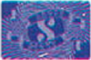
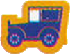

# Preparazione degli Elementi Comuni

Decidete casualmente il **primo giocatore** che prende il **segnalino Primo Giocatore** {.img-inline}.

Mescola il **mazzo di gioco** dopo aver rimosso il seguente numero di carte:

| Giocatori | Carte da rimuovere |
|:---:|:---|
| **2 o 4** | La carta che mostra sia "**9**" che "**10**" (1 carta) |
| **3** | Tutte le carte con il valore "**10**" (9 carte) |
| **5** | Nessuna carta (usa il mazzo completo) |

Poni tutti i **segnalini Scout** {.img-inline} (sono intesi come **illimitati**, *se li termini usa altro*) e tutti i **segnalini Punteggio** ({.img-inline}, {.img-inline}) al centro del tavolo in una **riserva** comune.

Poi distribuisci **1 segnalino Scout & Show** {.img-inline} ad ogni giocatore (*rimetti nella scatola quelli in eccesso*).

# Preparazione del Round

Mescolate `accuratamente` le **carte** e distribuiscile **coperte** ad ogni giocatore in base al **numero dei giocatori**:

| Giocatori | Carte per giocatore |
|:---:|:---:|
| **3** | 12 |
| **4** | 11 |
| **5** | 9 |

> **Non** prendere le carte in mano finché non sono state distribuite tutte le carte.

Prendi le carte **senza riordinarle** e tienile in mano in modo che il **numero grande in alto a sinistra** sia visibile solo a te. Questa disposizione costituisce la tua mano.

Solo **all’inizio di ogni round** puoi cambiare l’orientamento (sopra/sotto) di tutte le carte contemporaneamente. **Durante il round** non è più possibile farlo.

> **Non** puoi mai riorganizzare (da sinistra a destra) le carte in mano.
