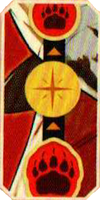
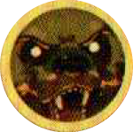

*Il Berserkorso*

| Complessità | Stile | Caratteristica |
|---|---|---|
| ●●○○○ | Danni Elevati | Trasformazione |

# Preparazione

La plancia combattente di Bödvar è a due lati:
- Poni la plancia Combattente con il lato **Bödvar** a **faccia in su**.
- Poni **1 indicatore Speciale** {.img-inline} sulla casella più in basso del **[tracciato Furia]{.def}** {.img-inline}.

# Stile di Gioco

## Carte Speciali

Alcune carte di Bödvar hanno **2 sezioni**: 
- Una utilizzata quando la sua plancia Combattente è sul lato **Bödvar**.
- L'altra quando è sul lato **Orso Berserker**.

Usa solo gli effetti della **sezione corrispondente** al lato a faccia in su della plancia Combattente.

## Tracciato Furia

{.img-center}

Quando giochi una carta che aumenta la **furia** {.img-inline}, fai salire il segnalino Speciale di **1 casella** sul tracciato Furia.

## {.img-inline-lg} Trasformazione

Quando l'indicatore Speciale raggiunge la **casella più in alto**, applicane l'effetto (**+3 cubetti Potere**) e poi gira la plancia Combattente sul lato **Orso Berserker**.

> Nel turno in cui Bödvar si trasforma, ignora **TUTTE** le **perdite di PF** e le **cure** da qualsiasi fonte.

Qualsiasi **segnalino assegnato** a Bödvar (come i segnalini concentrazione di Wong Fei-Hung o quelli fiamma di Shango) va trasferito sull'**Orso Berserker**.

### **L'Orso Berserker**{.accent}

I **PF iniziali** dell'Orso Berserker sono pari al suo **Potere** quando la sua plancia Combattente viene girata.
:::indent
Conta i suoi **cubetti Potere** e colloca l'**indicatore Salute** sulla casella corrispondente del** tracciato Salute**.
L'Orso Berserker conserva tutti i **cubetti Potere** di Bödvar, ma **devi** ignorare ogni cubetto potere oltre il **15°** quando collochi il suo indicatore Salute.
:::

> **Nota:** Questi sono i PF iniziali dell'Orso Berserker, **non** i suoi PF massimi. Può curarsi fino ad avere 15 PF.

# Dettagli di Gioco

- Se **Bödvar**{.accent} subisce **danni diretti** quando gioca *Trance Spiritica*, la carta **non** innesca i danni diretti aggiuntivi: solo un attacco innesca quell'effetto.
- Se invece il **partner** di **Bödvar**{.accent} viene attaccato mentre **Bödvar**{.accent} gioca *Trance Spiritica*, **Bödvar**{.accent} **non** subisce i 2 danni indiretti: li subisce solo se è lui stesso a venire attaccato.

:::glossary
[tracciato furia]: Il tracciato speciale di Bödvar. Avanza quando vengono giocate carte che aumentano la furia; al raggiungimento della casella più alta applica un bonus di potere e innesca la trasformazione in Orso Berserker.
:::
