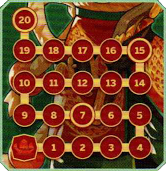

*La Regina Pirata*

| Complessità | Stile | Caratteristica |
|---|---|---|
| ●●●○○ | Travolgente | Versatile |

# Preparazione

Poni **1 indicatore Speciale** {.img-inline} sulla casella **nave** {.img-inline} del **[tracciato Flotta]{.def}**.

# Stile di Gioco

## Tracciato Flotta

{.img-center}

Quando Ching Shih ottiene delle **navi** {.img-inline}, fai avanzare l'**indicatore Speciale** sul **tracciato Flotta** di un pari ammontare di caselle.

> **Ignora** eventuali navi ottenute dopo che l'indicatore ha raggiunto la casella **20**. Il **numero di navi** sul tracciato Flotta influisce su alcune carte di Ching Shih.

# Dettagli di Gioco

## Effetto "20 Navi" di Terrore dei Mari

- L'effetto *20 navi di Terrore dei Mari* innesca le icone del tracciato salute, perché si tratta di **danni diretti** e quindi anche **non** parabili.
- Se un combattente come il **Popolo Fatato**{.accent} ha 2+ tracciati Salute, l'effetto **non** li riduce tutti a 1 PF: viene ridotto a 1 PF solo il tracciato Salute attualmente attivo.
- Se **Maman Brijit**{.accent} gioca *Rum al Peperoncino* nello stesso turno in cui **Ching Shih**{.accent} attiva l'**effetto 20 navi**, **Maman Brijit**{.accent} riduce i suoi PF a 1 e attacca **Ching Shih**{.accent}, ma **non** subisce il danno diretto che avrebbe altrimenti dovuto subire.
- Se invece **Milady**{.accent} scatena nello stesso turno la *congiura* che infligge **1 danno diretto** a tutti i combattenti, **Milady**{.accent} **e il suo partner** ignorano quel danno diretto, mentre **Ching Shih**{.accent} **e il suo partner** lo subiscono entrambi; in questa stessa situazione, la *congiura di Milady* che cura il partner viene invece ignorata.

:::glossary
[tracciato Flotta]: Il tracciato speciale di Ching Shih. L'indicatore avanza di tante caselle quante navi vengono ottenute, fino a un massimo della casella 20. Alcune carte di Ching Shih hanno effetti che dipendono dalla posizione dell'indicatore sul tracciato.
:::
