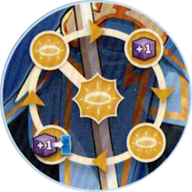

*Lo Scudo Divino*

| Complessità | Stile | Caratteristica |
|---|---|---|
| ●○○○○ | Supporto | Versatile |

# Preparazione

Poni **1 indicatore speciale** {.img-inline} sulla casella **aureola** centrale del **[tracciato Voce Divina]{.def}**.

# Stile di Gioco

## Tracciato Voce Divina

{.img-center}

Quando Jeanne ottiene una **Voce Divina** {.img-inline}, sposta l'indicatore speciale di **1 casella in senso orario** sul tracciato.

- Quando l'indicatore speciale raggiunge la casella **in alto a destra**, Jeanne ottiene **1 potere**.
- Quando l'indicatore speciale raggiunge la casella **in basso a sinistra**, il suo **partner** ottiene **1 potere**.

:::glossary
[tracciato Voce Divina]: Il tracciato speciale circolare di Jeanne. Ogni Voce Divina ottenuta fa avanzare l'indicatore di 1 casella in senso orario; al raggiungimento di determinate caselle, Jeanne o il suo partner ottengono potere.
:::
