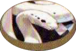
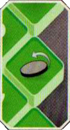

*L'Agente delle Tenebre*

| Complessità | Stile | Caratteristica |
|---|---|---|
| ●●●○○ | Aggressivo | Autosufficiente |

# Preparazione

Lancia e poni il **[segnalino Serpente]{.def}** {.img-inline} accanto alla plancia Combattente senza cambiare il lato su cui è caduto.

> **Non** puoi scegliere quale lato del segnalino Serpente usare: devi usare il lato che è a **faccia in su** nel momento in cui giochi la carta.

# Stile di Gioco

## Icona Speciale

{.img-center}

Ogni volta che l'**indicatore Salute** si ferma su questa casella o la supera, gira immediatamente il **segnalino Serpente** sull'altro lato **senza** applicare alcun effetto.

> Se giri il segnalino durante il tuo turno, **non** puoi attivare anche l'effetto del nuovo lato del segnalino.

# Dettagli di Gioco

- **Non** puoi scegliere quale lato del segnalino Serpente usare: devi sempre usare il lato che è a faccia in su nel momento in cui giochi la carta.
- Se lo giri durante il tuo turno **non** puoi attivare anche l'effetto del nuovo lato.
- Se **Mefisto**{.accent} viene **incenerito** nello stesso turno in cui gioca *Trascinato all'Inferno*, vince comunque il combattimento; lo stesso vale se il suo **partner** viene messo KO in quel turno: dato che la carta fa vincere quando si perde il combattimento in qualsiasi modo, **Mefisto**{.accent} vince comunque.

:::glossary
[segnalino Serpente]: Il componente a due lati di Mefisto, lanciato in preparazione. Viene girato automaticamente quando l'indicatore salute di Mefisto attraversa la casella speciale del tracciato salute, senza applicare alcun effetto in quel momento.
:::
