*La Coppa e la Spada*

| Complessità | Stile | Caratteristica |
|---|---|---|
| ●●○○○ | Imprevedibile | Parata e Risposta |

# Preparazione

Mescola e poni **coperti** gli **11 [segnalini Congiura]{.def}** {.img-inline} in una pila accanto alla sua plancia Combattente.

# Stile di Gioco

## Ordire una Congiura

Quando Milady ordisce una **congiura**, poni **1 segnalino Congiura coperto** dalla cima della pila al di sopra della sua plancia Combattente. Quando Milady esaurisce i segnalini congiura, **non** può più ordire congiure.

## Scatenare una Congiura

Le **congiure** possono essere scatenate dalle azioni delle carte, oppure quando l'**indicatore Salute** si ferma sopra, o supera, una di queste caselle del suo **tracciato Salute**.

Per scatenare una **congiura**, gira a faccia in su **1 segnalino Congiura** tra quelli posti al di sopra della sua plancia Combattente e applicane l'**effetto**. Poi **rimuovi** dal gioco quel segnalino per il resto del combattimento.

- Quando una **congiura** 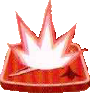{.img-inline} viene scatenata da una **carta azione** (*Scacco Matto*, *Così Prevedibile…*, *Una Pugnalata e un Sorriso*), è considerata l'azione di quella carta. Questo vuol dire che l'azione viene effettuata **contemporaneamente** alle azioni dell'avversario.
- Quando una **congiura** 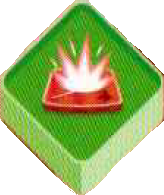{.img-inline} viene innescata dalle **icone** del **tracciato Salute**, viene **attivata dopo** aver risolto tutte le carte azione e i loro effetti. Le **congiure** scatenate dal **tracciato Salute** vanno risolte in una specie di **mini-fase successiva** alla risoluzione delle carte. Questo significa che gli **indicatori Salute** sui **blocchi** possono essere mossi nuovamente dalle **congiure**.

## Scatenare Congiure Multiple

Quando **2+ congiure** vengono scatenate nello **stesso turno**, assicurati di averle girate tutte a faccia in su (incluse le congiure scatenate dalle icone sui segnalini Congiura) in modo da poter vedere tutte le azioni. Risolvi tutti gli attacchi, i danni diretti, le cure e i guadagni di potere come faresti normalmente, **poi** applica gli **effetti veleno** per ultimi.

Il **veleno** 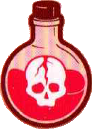{.img-inline} si attiva sempre **dopo** che sono state risolte tutte le altre azioni delle congiure. Il veleno influisce sui PF del combattente **dopo** ogni modifica ai PF delle congiure scatenate (dovuta ad attacchi, danni diretti, o i guadagni delle cure). Se ne **scateni 2+ nello stesso turn**o, ogni segnalino veleno si attiva sul nuovo totale di PF.

## Effetti dei Segnalini

| Icona | Effetto |
|---|---|
| 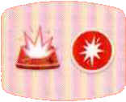{.img-inline} | Scatena una congiura e attacca |
| 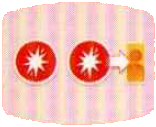{.img-inline} | Attacca entrambi gli avversari |
| 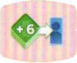{.img-inline} | Cura 6 PF al tuo partner |
| 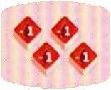{.img-inline} | TUTTI i combattenti subiscono 1 danno diretto |
| 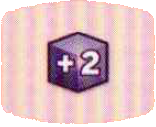{.img-inline} | Ottieni 2 cubetti Potere |
| 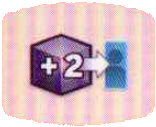{.img-inline} | Il tuo partner ottiene 2 cubetti Potere |
| 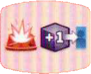{.img-inline} | Scatena una congiura e il tuo partner ottiene 1 cubetto Potere |
| 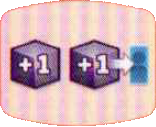{.img-inline} | Tu e il tuo partern ottenete 1 cubetto Potere ciascuno |
| {.img-inline} | Il tuo avversario subisce un ammontare di danni diretti pari alla metà dei suoi PF attuali (arrotondati per difetto). Per questo motivo, il veleno **non** può mettere KO un combattente. |

# Dettagli di Gioco

- Se **Milady**{.accente} subisce **danni diretti** quando gioca *Una Pugnalata e un Sorriso*, **non** scatena una congiura: lo fa solo se viene effettivamente attaccata. Lo stesso vale se è il suo **partner** a venire attaccato mentre lei gioca quella carta: anche in quel caso **non** scatena una congiura, perché la condizione si verifica solo se è lei a essere attaccata.
- Se giochi un'azione *Ordire una Congiura*, ma **non** hai più congiure nella pila, ignori semplicemente l'azione: una volta scatenate, le congiure vengono **rimosse** dal gioco e **non** possono essere riutilizzate.

:::glossary
[segnalini Congiura]: Gli 11 segnalini di Milady. Vengono ordinati a faccia in giù sulla plancia e scatenati (girati a faccia in su) dalle carte azioni o dalle icone del tracciato salute. Ogni segnalino produce un effetto diverso e viene rimosso dal gioco una volta scatenato.
:::
