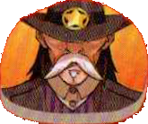

*La Banda di Fuorilegge*

| Complessità | Stile | Caratteristica |
|---|---|---|
| ●●●●● | Tempismo Perfetto | Resistente |

# Preparazione

Poni il **[segnalino Sceriffo]{.def}** {.img-inline} accanto alla plancia Combattente del Mucchio Selvaggio (può influenzare entrambe le squadre).

# Stile di Gioco

## Danni e Cure

Ogni casella del **tracciato Salute** del Mucchio Selvaggio è un **blocco** {.img-inline}: l'**indicatore Salute** può muoversi solo di **1 casella alla volta**.

Quando il Mucchio Selvaggio viene curato nello stesso momento in cui perde PF:

- Se perde **più PF** di quanti se ne cura, scende di **1 casella** sul tracciato salute.
- Se si cura di **più PF** di quanti ne perde, sale di **1 casella**.

:::glossary
[segnalino Sceriffo]: Componente a due lati specifico del Mucchio Selvaggio. Cambia bandiera nel corso del combattimento e può influenzare entrambe le squadre in gioco.
:::
