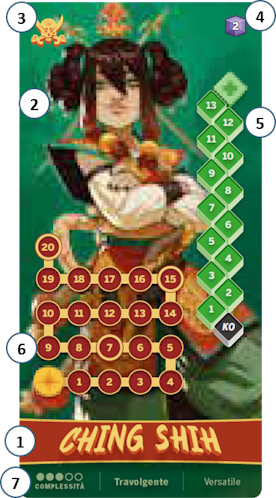
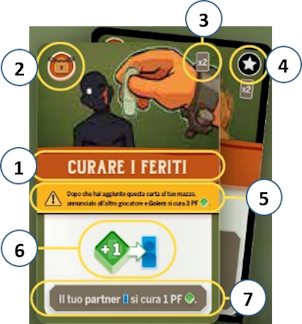

# Plance Combattente

{.img-center}

La **[plancia Combattente]{.def}** riporta:

| # | Elemento | Note |
|:---:|:---|:---|
| **1**{.accent} | **Nome** | - |
| **2**{.accent} | **Immagine** | - |
| **3**{.accent} | **Simbolo** | Riportato anche sulle sue **carte Combattimento** |
| **4**{.accent} | **Potere base** | Valore iniziale di **cubetti Potere** da assegnare al combattente |
| **5**{.accent} | **Tracciato Salute** | - |
| **6**{.accent} | **Tracciato Salute** | O spazi per **segnalini unici** |
| **7**{.accent} | **Caratteristiche** | Complessità e aggettivi |

Il **tracciato Salute** contiene:

| # | Elemento | Note |
|:---:|:---|:---|
| **1**{.accent} | **Caselle Numeriche** | Attuale livello dei PF del combattente senza altri effetti |
| **2**{.accent} | **+1 Potere** | Il combattente ottiene 1 cubetto Potere |
| **3**{.accent} | **+X PF (cura)** | Il combattente recupera X PF |
| **4**{.accent} | **Blocco** | L'indicatore Salute si ferma sia in caso di danni che in caso di cure |
| **5**{.accent} | **Icone speciali** | Icone specifiche del combattente e descritte nella *Guida ai Combattenti* |
| **6**{.accent} | **KO** | Il combattente perde il combattimento |

# Carte Combattente

{.img-center}

Una **[carta Combattimento]{.def}** riporta:

| # | Elemento | Note |
|:---:|:---|:---|
| **1**{.accent} | **Nome** | - |
| **2**{.accent} | **Simbolo** | Riportato anche sulla **plancia Combattente** |
| **3**{.accent} | **Frequenza** | Numero di copie della carta nel mazzo Combattente|
| **4**{.accent} | **Simbolo stella** | La identifica come **carta iniziale** (la carta ha anche un **bordo nero**) |
| **5**{.accent} | **Bonus istantaneo** | Effetto da risolvere appena la si aggiunge al mazzo Combattente |
| **6**{.accent} | **Azione** | Effetto della carta |
| **7**{.accent} | **Testo** | Descrive le azioni nel dettaglio |

:::glossary
[plancia Combattente]: La plancia individuale di ogni combattente, con tracciato Salute, potere base, simbolo identificativo ed eventuali tracciati o spazi speciali.

[carta Combattimento]: Una delle 10 carte di un combattente, rivelata durante il passo "Combattete!". Riporta azioni obbligatorie, simbolo, frequenza e possibile bonus istantaneo.
:::
