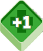
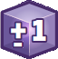
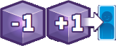

La partita si svolge in una serie di [round]{.def} finché un combattente non viene messo {.img-inline}. Ogni round è composto da **2 passi** eseguiti in ordine:

## Passo 1 — Combattete!

Ogni giocatore rivela contemporaneamente **1 carta Combattimento** dalla cima del proprio mazzo (**turno**).

1. Entrambi i giocatori eseguono **contemporaneamente tutte le azioni** indicate sulle rispettive carte.
   - Il **potere** usato per un attacco è sempre quello presente **all'inizio del turno**; cubetti aggiunti o rimossi durante il turno **non** modificano l'attacco in corso.
   - **Danni diretti e potere dell'attacco** si sommano; le **cure** si sottraggono; il **risultato netto** si applica al tracciato salute.
   - Le **icone** sui **tracciati salute/speciali** si attivano tutte **contemporaneamente dopo** aver risolto le azioni di tutte le carte.
2. Al termine di tutte le azioni (inclusi effetti innescati), il **turno termina**: impila la carta scoperta sulle precedenti e rivela la carta successiva.
3. Ripeti finché entrambi i giocatori non hanno rivelato **l'ultima carta** del proprio mazzo Combattimento.

> I mazzi **non vanno mai mescolati**.

*Combattente attivo e partner*{.accent} — Ogni volta che viene rivelata una carta si identificano:

:::indent
- **Combattente attivo**: il combattente a cui appartiene la carta rivelata. Tutte le azioni sulla carta si considerano effettuate da lui. È anche il bersaglio standard dell'avversario.
- **Partner**: l'altro combattente della stessa squadra (proprio {.img-inline} o avversario {.img-inline}). Alcune azioni lo coinvolgono direttamente.
:::

*Azioni base*{.accent} — Tutte le azioni su una carta sono **obbligatorie**:

:::indent
- {.img-inline} **Attaccare** — l'avversario perde PF pari al [Potere]{.def} del combattente attivo. Se ci sono attacchi da più fonti nello stesso turno, si sommano in un singolo attacco.
- {.img-inline} **Danni diretti** — perdita di PF che **ignora la parata**. Non è un attacco; si somma all'attacco se presenti entrambi nello stesso turno.
- {.img-inline} **Parare** — nega tutti gli attacchi dell'avversario e del suo partner. Include **un'azione bonus** se para con successo 1+ attacchi (anche con Potere 0 e una sola volta per turno).
- {.img-inline} **Curare** — il combattente attivo recupera i PF indicati. Se nello stesso turno perde PF, si applica la differenza netta.
- {.img-inline} **Ottenere/Perdere Potere** — aggiunge o rimuove cubetti Potere dalla riserva del combattente (non influisce sul turno in corso).
- {.img-inline} **Trasferire** — sposta un componente (di solito Potere) tra combattenti. Si trasferisce sempre il massimo possibile.
- {.img-inline} **Annullare** — la carta dell'avversario viene ignorata completamente.
- {.img-inline} **Successo** — il combattente ottiene un'**azione bonus** se l'azione principale è andata a buon fine.
:::

*Tracciato Salute*{.accent} — Quando l'indicatore Salute si muove:

:::indent
- **Casella con icona** (non blocco): si attiva l'effetto **dopo** aver completato tutti gli spostamenti del turno.
- **Casella blocco**: l'indicatore si **ferma immediatamente**, interrompendo sia danni che cure.
- **Casella KO**: il combattente non può più essere curato.
:::

## Passo 2 — Potenziate!

Ogni giocatore potenzia il proprio **mazzo Combattimento** in **3 passi**:

1. **Pesca 3 carte** dalla cima del tuo mazzo Potenziamento.
2. **Aggiungi 1 carta** tra le 3 pescate in un qualsiasi punto del tuo mazzo Combattimento, senza cambiare l'ordine delle altre carte.
   - Se la carta ha un **Bonus Istantaneo** {.img-inline}, annuncialo all'avversario e applicalo dopo che entrambi avete aggiunto la vostra carta.
3. **Scarta coperte** le altre 2 carte in fondo al tuo mazzo Potenziamento, nell'ordine che preferisci.

Poni il **mazzo Combattimento** davanti ai tuoi combattenti e inizia un **nuovo round**.

:::glossary
[round]: Un ciclo completo composto dal passo Combattete! e dal passo Potenziate!. I round si ripetono finché il combattimento non termina.

[Potere]: Il numero di cubetti Potere nella riserva di un combattente all'inizio del turno. Non viene "speso" quando si attacca e non scende mai sotto lo 0.
:::
