# Tabellone e Tessere Strada

Il **tabellone** è composto da **3 tessere strada** affiancate in fila (**posteriore → centrale → anteriore**) che scorrono man mano che la gara avanza. Le **auto** si muovono dalla tessera posteriore verso quella anteriore.

## Terreno

Ogni tessera ha **caselle di terreno** diverso e **caselle pericolo**.

|   | Casella | Costo |
| :---: | :---: | :--- |
| {.img-inline} | **Strada** | 1 punto movimento |
| {.img-inline} | **Fuori-strada** | 1 punto movimento |
| 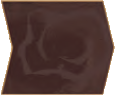{.img-inline} | **Fango** | punto movimento (o 1 rimasto) |
| {.img-inline} | **Invalicabile** | L’auto è eliminata |
| {.img-inline} | **Pericolo** | Posizione per segnalino pericolo |

## Segnalini Pericolo

I **segnalini pericolo** 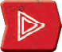{.img-inline} sono posti **coperti** sulle **caselle pericolo** quando viene aggiunta una nuova tessera e vengono risolti quando un'**auto** si muove su di essi. Alcuni vengono **scartati**, altri **rimangono** sul tabellone.

|   | Segnalino | Effetto | Dopo |
| :---: | :---: | :--- | :--- |
| 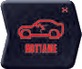{.img-inline} | **Rottame** | Poni 1 miniatura rottame e tampona | Scarta (sostituito dal rottame) |
| {.img-inline} | **Mina** | Subisci 1 danno (pesca e risolvi 1 segnalino danno) e termina il movimento | Scarta il segnalino |
| {.img-inline} | **Strada** | La casella diventa casella Strada | Resta sul tabellone |
| 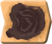{.img-inline} | **Fango** | La casella diventa casella Fango | Resta sul tabellone |
| {.img-inline} | **Petrolio** | Sposta l'auto di 1 casella, poi diventa casella Strada | Resta sul tabellone |

## Rottami

Sono **veicoli carbonizzati** 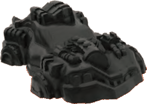{.img-inline} di precedenti gare, rappresentati da apposite miniature, da trattare come **auto piccole fuori uso**.

- Se un **veicolo** su strada entra nella loro casella, vengono **tamponati** normalmente.
- Se un **rottame** entra in una casella con un **segnalino pericolo** (per via di un tamponamento), quest'ultimo viene **risolto**.
- Se subiscono **danno** o terminano il turno nella casella di un **elicottero**, sono **eliminati** e rimossi dal tabellone.

## Ostacoli

Esistono **5 tipi** di ostacoli. Se un **veicolo su strada** entra in una casella che ne contiene, devi risolvere quanto segue:

- **Casella occupata** da un altro veicolo su strada (anche dello stesso equipaggio): perde il movimento rimanente, lo impili sopra all'altro e risolvi immediatamente un tamponamento.
- **Elicottero:** può attraversarla liberamente senza effetti, ma se vi termina il turno (per qualsiasi motivo, anche a seguito di tamponamento o danno) è immediatamente eliminato.
- **Pericolo coperto:** il segnalino viene girato a faccia in su e risolto immediatamente.
- **Pericolo scoperto:** viene risolto immediatamente.
- **Casella invalicabile:** il veicolo viene immediatamente eliminato.

Una casella senza ostacoli è invece una **casella libera**.

## Arco Frontale

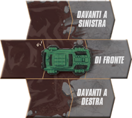{.img-center}

L'arco frontale sono le **3 caselle di fronte a sinistra, di fronte e di fronte a destra**.

- Le auto in **movimento** (di turno, su tamponamento o danni) si possono muovere solo verso l'arco frontale.
- Le auto possono **sparare** solo su bersagli nel proprio arco frontale.

# Veicoli

Ogni equipaggio ha **2 tipi** di veicoli. 

|   | Veicolo | Dimensione | Mira (Difficoltà) | Potenza Tamponamento |
| :---: | :---: | :---: | :--- | :--- |
| 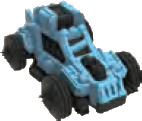{.img-inline} | **Auto Picola** | **S** | Difficile da colpire | Minima |
| 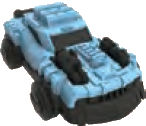{.img-inline} | **Auto Media** | **M** | Bilanciata | Media |
| 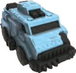{.img-inline} | **Auto Grande** | **L** | Bersaglio facile | Massima |
| 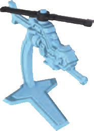{.img-inline} | **Elicottero** | - | - | - |

Gli **elicotteri non** ricevono danni, **non** possono essere bersagliati, **non** tamponano. Possono però **sparare** ed **eliminano** qualsiasi auto (anche della propria squadra) che termini il turno nella loro casella.

## Cruscotti

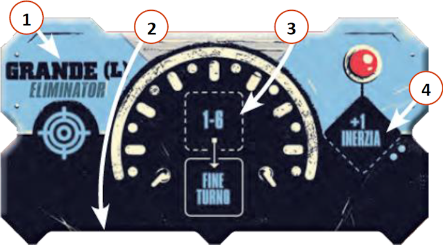{.img-center}

Ogni auto ha il proprio **cruscotto** caratterizzato dai seguenti elementi:

| # | Elemento | Note |
|:---:|:---|:---|
| **1**{.accent} | **Dimensione** | |
| **2**{.accent} | **Slot dei Danni** | 2 al massimo |
| **3**{.accent} | **Movimento** e **Fine Turno** | |
| **3**{.accent} | **Inerzia** | Con 2 pallini come limite |

## Stato delle Auto

| Stato | Condizione | Effetti |
| :---: | :--- | :--- |
| **Operativa** | 0-1 Danni | Può muovere e sparare normalmente |
| **Fuori Uso** | 2 Danni | Gira auto e cruscotto. No movimento/fuoco. Riparabile. |
| **Eliminata** | - | Rimossa dal gioco. Libera i segnalini danno. |

Un'auto viene **Eliminata** se:
- Entra in una casella invalicabile o termina su un elicottero.
- Esce dai bordi (sinistro, destro o posteriore).
- Si trova sulla tessera posteriore quando viene rimossa.
- Subisce un effetto che la elimina direttamente.

> **Nota**: Se tutte le tue auto sono Fuori Uso o Eliminate, sei **fuori dal gioco**!
> Quando accade, l'attuale tessera strada anteriore diventa la **tessera finale** (aggiungi la **linea del traguardo**).

## Segnalini Danno

Quando un'auto subisce **danno**, pesca **1 segnalino danno** {.img-inline}, risolvine l'**effetto**, poi posizionalo **coperto** in **1 slot danno** libero del cruscotto (se ha 2 danni, è **fuori uso**).
::: indent
Se si stava muovendo, perde il **movimento rimanente**.
:::

|   | Segnalino | Effetto | Dadi usati |
| :---: | :---: | :--- | :---: |
| 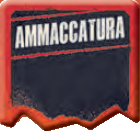{.img-inline} | **Ammaccatura** | Nessun effetto extra | — |
| {.img-inline} | **Schegge** | Colpisce il primo veicolo in linea retta | {.img-inline} |
| {.img-inline} | **Slittamento** | Sposta l'auto di 1 casella nella direzione mostrata | — |
| {.img-inline} | **Sbandata** | Movimento casuale (il terreno ha effetto) | 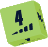{.img-inline} {.img-inline} |
| {.img-inline} | **Sbalzo** | L'auto "salta" in linea retta (ignora ostacoli) | {.img-inline} {.img-inline} |

Se un'auto viene mossa su un altro veicolo, perde il **movimento rimanente** e risolve un **tamponamento**. Se un'auto viene mossa su una casella invalicabile o oltre i bordi (sinistro, destro o posteriore) del tabellone, è **eliminata**.

# Plancia Comando

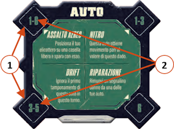{.img-center}

Ogni giocatore ha una plancia comando con **4 comandi** da usare **una sola volta** per round e solo se **non** sta muovendo per **inerzia**.

| # | Elemento |
|:---:|:---|
| **1**{.accent} | **Spazio comando** |
| **2**{.accent} | **Valori del dado consenti** |

| # | Comando | Valore del Dado |
|:---:|:---|:---:|
| **2.1**{.accent} | **Assalto Aereo** | 1-6 |
| **2.2**{.accent} | **Nitro** | 1-3 |
| **2.3**{.accent} | **Drift** | 3-5 |
| **2.4**{.accent} | **Riparazione** | 6 |

# Dadi

Oltre ai **4 dadi movimento** nei colori dei vari giocatori sono presenti nel gioco anche i **4 dadi FX**.

|   | Dado | Quando si usa |
| :---: | :---: | :--- |
| {.img-inline} | **Dado Movimento** | Movimento, inerzia e comando |
| 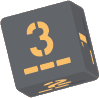{.img-inline} | **Dado Strada** | Bonus movimento dopo un turno tutto su strada |
| {.img-inline} | **Dado Acrobazia** | Sbandate e sbalzi da segnalini danno |
| {.img-inline} | **Dado Mira** | Per determinare se un colpo va a segno |
| {.img-inline} | **Dado Tamponamento** | Per determinare quale veicolo si sposta nel tamponamento |
| {.img-inline} | **Dado Direzione** | Per determinare la direzione di movimenti causati da effetti |

---
---

# ![puzzle]{.icon} Solo Parti Originali

## Plancia Comando dei Capitani

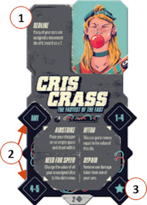{.img-center}

Sostituisce la plancia comando regolare. Conferisce **nuovi comandi** e **1 potere speciale**:

| # | Elemento | Note |
|:---:|:---|:---|
| **1**{.accent} | **Potere speciale** | Sempre attivo, senza dado | 
| **2**{.accent} | **Comandi** | Alcuni attivabili solo con segnalino comando |
| **3**{.accent} | **Icona segnalino comando** | Identifica i comandi che richiedono un segnalino invece di un dado |
