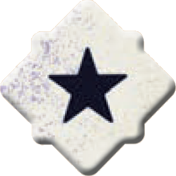

# Tabellone

Componi il **tabellone di gioco** come segue (tieni poi le **tessere** rimaste come pila di pesca e mettici accanto il **traguardo**)

- Poni la **tessera strada iniziale** (*Il Parcheggio* o la *Pista del Disastro*) al centro del tavolo come **tessera posteriore**.
- Mescola e pesca **2 tessere strada** tra le rimanenti: la prima diventa la **tessera centrale**, la seconda la **tessera anteriore**.

Mescola e poni **1 [segnalino pericolo]{.def} coperto** su ogni casella pericolo delle 3 tessere. Poni i rimanenti segnalini in una **pila coperta** accanto all'area di gioco.

> Sulla **tessera iniziale**, poni i segnalini pericolo solo sulle caselle indicate per il numero di giocatori corretto.

Mescola e poni i [segnalini danno]{.def} in un'altra **pila coperta** insieme ai **dadi FX** accanto all'area di gioco.

# Giocatori

Ogni giocatore sceglie un colore e ne prende i componenti:

- **1 plancia comando**
- **3 cruscotti** (uno per ogni auto)
- **3 auto** (piccola **S**, media **M,** grande **L**)
- **1 elicottero**
- **4 dadi movimento**

Poi pone i **cruscotti** in fila davanti a sé (S, M, L), la **plancia comando** all'inizio di questa fila e le **3 auto** nell'**area iniziale** dietro la tessera posteriore.

Ogni giocatore lancia i propri **4 dadi movimento** e **conserva** il risultato per usarlo nel 1° turno. Chi ottiene il **totale più basso** è il **primo giocatore**.

> In caso di parità, **tutti** i giocatori rilanciano tutti i propri dadi finché non c'è un vincitore chiaro.

Il primo giocatore lancia e pone il **dado strada** {.img-inline} accanto al tabellone, visibile a tutti.

---
---

# ![puzzle]{.icon} Munizioni Extra

Puoi aggiungere **uno o più dei seguenti mazzi** al gioco base. Mescola ogni mazzo **separatamente**.

| Mazzo | Distribuisci | Uso |
| :--- | :--- | :--- |
| **Assalti Aerei** | **1 carta coperta** a testa. | Gioca quando indicato dalla carta. |
| **Assi nella Manica** | **1 carta coperta** a testa. | Gioca quando indicato dalla carta. |
| **Comandi Bonus** | **1 carta scoperta** a testa. | È un comando aggiuntivo sempre disponibile. |
| **Ricompense** | **1 carta coperta** a testa. | Riscuoti quando soddisfi la condizione. |
| **Condizioni Stradali** | **1 carta scoperta** su ogni tessera (esclusa la posteriore). | Applica la regola alla tessera corrispondente. |

# ![puzzle]{.icon} Solo Parti Originali

Puoi usare i **capitani** e le **carte accessorio** separatamente o insieme nella stessa partita.

## Capitani

Poni i **segnalini comando** accanto al tabellone come **riserva**.

Mescola e dai **2 plance comando dei capitani** ad ogni giocatore, che ne **sceglie 1** e scarta l'altra. Ognuno la pone accanto ai propri **cruscotti** al posto della **plancia comando regolare**.

::: indent
Dai ad ogni giocatore dalla riserva un numero di **segnalini comando** {.img-inline} pari alle **stelle** indicate in fondo alla loro plancia.
:::

## Carte Accessorio

Mescola e dai **4 carte accessorio** ad ogni giocatore, poi eseguite un draft di **3 carte**:

- Contemporaneamente, ogni giocatore sceglie e pone **1 carta coperta** dalla propria mano davanti a sé.
- Passa le rimanenti al giocatore alla propria sinistra.
- Si continua finché tutti hanno **3 carte** (rimetti le rimanenti nella scatola).

Ogni giocatore pone **1 carta accessorio** al di sopra del cruscotto di ciascuna delle proprie **auto**. Al termine, tutti le **rivelano insieme**.

:::glossary
[segnalino pericolo]: Segnalino posto coperto sulle caselle pericolo del tabellone; viene risolto quando un'auto vi entra.

[segnalino danno]: Segnalino pescato casualmente quando un'auto subisce danno; ne determina l'effetto immediato.
:::
