Il gioco si svolge in **round**, ognuno composto da **3 turni per giocatore**.
- All'inizio di ogni round (eccetto il primo) tutti tirano i propri **4 dadi movimento** 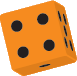{.img-inline}.
- Il [primo giocatore]{.def} lancia anche il **dado strada** {.img-inline}.

I giocatori si alternano nei **3 turni** partendo dal **primo giocatore** e procedendo in **senso orario**. Nel proprio turno un giocatore svolge nell'ordine i seguenti **4 passi**:

1. **Assegnazione**: assegna un dado a un'auto operativa.
2. **Comando**: attiva un comando (una sola volta per round).
3. **Movimento**: muove quell'auto.
4. **Sparare**: spara con quell'auto (se possibile).

Dopo che ogni giocatore ha svolto **3 turni**, chi ha il **dado strada** lo passa al giocatore alla propria sinistra che diventa il nuovo **primo giocatore** ed inizia un nuovo round.

# Passo 1 — Assegnazione

Poni **1 [dado movimento]{.def}** {.img-inline} inutilizzato al **centro del cruscotto** di un'**auto operativa** (0–1 segnalini danno) che **non** hai ancora mosso nel round.

> Il **valore** del dado indica di quante caselle si muoverà nel Passo 3 - Movimento.

Solo se **non** hai auto disponibili, ponilo sullo **spazio inerzia** del cruscotto di un'**auto già mossa**. Puoi muovere un'auto per inerzia **fino a 2 volte** (i 2 pallini accanto allo spazio inerzia lo ricordano).

**Una sola volta per round**, puoi porre anche **1 dado movimento** inutilizzato su uno dei **comandi** della tua **plancia comando** (**deve** rispettare il valore indicato).

> **Non** puoi farlo se in questo turno stai muovendo per **inerzia**.

# Passo 2 — Comando

Se in questo turno hai assegnato **1 dado movimento** a un comando della tua **plancia comando**, risolvine l'effetto **prima** del movimento assegnato all'auto.

| Comando | Dado | Effetto |
| :---: | :---: | :---|
| **Assalto Aereo** | 1-6 | Poni il tuo elicottero su una qualsiasi [casella libera]{.def} del tabellone. Se possibile e non è il primo round, spara. |
| **Nitro** | 1–3 | Aggiungi il valore del dado al movimento dell'auto di questo turno (devi usare tutto il movimento). |
| **Drift** | 3–5 | L'auto attraversa la prima casella occupata da un altro veicolo senza tamponarlo, a meno che non vi termini il movimento. |
| **Riparazione** | 6 | Rimuovi e mescola 1 segnalino danno da una qualsiasi auto nella pila corrispondente. Se era fuori uso (2 segnalini danno), l'auto diventa operativa (e può muoversi nel round se rimangono ancora turni). |

# Passo 3 — Movimento

Muovi l'auto a cui hai assegnato il **dado movimento** di tante caselle nell'**[arco frontale]{.def}** (a meno di effetti che indichino diversamente) quante indicate dal dado applicando le seguenti regole (1-4).

> **Ricorda** che le regole di movimento (1-4) valgono ogni volta che muovi un'auto: nel tuo turno, per via di un tamponamento o di un danno.

## 1. Regole Base

Devi usare **tutto** il movimento, a meno di effetti che lo interrompano. Se subisci un **danno o tamponi**, perdi tutto il movimento rimanente.

> **Primo round:** devi muovere verso una delle caselle del bordo posteriore della tessera posteriore per entrare in gioco.

Se durante il movimento hai percorso **solo caselle strada**, al termine puoi usare il **dado strada** {.img-inline} per ottenere movimento aggiuntivo pari all'**intero** suo valore (non per forza sulla strada).

## 2. Costi del Terreno

Ogni tessera ha **caselle di terreno** diverso e **caselle pericolo**.

|   | Casella | Costo |
| :---: | :---: | :--- |
| 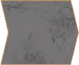{.img-inline} | **Strada** | 1 movimento per entrarci (consente il bonus dado strada) |
| 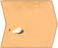{.img-inline} | **Fuori-strada** | 1 movimento per entrarci (nessun bonus) |
| {.img-inline} | **Fango** | 2 movimenti (o 1 rimasto) per entrarci |
| 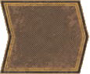{.img-inline} | **Invalicabile** | l'auto viene eliminata (doppia linea gialla) |
| 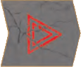{.img-inline} | **Pericolo** | posizione per segnalino pericolo (se non ne contiene uno, non ha effetto; doppie linee rosse e triangolo) |

## 3. Ostacoli e Veicoli

- Se entri in una **casella occupata** da un altro **veicolo su strada** (anche della tua squadra), perdi tutto il movimento rimanente e risolvi un **[tamponamento]{.def}** (impila la tua auto sul veicolo tamponato).
- Tratta i **rottami** (veicoli carbonizzati di precedenti gare) come **auto piccole fuori uso**: provocano tamponamento.
- Se entri in una **casella invalicabile**, vieni subito eliminato.
- Puoi muoverti attraverso una casella con un **elicottero**, ma se ci termini il movimento l'auto viene eliminata.

Ricorda che una casella senza ostacoli è una **casella libera**.

## 4. Segnalini Pericolo

Se entri in una casella con un **segnalino pericolo** {.img-inline}, rivelalo (se coperto) e risolvilo. Alcuni vengono **scartati**, altri **rimangono** sul tabellone.

|   | Segnalino | Effetto | Dopo |
| :---: | :---: | :--- | :--- |
| {.img-inline} | **Rottame** | Poni 1 miniatura rottame e tampona | Scarta (sostituito dal rottame) |
| 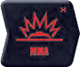{.img-inline} | **Mina** | Subisci 1 danno (pesca e risolvi 1 segnalino danno) e termina il movimento | Scarta il segnalino |
| 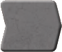{.img-inline} | **Strada** | La casella diventa casella Strada | Resta sul tabellone |
| {.img-inline} | **Fango** | La casella diventa casella Fango | Resta sul tabellone |
| 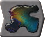{.img-inline} | **Petrolio** | Lancia il 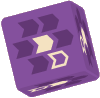{.img-inline} e sposta l'auto di 1 casella nella direzione indicata, poi continua il movimento. Diventa casella Strada | Resta sul tabellone |

## Interruzione del Movimento

Il movimento si **interrompe** e perdi il movimento rimanente se:

- Entri nella casella di un **altro veicolo su strada** (tamponamento).
- Subisci un **danno** (da mina o da effetto segnalino danno).

## Inerzia

Se il movimento è per **inerzia**, muovi l'auto di **1 casella** (indipendentemente dal valore del dado).
::: indent
Puoi **sparare** se hai un bersaglio valido, ma **non** puoi usare il **dado strada**.
:::

## Tamponamento

Quando due veicoli si trovano **impilati** sulla **stessa casella**, avviene un **tamponamento** e il veicolo in movimento perde il movimento rimanente. Risolvi nell'ordine:

1. Lancia **1 dado tamponamento** 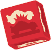{.img-inline} e **1 dado direzione** {.img-inline} per determinare quale veicolo si muove (in cima o in fondo) e in quale direzione.

|   | # | Veicolo |
| :---: | :---: | :--- |
| 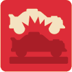{.img-inline} | **x2**{.accent} | Si muove il veicolo in cima |
| 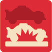{.img-inline} | **x4**{.accent} | Si muove il veicolo in fondo |

|   | # | Direzione |
| :---: | :---: | :--- |
| 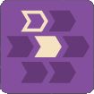{.img-inline} | **x1**{.accent} | Dietro a sinistra |
| 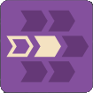{.img-inline} | **x1**{.accent} | Dietro |
| {.img-inline} | **x3**{.accent} | Dietro a destra |
| 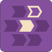{.img-inline} | **x1**{.accent} | Dietro a sinistra |
| 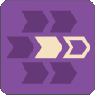{.img-inline} | **x1**{.accent} | Dietro |
| {.img-inline} | **x3**{.accent} | Dietro a destra |

2. Se uno dei due veicoli è di **dimensioni maggiori**, il suo proprietario può richiedere un singolo ritiro di **entrambi i dadi** (anche se è fuori uso o se entrambi appartengono allo stesso proprietario).
3. Muovi il veicolo indicato dal **dado tamponamento** di **1 casella** nella direzione del **dado direzione**.

Se questo movimento provoca un **altro tamponamento**, risolvilo e continua finché non ne accadono più.

## Oltrepassare il Tabellone

Quando un'auto **supera il bordo anteriore** della tessera anteriore, se è la **[tessera finale]{.def}** quel giocatore **vince** immediatamente la gara, altrimenti aggiorna il tabellone:

1. Tutte le **auto** sulla tessera posteriore sono **eliminate**.
2. Tutti i **segnalini pericolo** sulla tessera posteriore sono **scartati**.
3. Gli **elicotteri** sulla tessera posteriore **tornano** ai rispettivi proprietari.
4. La **tessera posteriore** viene rimossa, girata e messa in fondo alla corrispondente pila di pesca.
5. Le **tessere centrale e anteriore** diventano rispettivamente la nuova posteriore e la nuova centrale.
6. Si pesca una **nuova tessera anteriore** e si pone **1 segnalino pericolo coperto** su ogni sua **casella pericolo**.
    6.1. Se la **pila di pesca** è terminata, mescola i segnalini pericolo scartati e formane una nuova.
7. Si controlla se la nuova tessera è la **tessera finale** (e nel caso si aggiunge la **linea del traguardo**).
8. Se l'auto ha ancora **movimento rimasto**, continua a muoversi sulla nuova tessera.

> Quando un'auto supera il **bordo sinistro, destro o posteriore**, viene eliminata.

# Passo 4 — Sparare

L'**auto** che hai mosso (o l'**elicottero** posizionato con il comando **Assalto Aereo**) può **sparare** a un veicolo su strada nell'**arco frontale** (se ci sono più bersagli, scegline uno).

- **Non** può bersagliare **elicotteri**.
- Può bersagliare **rottami** (auto piccole fuori uso): se subiscono danno, sono eliminati.
- Può sparare dopo aver risolto un **tamponamento**.
- Può bersagliare un'auto della **propria squadra**.

> **Primo round:** non è possibile sparare (le armi non sono collegate fino al secondo round).

Lancia 1 **dado mira** {.img-inline}: se la dimensione dell'auto bersaglio compare nel risultato, quel veicolo è colpito e riceve **danno**.

|   | # | Bersaglio |
| :---: | :---: | :--- |
| {.img-inline} | **x1**{.accent} | Veicolo su strada piccolo/medio |
| {.img-inline} | **x1**{.accent} | Veicolo su strada medio |
| {.img-inline} | **x3**{.accent} | Veicolo su strada grande |
| {.img-inline} | **x1**{.accent} | Veicolo su strada di qualsiasi dimensione |

Il proprietario dell'auto danneggiata pesca e risolve **1 segnalino danno**.

# Risoluzione dei Danni

Quando un'auto subisce **danno**, pesca **1 segnalino danno** 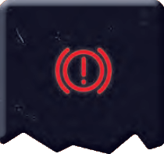{.img-inline}, risolvine l'**effetto**, poi posizionalo **coperto** in **1 slot danno** libero del cruscotto (se ha 2 danni, è **fuori uso**).
::: indent
Se si stava muovendo, perde il **movimento rimanente**.
:::

|   | Segnalino | Effetto |
| :---: | :---: | :--- |
| {.img-inline} | **Ammaccatura** | Nessun effetto aggiuntivo |
| 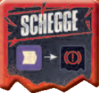{.img-inline} | **Schegge** | Lancia il dado direzione {.img-inline}; il primo veicolo su strada, se presente, in quella direzione riceve 1 danno (le schegge ignorano qualsiasi terreno, anche invalicabile) |
| 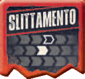{.img-inline} | **Slittamento** | Sposta l'auto di 1 casella nella direzione mostrata (6 varianti) |
| {.img-inline} | **Sbandata** | lancia il dado acrobazia {.img-inline}; l'auto si muove di tante caselle lanciando il dado direzione {.img-inline} per ognuna (il terreno ha effetto come al solito; la sbandata termina se l'auto perde il movimento) |
| 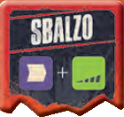{.img-inline} | **Sbalzo** | lancia il dado direzione {.img-inline} e il dado acrobazia {.img-inline}; l'auto si sposta di tante caselle in quella direzione ignorando tutto ciò che c'è in mezzo (la casella finale ha effetto come al solito) |

Se un'auto viene mossa su un altro veicolo, perde il **movimento rimanente** e risolve un **tamponamento**. Se un'auto viene mossa su una casella invalicabile o oltre i bordi (sinistro, destro o posteriore) del tabellone, è **eliminata**.

# Fine del Turno

Sposta il **dado movimento** dal **centro del cruscotto** dell'auto mossa sullo **spazio Fine Turno**. 

> **Non** può ricevere un altro dado per movimento regolare in questo round, ma può ancora muoversi per **inerzia**.

Qualsiasi auto che si trovi nella casella di un **elicottero** a fine turno è **eliminata**.

Il turno passa al giocatore **ancora in gioco** alla tua sinistra.

# Fine del Round

Dopo che ogni giocatore ha svolto **3 turni**, chi ha il **dado strada** lo passa al giocatore alla propria sinistra che diventa il nuovo **primo giocatore** e inizia un nuovo round.

---
---

# ![puzzle]{.icon} Munizioni Extra

| Mazzo | Quando / Come | Effetto |
| :---: | :--- | :--- |
| **Assalti Aerei Avanzati** | Quando indicato | Gioca, risolvi e scarta |
| **Assi nella Manica** | Quando indicato | Gioca, risolvi e scarta |
| **Ricompense** | Se soddisfi la condizione | Riscuoti subito e scarta |
| **Comandi Bonus** | Tuo turno | Comando extra sempre disponibile |
| **Condizioni Stradali** | Sempre attivo | Regola valida sulla tessera specifica |

# ![puzzle]{.icon} Solo Parti Originali

## Capitani

Ogni **plancia comando dei capitani** fornisce **1 potere speciale** e **nuovi comandi**.

- **Potere speciale**: ogni capitano ha 1 potere speciale indicato in cima alla plancia, per il quale **non occorre assegnare alcun dado** (è sempre attivo o si attiva automaticamente secondo le condizioni descritte sulla plancia).
- **Nuovi comandi**: alcuni capitani hanno comandi contrassegnati dall'**icona del segnalino comando** invece di un numero. Puoi usare questi comandi **solo** assegnandovi 1 segnalino comando.

## Segnalini Comando
I **segnalini comando** {.img-inline} ti consentono di usare comandi aggiuntivi durante il round.

### Passo 1 - Assegnazione{.accent}

In ogni turno, puoi assegnare **1 segnalino comando (solo 1)** a un qualsiasi comando che **non** abbia già un dado o un altro segnalino assegnato.
::: indent
Questo è **aggiuntivo** rispetto al normale dado comando: puoi quindi attivare **due comandi** nello stesso turno.
**Non** puoi farlo se in questo turno stai muovendo per **inerzia**.
:::

### Passo 2 - Comando{.accent}

Risolvi **nell'ordine che preferisci** i comandi assegnati in questo turno (dado e/o segnalino comando).
::: indent
Il **segnalino comando** assegnato ad un comando con intervallo di valori, vale come il **valore più basso** accettato.
:::

### Fine del Round{.accent}

Scarta nella riserva comune **tutti** i segnalini comando assegnati.

## Accessori

La carta accessorio assegnata a un'auto le conferisce una **capacità unica**, valida solo per quella specifica auto. Una volta assegnata, la carta **non può essere spostata** su un'altra auto. 

L'accessorio è **inattivo** mentre l'auto è **fuori uso** e torna attivo automaticamente quando viene **riparata**.

:::glossary
[primo giocatore]: Ad inizio gara, è il giocatore che ha ottenuto la somma dei dadi movimento più bassa. Lancia il dado strada ed inizia il round. Cambia ad ogni round in senso orario.

[dado movimento]: Uno dei 4 dadi del proprio colore, usato per muovere le auto o attivare comandi.

[casella libera]: Una casella senza ostacoli.

[arco frontale]: Le 3 caselle di fronte a sinistra, di fronte e di fronte a destra di un veicolo. Le auto possono muoversi e sparare solo verso l'arco frontale.

[tamponamento]: Scontro tra due veicoli su strada nella stessa casella. Si risolve con dado tamponamento e dado direzione.

[tessera finale]: La tessera su cui viene posizionata la linea del traguardo, che determina la fine imminente della partita.
:::
