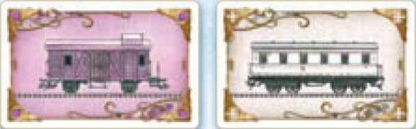
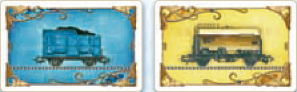
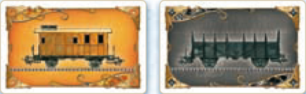
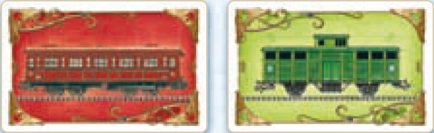
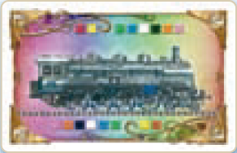
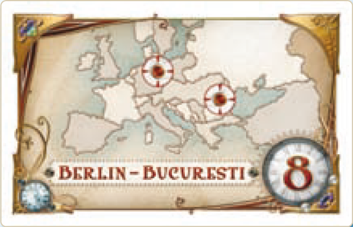

# Carte Treno

Di seguito i 9 tipi di **carte Treno** usate per controllare le linee presenti nel gioco>

{.img-center}

{.img-center}

{.img-center}

{.img-center}

{.img-center}

# Carte Biglietto Destinazione

Di seguito una **carta Biglietto Destinazione** che indica una tratta da controllare per ottenere punti a fine partita:

{.img-center}
