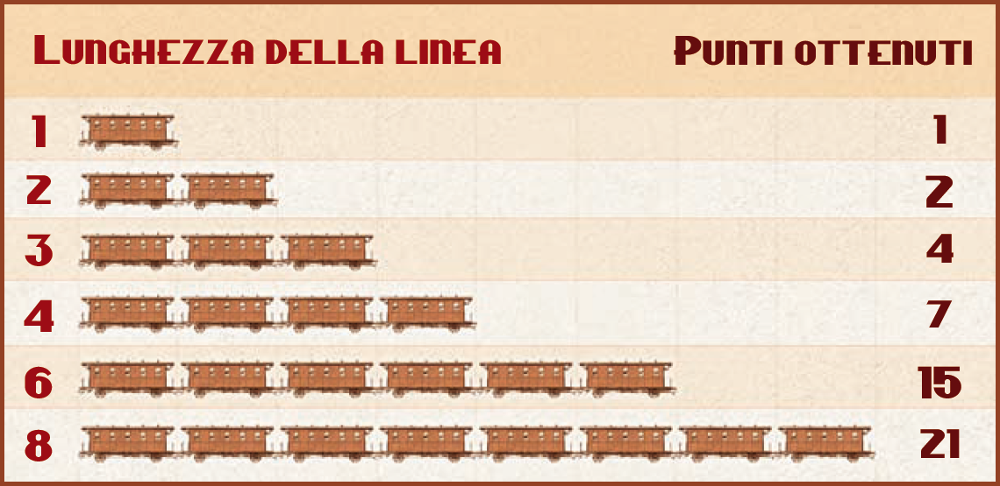
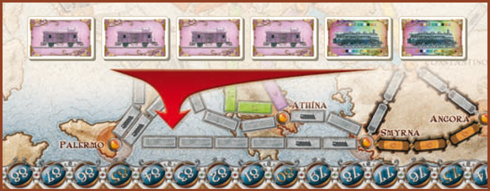
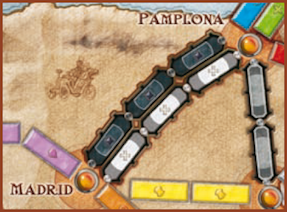

I giocatori si alternano in **turni** partendo dal primo giocatore e procedendo poi in **senso orario**. Al suo turno il giocatore deve eseguire **una (ed una sola)** tra le **4 azioni** consentite.

| Azione | Descrizione |
|--------|-------------|
| **Pescare carte Treno** | Pesca 2 carte Treno o 1 carta Locomotiva tra quelle scoperte, oppure pesca 2 carte Treno dal mazzo |
| **Controllare una Linea** | Gioca carte Treno per prendere il controllo di una linea; posiziona i vagoni e avanza il Segnapunti |
| **Pescare Biglietti Destinazione** | Pesca 3 carte Biglietto Destinazione e tienine almeno 1 |
| **Costruire una Stazione Ferroviaria** | Posiziona 1 Stazione in una città senza stazione, pagando carte Treno |

# Pescare carte Treno

Scegli **una** tra le seguenti opzioni di pesca:

- Pesca **1 [carta Locomotiva]{.def}** tra le cinque **scoperte**. Rimpiazzala immediatamente con una nuova dal mazzo Treno.
- Pesca **2 carte Treno** (non Locomotiva) tra le cinque **scoperte**. Ad ogni carta pescata rimpiazzala immediatamente con una nuova dal mazzo Treno.
- Pesca **2 carte Treno** (*alla cieca*) **coperte** dal mazzo Treno.

> Se in un qualsiasi momento **3 delle 5 carte Treno** scoperte sono **carte Locomotiva**, scarta immediatamente tutte e 5 le carte e rimpiazzale con 5 nuove carte.

Puoi tenere in mano un **qualsiasi numero** di carte Treno.

Quando il mazzo Treno si **esaurisce**, mescola `accuratamente` la pila degli scarti e forma un nuovo mazzo. Se **non** ci sono carte Treno tra gli scarti **non** puoi eseguire questa azione.

## Carte Treno

Esistono **8 tipi di carte Treno** (*12 per ogni tipo*) corrispondenti ai colori delle varie linee (*viola, blu, arancio, bianco, verde, giallo, nero e rosso*) e **14 carte Locomotiva** (*jolly*).

Le **Locomotive** sono multicolore e fungono da **jolly**. Possono essere giocate assieme a qualsiasi altra serie di carte per controllare una linea e sono fondamentali per controllare le **linee dei Traghetti**.

Puoi **pescare una Locomotiva** tra quelle scoperte come prima ed unica carta di pesca, oppure puoi avere la fortuna di pescarne una o due tra le 2 pescate alla cieca.

# Controllare una Linea

Una **[linea]{.def}** è formata da una serie di **caselle continue** colorate (o grigie) tra due città adiacenti. Per controllarla gioca una serie di **carte Treno** il cui **colore e quantità** corrispondono al colore e al numero di caselle della linea scelta.

- Le **Locomotive** sostituiscono qualsiasi colore.
- Le **[linee Grigie]{.def}** possono essere controllate con una serie di carte di un colore qualsiasi (ma tutte dello stesso colore).

Colloca poi un tuo **vagone** su ogni casella che compone la linea e scarta le carte Treno giocate. Fai avanzare immediatamente il **Segnapunti** in base a quanto indicato nella **Tabella Punteggi**.

{.img-center}

> In un singolo turno puoi scegliere di controllare **una (ed una sola)** qualsiasi intera linea non occupata, anche se non è collegata a una tua altra linea.

## Doppie Linee

Alcune città sono collegate da una **[Doppia Linea]{.def}** con un pari numero di caselle parallele tra le due città adiacenti. **Non** puoi controllarle entrambe nella stessa partita.
- Se collegano **città diverse**, anche se per un tratto sono parallele, **non** sono Doppie Linee.

> **2|3 giocatori:** è possibile usare **solo una linea** delle Doppie Linee (l'altra diventa chiusa).

## Traghetti

Sono **[linee Grigie]{.def} speciali** che collegano due città adiacenti **via acqua**, riconoscibili dall'**icona Locomotiva** presente su almeno una casella della linea.

{.img-center}

Per **controllare** una Linea Traghetto gioca:

- **1 carta Locomotiva** per ogni casella Locomotiva presente sulla linea;
- **carte Treno appropriate** per le rimanenti caselle.

## Gallerie

Sono **linee speciali** riconoscibili dagli **speciali simboli galleria e dai bordi evidenziati** di ogni casella. Un giocatore **non** può sapere con sicurezza quanto sarà lunga la linea per prenderne il controllo.

{.img-center}

Per **controllare** una Galleria:

1. Gioca il numero di **carte Treno appropriate**.
2. Scopri a faccia in su **3 carte dal mazzo Treno**.
    - Se **non** ci sono abbastanza carte nel mazzo Treno e negli scarti, scopri solo le carte disponibili (anche nessuna).
3. Per ogni carta scoperta **dello stesso colore** che hai giocato: gioca **1 carta aggiuntiva** dello stesso colore o 1 Locomotiva.
4. Per ogni carta scoperta **Locomotiva**: gioca **1 carta aggiuntiva** dello stesso colore giocato o 1 Locomotiva.
    - Se hai giocato **solo carte Locomotiva**, gioca carte aggiuntive di tipo Locomotiva solo se scopri carte Locomotiva.

> Se **non** hai abbastanza carte o **non** vuoi giocarle, **riprendi le carte** che hai giocato e termina il turno senza prendere il controllo della linea.

**Scarta** infine le 3 carte scoperte dal mazzo Treno.

# Pescare Biglietti Destinazione

Pesca **3 carte Biglietto Destinazione** (o solo quelle rimanenti se nel mazzo ce ne sono di meno) e conservane **almeno 1**. **Rimetti** quelle che non tieni **in fondo al mazzo**.

Puoi tenere in mano un **qualsiasi numero** di carte Biglietto Destinazione (da mantenere **segrete** fino alla fine della partita).

## Carte Biglietto Destinazione

Le città elencate sulla carta rappresentano gli obiettivi di viaggio del giocatore fornendogli dei **bonus** o delle **penalità**.

- Se a fine partita hai creato un **percorso continuo** tra le due città con i tuoi vagoni (o con le Stazioni Ferroviarie), **ottieni** il numero di punti indicati dalla carta.
- Se a fine partita **non** hai creato il percorso continuo, **sottrai** il numero di punti indicati dalla carta.

# Costruire una Stazione Ferroviaria

Colloca **1 Stazione Ferroviaria** su una qualsiasi città **non** occupata (anche se non dispone di linee controllate) e gioca le carte richieste:

| Stazione | Costo |
|:---:|:---|
| **1ª Stazione** | 1 carta Treno qualsiasi |
| **2ª Stazione** | 2 carte Treno dello stesso colore |
| **3ª Stazione** | 3 carte Treno dello stesso colore |

Puoi usare **carte Locomotiva** normalmente. Puoi collocare **1 sola Stazione Ferroviaria per turno** e **3 Stazioni Ferroviarie** nel corso della partita.

La Stazione Ferroviaria ti consente di usare **una (ed una sola) linea** di proprietà di un altro giocatore che arriva o parte da quella città, per aiutarti a collegare le città dei tuoi Biglietti Destinazione.

> Se usi la stessa Stazione Ferroviaria per collegare le città su **più Biglietti Destinazione**, devi usare la **stessa linea** scelta per tutti i Biglietti Destinazione.

:::glossary
[carta Locomotiva]: Carta jolly multicolore. Può sostituire qualsiasi colore di carta Treno. Indispensabile per le linee Traghetto.

[linea]: Serie di caselle continue colorate (o grigie) tra due città adiacenti sul tabellone.

[linee Grigie]: Linee neutrali che possono essere controllate con carte di qualsiasi colore (purché tutte dello stesso colore).

[Doppia Linea]: Due linee parallele dello stesso percorso tra due città adiacenti. Ogni giocatore può controllarne solo una per partita.
:::
