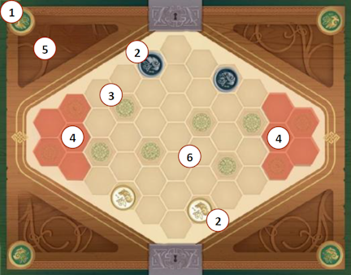
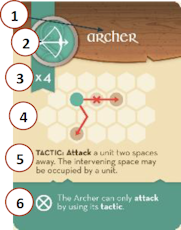
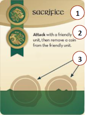
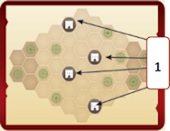
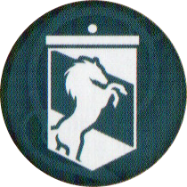
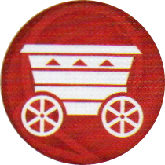
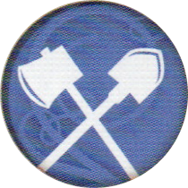
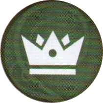
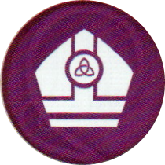
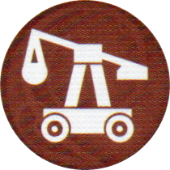

# Tabellone

{.img-center}

| # | Elemento | Descrizione |
|:---:|:---|:---|
| **1**{.accent} | **Lati Fazione** | I due lati opposti del tabellone, uno per ogni fazione |
| **2**{.accent} | **Posizioni di partenza** | Le posizioni inizialmente controllate dai giocatori |
| **3**{.accent} | **Posizioni neutrali** | Le posizioni non controllate all'inizio della partita |
| **4**{.accent} | **Spazi normali e di partenza/neutrali aggiuntivi** | Usati anche in 4 giocatori (aree esterne più scure) |
| **5**{.accent} | **Area degli scarti** | Zona personale per i gettoni usati, sempre visibile ad entrambi |
| **6**{.accent} | **Spazi normali** | Esagoni di movimento, non controllabili |

# Carte Unità

{.img-center}

| # | Elemento | Descrizione |
|:---:|:---|:---|
| **1**{.accent} | **Nome** | Il nome dell'unità |
| **2**{.accent} | **Immagine gettone** | Il simbolo del gettone corrispondente |
| **3**{.accent} | **Numero gettoni** | Quanti gettoni di quell'unità esistono (es. ×4, ×5) |
| **4**{.accent} | **Illustrazione** | Il disegno dell'unità |
| **5**{.accent} | **Tattica** | L'abilità speciale dell'unità (se presente) |
| **6**{.accent} | **Attributi e Restrizioni** | Simboli {.img-inline} e {.img-inline} con regole aggiuntive |

# Carte Decreto Reale

{.img-center}

> Componente dell'**Espansione Nobiltà**.

| # | Elemento |
|:---:|:---|
| **1**{.accent} | **Titolo** del Decreto |
| **1**{.accent} | **Abilità** da eseguire quando proclamata |
| **1**{.accent} | **Spazi sigilli Proclamazione** (uno per fazione) |

# Carte Mappa Fortificazioni

{.img-center}

> Componente dell'**Espansione Assedio**.

| # | Elemento |
|:---:|:---|
| **1**{.accent} | **Spazi di partenza** per le Fortificazioni. |

# Elenco Unità

|   | Unità |   | Unità |
|:---:|:---|:---:|:---|
| {.img-inline} | **Arciere** | {.img-inline} | **Guardia Reale** |
| {.img-inline} | **Balestiere** | {.img-inline} | **Lanciere** |
| {.img-inline} | **Berserker** | {.img-inline} | **Maresciallo** | 
| {.img-inline} | **Cavaliere** | {.img-inline} | **Mercenario** |
| {.img-inline} | **Cavalleria** | {.img-inline} | **Picchiere** |
| {.img-inline} | **Cavalleria Leggera** | {.img-inline} | **Sacerdote Guerriero** | 
| {.img-inline} | **Esploratore** | {.img-inline} | **Spadaccino** |
| {.img-inline} | **Fanteria** | {.img-inline} | **Stendardiere** |

> Componente dell'**Espansione Nobiltà** e dell'**Espandione Assedio**.

|   | Unità Nobiltà |   | Unità Assedio |
|:---:|:---|:---:|:---|
| {.img-inline} | **Alfiere** | {.img-inline} | **Carro da Guerra** |
| {.img-inline} | **Araldo** | {.img-inline} | **Geniere** |
| {.img-inline} | **Conte** | {.img-inline} | **Torre d'Assedio** |
| {.img-inline} | **Vescovo** | {.img-inline} | **Trabucco** |
