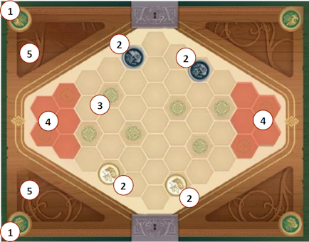
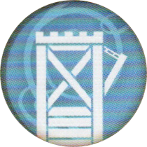
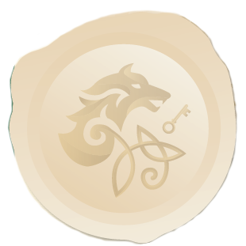
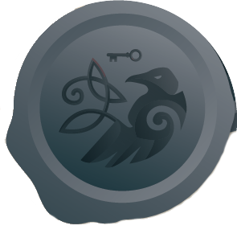

# Modalità a 2 Giocatori

{.img-center}

## Tabellone

Poni il **tabellone** al centro del tavolo. Ogni giocatore sceglie una **[fazione]{.def}**, si posiziona dal lato corrispondente **(1)**{.accent} e ne prende i componenti (*rimettete nella scatola quanto rimane*):

- **1 sacchetto**
- **1 gettone Reale**
- **6 indicatori Controllo**

Pone **1 indicatore Controllo** su ciascuna delle proprie **2 posizioni di partenza** **(2)**{.accent} e tiene davanti a sé gli indicatori rimanenti. Le restanti **6 posizioni** **(3)**{.accent} sono **neutrali**.

## Indicatore Iniziativa

Lancia l'**[indicatore Iniziativa]{.def}** per determinare il **primo giocatore**, in base alla faccia visibile, che ottiene l'iniziativa e l'indicatore.

## Carte Unità

- **Preparazione standard**{.accent}
:::indent
Mescola e poni **4 carte Unità scoperte** davanti a ciascun giocatore come unità disponibili per tutta la partita (*rimetti nella scatola le carte rimanenti*).
:::

- **Prima partita**{.accent}
:::indent
Usa le seguenti unità.

|   | Giocatore A |   | Giocatore B |
|:---:|:---|:---:|:---|
| {.img-inline} | **Spadaccino** | {.img-inline} | **Arciere** |
| {.img-inline} | **Picchiere** | {.img-inline} | **Cavalleria** |
| {.img-inline} | **Balestriere** | {.img-inline} | **Lanciere** |
| {.img-inline} | **Cavalleria Leggera** | {.img-inline} | **Esploratore** |
:::

- **Preparazione avanzata**{.accent}
:::indent
Poni **8 carte Unità scoperte** al centro del tavolo. Il **[draft]{.def}** si svolge in questo modo, iniziando dal giocatore con l'iniziativa:

- G1 sceglie 1 carta
- G2 sceglie 2 carte
- G1 sceglie 2 carte
- G2 sceglie 2 carte
- G1 prende l'ultima carta rimasta

Infine l'**indicatore Iniziativa** passa a G2 che inizierà poi la partita.
:::

- **Battaglie famose**{.accent}
:::indent
Per rivivere **battaglie famose** usa le seguenti combinazioni di unità.

### Battaglia di Guagamela (331 a.C.){.accent}

|   | Unità Greche |   | Unità Persiane |
|:---:|:---|:---:|:---|
| {.img-inline} | Cavaliere | {.img-inline} | Cavalleria |
| {.img-inline} | Cavalleria Leggera | {.img-inline} | Fanteria |
| {.img-inline} | Picchiere | {.img-inline} | Mercenario |
| {.img-inline} | Maresciallo | {.img-inline} | Guardia Reale |

### Battaglia di Bannockburn (1314 d.C.){.accent}

|   | Unità Inglesi |   | Unità Scozzesi |
|:---:|:---|:---:|:---|
| {.img-inline} | Arciere | {.img-inline} | Cavalleria Leggera |
| {.img-inline} | Cavalleria | {.img-inline} | Picchiere |
| {.img-inline} | Lanciere | {.img-inline} | Sacerdote Guerriero |
| {.img-inline} | Fanteria | {.img-inline} | Spadaccino |

### Battaglia di Crécy (1346 d.C.){.accent}

|   | Unità Inglesi |   | Unità Francesi |
|:---:|:---|:---:|:---|
| {.img-inline} | Arciere | {.img-inline} | Cavalleria |
| {.img-inline} | Stendardiere | {.img-inline} | Balestriere |
| {.img-inline} | Cavaliere | {.img-inline} | Lanciere |
| {.img-inline} | Guardia Reale | {.img-inline}| Esploratore |

### Battaglia di Bosworth Field (1485 d.C.){.accent}

> Richiede l'**Espansione Nobiltà**

|   | Unità Lancaster |   | Unità York |
|:---:|:---|:---:|:---|
| {.img-inline} | Conte | {.img-inline} | Alfiere |
| {.img-inline} | Araldo | {.img-inline} | Cavalleria |
| {.img-inline} | Mercenario | {.img-inline} | Cavaliere |
| {.img-inline} | Picchiere | {.img-inline} | Spadaccino |

## Battaglia di Xiangyang (1267 d.C.)

> Richiede l'**Espansione Assedio**

|   | Unità Yuan |   | Unità Song |
|:---:|:---|:---:|:---|
| {.img-inline} | Cavalleria Leggera | {.img-inline} | Geniere |
| {.img-inline} | Cavalleria | {.img-inline} | Picchiere |
| {.img-inline} | Trabucco | {.img-inline} | Maresciallo |
| {.img-inline} | Torre d'Assedio | {.img-inline} | Balestriere |
:::

## Gettoni e riserva

Ogni giocatore prende i **[gettoni Unità]{.def}** corrispondenti alle proprie **4 carte Unità**. Mette nel sacchetto il **gettone Reale** e **2 gettoni Unità** per ciascun tipo di unità (**9 gettoni totali**), e pone i gettoni rimanenti accanto alle rispettive carte Unità come **[riserva]{.def}**.

Le **aree esterne non** **(4)**{.accent} vengono usate durante la partita a due giocatori, mentre l'area **(5)**{.accent} accanto al simbolo della propria fazione viene usata per i propri **[scarti]{.def}**.

# Modalità a 4 Giocatori

Formate **2 squadre da 2 giocatori** ciascuna, poi seguite le normali regole del gioco base con le seguenti differenze.

{.img-center}

## Tabellone

Poni il **tabellone** al centro del tavolo, utilizzando anche le **aree esterne** con gli esagoni più scuri **(4)**{.accent}. Ogni squadra sceglie una **fazione**, ogni membro si posiziona alternandosi con un avversario ai due lati del tabellone **(1)**{.accent} e ne prende i componenti:

- **1 sacchetto** e **1 gettone Reale** per ogni membro
- **8 indicatori Controllo** per ogni squadra

Ogni squadra pone **1 indicatore Controllo** su ciascuna delle proprie **3 posizioni di partenza** **(2)**{.accent} e tiene davanti a sé gli indicatori rimanenti. Le restanti **8 posizioni** **(3)**{.accent} sono **neutrali**.

## Indicatore Iniziativa

Lancia l'**[indicatore Iniziativa]{.def}** per determinare il **primo giocatore**, in base alla faccia visibile. La squadra che ottiene l'iniziativa decide quale **membro** prende l'indicatore.

## Carte Unità

- **Preparazione standard**{.accent}
:::indent
Mescola e poni **3 carte Unità scoperte** davanti a ciascun giocatore come unità disponibili per tutta la partita (*rimetti nella scatola le carte rimanenti*).
:::

- **Preparazione avanzata**{.accent}
:::indent
Poni **12 carte Unità scoperte** al centro del tavolo. Il **draft** si svolge in tre fasi, iniziando dal giocatore con l'iniziativa:

- **Fase 1 — in senso orario:**
    - G1 sceglie 1 carta
    - G2 sceglie 1 carta
    - G3 sceglie 1 carta
    - G4 sceglie 2 carte
- **Fase 2 — in senso antiorario:**
    - G3 sceglie 1 carta
    - G2 sceglie 1 carta
    - G1 sceglie 1 carta
- **Fase 3 — in senso orario:**
    - G2 sceglie 1 carta
    - G3 sceglie 1 carta
    - G4 sceglie 1 carta
    - G1 prende l'ultima carta rimasta

Infine l'**indicatore Iniziativa** passa a G2 che inizierà poi la partita.
:::

## Gettoni e riserva

Ogni giocatore prende i **gettoni Unità** corrispondenti alle proprie **3 carte Unità**. Mette nel sacchetto il **gettone Reale** e **2 gettoni Unità** per ciascun tipo di unità (**7 gettoni totali**), e pone i gettoni rimanenti accanto alle rispettive carte Unità come **riserva**.

L'area **(5)**{.accent} accanto al simbolo della propria fazione davanti a sé viene usata per i propri **scarti**.

---
---

# ![puzzle]{.icon} Nobiltà

Seguite le **normali regole** del gioco base con le seguenti **differenze**.

Prima di distribuire le **carte Unità**, mescola e poni **3 carte Decreto Reale scoperte** accanto al tabellone (*rimetti nella scatola le carte rimanenti*). Questi sono i **3 Decreti** disponibili per tutta la partita.

Ogni giocatore (o squadra) riceve i **3 sigilli Proclamazione** ({.img-inline}, {.img-inline}) del colore della propria fazione.

Aggiungi le **4 nuove carte Unità** a quelle del gioco base (*e di altre espansioni*) e procedi normalmente con la distribuzione o il draft.

> Sostituisci la **carta Guardia Reale** del gioco base (muovi di **1 spazio**) con quella **nuova** presente in Nobiltà (muovi di **2 spazi**). 

# ![puzzle]{.icon} Assedio

Seguite le **normali regole** del gioco base con le seguenti **differenze**.

Prima di distribuire le **carte Unità**, mescola e rivela **1 carta Mappa Fortificazione** (*rimetti nella scatola le altre carte*). Questa carta indica le posizioni di partenza delle **[Fortificazioni]{.def}** sul tabellone.

- Poni **4 gettoni Fortificazione** {.img-inline} sulle posizioni indicate dalla carta.
- I **3 gettoni Fortificazione** rimanenti vengono posizionati accanto al tabellone come **riserva**.

Aggiungi le **4 nuove carte Unità** a quelle del gioco base (*e di altre espansioni*) e procedi normalmente con la distribuzione o il draft.

> **Con entrambe le espansioni Nobiltà e Assedio:** rivela i **Decreti Reali** e posiziona le **Fortificazioni** nella stessa fase, prima che il draft abbia inizio.

:::glossary
[fazione]: Una delle due fazioni giocabili, ognuna con il proprio sacchetto, gettone Reale e indicatori Controllo colorati.

[indicatore Iniziativa]: Gettone a doppia faccia che indica chi va per primo in ogni round. Può cambiare di mano una sola volta per round.

[draft]: Modalità avanzata di selezione delle carte Unità: i giocatori scelgono a turno le proprie unità da un pool comune scoperto al centro del tavolo.

[gettoni Unità]: Gettoni che rappresentano le unità sul tabellone e nel sacchetto. Ogni tipo corrisponde a una carta Unità.

[riserva]: Pila di gettoni accanto alle **carte Unità**, non ancora entrati in gioco. Si accede alla riserva solo tramite l'**azione Reclutare**.

[scarti]: Area personale dove finiscono i **gettoni usati**. Viene rimescolata nel **sacchetto** quando questo è vuoto.

[Fortificazioni]: Elementi neutri sul tabellone che bloccano l'accesso alle posizioni nemiche e il movimento multi-spazio. Quando distrutte tornano nella riserva.
:::
