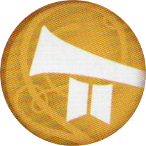

## Preparazione Comune

1. Poni il **tabellone** al centro del tavolo.
2. ![puzzle]{.icon} **[NB]** Mescola e poni **3 carte Decreto Reale scoperte** accanto al tabellone (*rimetti le altre nella scatola*). Sostituisci la **carta Guardia Reale** del gioco base con quella nuova di Nobiltà.
3. ![puzzle]{.icon} **[AS]** Mescola e poni **1 carta Mappa Fortificazione scoperta** accanto al tabellone (*rimetti le altre nella scatola*). Poni **4 gettoni Fortificazione** nelle posizioni indicate e i **3 gettoni Fortificazione** rimanenti accanto al tabellone come [riserva Fortificazione]{.def}.
4. Distribuisci le **carte Unità**:

   - **Prima partita**: usa le unità consigliate:
:::accordion Unità Consigliate
|   | Giocatore A |   | Giocatore B |
|:---:|:---|:---:|:---|
| {.img-inline} | **Spadaccino** | {.img-inline} | **Arciere** |
| {.img-inline} | **Picchiere** | {.img-inline} | **Cavalleria** |
| {.img-inline} | **Balestriere** | {.img-inline} | **Lanciere** |
| {.img-inline} | **Cavalleria Leggera** | {.img-inline} | **Esploratore** |
:::

   - **Preparazione standard**: mescola le **carte Unità** e distribuisci **4 carte scoperte** davanti a ciascun giocatore (*rimetti le altre nella scatola*).

   - **Preparazione avanzata**: mescola e poni **8 carte Unità scoperte** al centro. Il [draft]{.def} si svolge così, iniziando dal giocatore con l'iniziativa: G1 sceglie 1 carta → G2 ne sceglie 2 → G1 ne sceglie 2 → G2 ne sceglie 2 → G1 prende l'ultima. L'**indicatore Iniziativa** passa poi a G2.

   - **Battaglie famose**: scegli una battaglia ed usa le unità indicate:
:::accordion Battaglia di Guagamela (331 a.C.)
|   | Unità Greche |   | Unità Persiane |
|:---:|:---|:---:|:---|
| {.img-inline} | Cavaliere | {.img-inline} | Cavalleria |
| {.img-inline} | Cavalleria Leggera | {.img-inline} | Fanteria |
| {.img-inline} | Picchiere | {.img-inline} | Mercenario |
| {.img-inline} | Maresciallo | {.img-inline} | Guardia Reale |
:::
:::accordion Battaglia di Bannockburn (1314 d.C.)
|   | Unità Inglesi |   | Unità Scozzesi |
|:---:|:---|:---:|:---|
| {.img-inline} | Arciere | {.img-inline} | Cavalleria Leggera |
| {.img-inline} | Cavalleria | {.img-inline} | Picchiere |
| {.img-inline} | Lanciere | {.img-inline} | Sacerdote Guerriero |
| {.img-inline} | Fanteria | {.img-inline} | Spadaccino |
:::
:::accordion Battaglia di Crécy (1346 d.C.)
|   | Unità Inglesi |   | Unità Francesi |
|:---:|:---|:---:|:---|
| {.img-inline} | Arciere | {.img-inline} | Cavalleria |
| {.img-inline} | Stendardiere | {.img-inline} | Balestriere |
| {.img-inline} | Cavaliere | {.img-inline} | Lanciere |
| {.img-inline} | Guardia Reale | {.img-inline}| Esploratore |
:::
:::accordion Battaglia di Bosworth Field (1485 d.C.)
- ![puzzle]{.icon} **[NB]** Richiede l'**Espansione Nobiltà**

|   | Unità Lancaster |   | Unità York |
|:---:|:---|:---:|:---|
| {.img-inline} | Conte | {.img-inline} | Alfiere |
| {.img-inline} | Araldo | {.img-inline} | Cavalleria |
| {.img-inline} | Mercenario | {.img-inline} | Cavaliere |
| {.img-inline} | Picchiere | {.img-inline} | Spadaccino |
:::
:::accordion Battaglia di Xiangyang (1267 d.C.)
- ![puzzle]{.icon} **[AS]** Richiede l'**Espansione Assedio**

|   | Unità Yuan |   | Unità Song |
|:---:|:---|:---:|:---|
| {.img-inline} | Cavalleria Leggera | {.img-inline} | Geniere |
| {.img-inline} | Cavalleria | {.img-inline} | Picchiere |
| {.img-inline} | Trabucco | {.img-inline} | Maresciallo |
| {.img-inline} | Torre d'Assedio | {.img-inline} | Balestriere |
:::

---

## Preparazione dei Giocatori

1. Ogni giocatore sceglie una **fazione** e ne prende i componenti: **1 sacchetto**, **1 gettone Reale**, **6 [indicatori Controllo]{.def}**.
   - ![puzzle]{.icon} **[NB]** Prendi anche i **3 sigilli Proclamazione** corrispondenti alla tua fazione.
2. Poni **1 indicatore Controllo** su ciascuna delle tue **2 posizioni di partenza**. Le restanti **6 posizioni** sono [neutrali]{.def}. Tieni gli altri indicatori davanti a te.
3. Prendi i [gettoni Unità]{.def} corrispondenti alle tue **4 carte Unità**:
   - Metti nel sacchetto: **1 gettone Reale** + **2 gettoni Unità** per tipo (**9 gettoni totali**).
   - Poni i gettoni rimanenti accanto alle rispettive carte come [riserva]{.def}.
4. Lancia l'**[indicatore Iniziativa]{.def}** per determinare il **primo giocatore**, in base alla faccia visibile, che ottiene l'iniziativa e l'indicatore.

---

> **Obiettivo:** chi per primo pone tutti i propri **6 indicatori Controllo** sulle posizioni del tabellone (*di partenza o neutrali*) vince.

:::glossary
[riserva Fortificazione]: I gettoni Fortificazione non ancora in gioco, tenuti accanto al tabellone. Quando una Fortificazione viene distrutta, il gettone torna qui (non nella scatola).

[draft]: Modalità avanzata di selezione delle carte Unità: i giocatori scelgono a turno da un pool comune di carte scoperte al centro del tavolo.

[indicatori Controllo]: I segnalini colorati che marcano le posizioni controllate da ciascun giocatore. Vincere significa piazzarli tutti sul tabellone.

[neutrali]: Posizioni del tabellone non ancora controllate da nessun giocatore all'inizio della partita.

[gettoni Unità]: Le monete circolari che rappresentano le unità sul tabellone e nel sacchetto. Ogni tipo corrisponde a una carta Unità.

[riserva]: I gettoni non ancora entrati in gioco, tenuti accanto alle carte Unità. Si accede alla riserva solo tramite l'azione Reclutare.

[indicatore Iniziativa]: Segnalino a doppia faccia che indica chi agisce per primo in ogni round. Può cambiare di mano al massimo una volta per round.
:::
